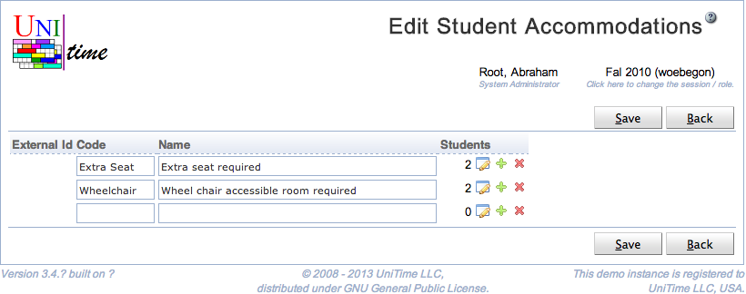

## Screen Description

 The Edit Student Accommodations screen makes it possible to edit all of the student accommodations (special needs or disabilities) in one place. See [Student Accommodations](student-accommodations) for more details about student accommodations.

## Details

 The columns in the table are as follows

* **External Id**
	* Id of the accommodation as used outside UniTime

* **Code**
	* Code or abbreviation of the accommodation name

* **Name**
	* Name of the accommodation

* **Students**
	* Number of students in the accommodation
	* **Pencil icon**
		* Click on this icon to edit the list of students in the accommodation
		* If the accommodation has been imported from an authoritative source and has an External Id, editing of the students is not possible and this icon is not displayed

 There are two icons at the end of each line

* **+ icon:** Add a new line to add a new accommodation

* **- icon:** Remove an accommodation from the list

* It is not possible to remove an accommodation that has an External Id

## Operations

* **Save**
	* Save changes to student accommodations and go back to the [Student Accommodations](student-accommodations) screen

* **Back**
	* Go back to the [Student Accommodations](student-accommodations) screen without saving any changes

{:class='screenshot'}
