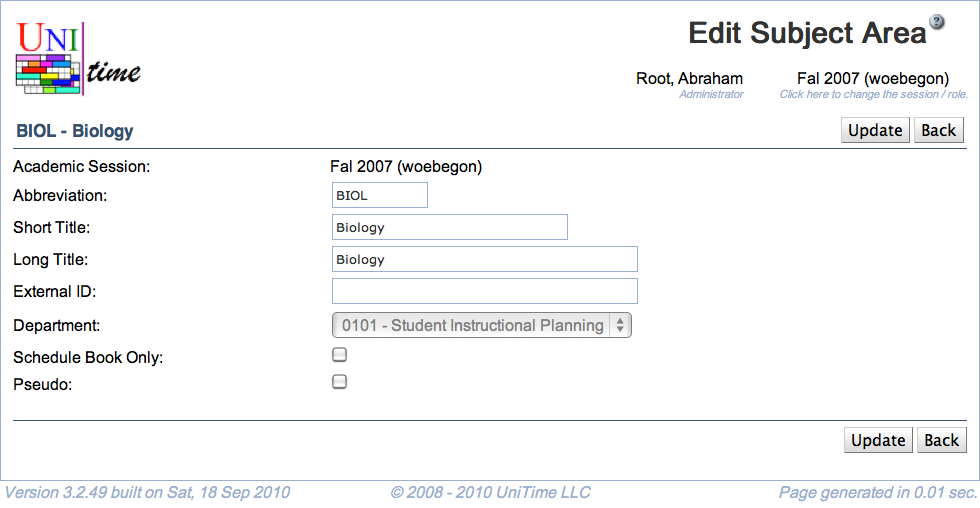

## Screen Description

The Edit Subject Area screen provides administrators with interface for editing an existing subject area.

{:class='screenshot'}

## Details

* **Academic Session**
	* The academic session for which you are editing a subject area
	* Can be changed from the [Academic Sessions](academic-sessions) screen

* **Abbreviation**
	* Subject area abbreviation

* **Title**
	* Title of the subject area

* **External ID**
	* External ID of the subject area (optional)

* **Department**
	* Change the department to which the subject area belongs (a subject area has to belong to a department)
		* This option is disabled if there is a timetable committed for the current department of this subject area
		* A new department can be added in the [Add Department](add-department) screen - to get there, click on Departments in the Administration section of the left hand side menu

* **Funding Department**
	* The department funding the classes for this subject area if they are funded by a department other than the department to which the subject area belongs.
		* This field is not visible by default.  To enable this field the unitime.courses.funding_departments_enabled application property must be set to true.

## Operations

* **Update/Save** (ALT+U/ALT+S
	* Save changes and go back to the [Subject Areas](subject-areas) screen

* **Delete** (ALT+D)
	* Delete subject area and go back to the [Subject Areas](subject-areas) screen
		* This option is only available if there are no courses offered for this subject area

* **Back** (ALT+B)
	* Go back to the [Subject Areas](subject-areas) screen without saving any changes
