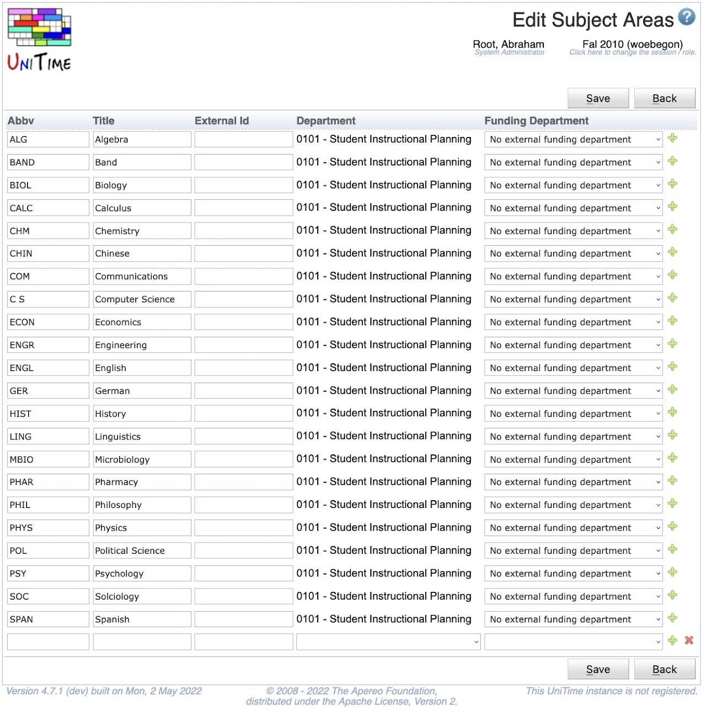

## Screen Description

The Edit Subject Areas screen lists all subject areas for a given academic session and allows the data to be edited.

{:class='screenshot'}

## Details

The top line shows the academic session for which the subject areas are listed. The list contains the following columns (and can be sorted by any of them by clicking on the column heading)

* **Abbv**
	* Abbreviation of the subject area

* **Title**
	* Title of the subject area

* **External ID**
	* External ID of the subject area (optional)

* **Department**
	* Department to which the subject area belongs (required)

* **Funding Department**
	* The department funding the classes for this subject area if they are funded by a department other than the department to which the subject area belongs.
		* This column is not visible by default.  To enable this column the unitime.courses.funding_departments_enabled application property must be set to true.

## Operations

* **Save** (Alt+S)
	* Save the new subject area and go back to the [Subject Areas](subject-areas) screen

* **Back** (Alt+B)
	* Go back to the [Subject Areas](subject-areas) screen without saving any changes
