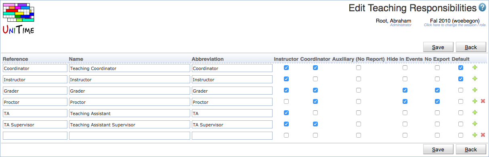

## Screen Description

The Edit Teaching Responsibilities page can be used to create, modify, or delete existing teaching responsibilities using a single page. Both instructor and coordinator assignment can have a teaching responsibility defined (optional). This allows, for instance, to distinguish between instructors, teaching assistants, course supervisors, graders, and other roles.

{:class='screenshot'}

The user needs to have Teaching Responsibility Edit permission to be able to edit teaching responsibilities. See [Teaching Responsibilities](teaching-responsibilities) for more details.

## Details

Beside of reference, name, and abbreviation, there is a flag defining whether the responsibility can be used on an instructor (Instructor column), on a coordinator (Coordinator column), whether the assignment should be visible in the reports (Auxiliary), not visible in the event management (Hide in Events) or not exported / sent to an external system (No Export).

## Operations

Click **Save** to save the teaching responsibilities. The button **Back** will get you back to [Teaching Responsibilities](teaching-responsibilities) page without making any changes. A new line can be added by clicking on the green plus button, a line (and the appropriate teaching responsibility) can be deleted by clicking the red x button.

Please note that the teaching responsibilities that cannot be deleted do not have the red x button. These are the responsibilities that are already being used.
