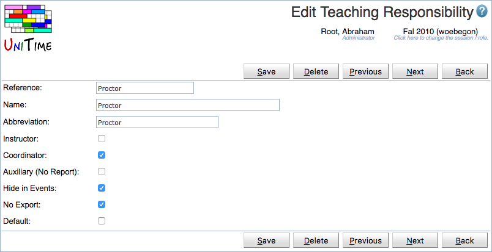

## Screen Description

The Edit Teaching Responsibility page can be used to change an existing teaching responsibility. Both instructor and coordinator assignment can have a teaching responsibility defined (optional). This allows, for instance, to distinguish between instructors, teaching assistants, course supervisors, graders, and other roles.

{:class='screenshot'}

The user needs to have Teaching Responsibility Edit permission to be able to edit a teaching responsibility.. See [Teaching Responsibilities](teaching-responsibilities) for more details.

## Details

Beside of reference, name, and abbreviation, there is a flag defining whether the responsibility can be used on an instructor (Instructor column), on a coordinator (Coordinator column), whether the assignment should be visible in the reports (Auxiliary), not visible in the event management (Hide in Events) or not exported / sent to an external system (No Export).

## Operations

Click **Save** to update the modified responsibility. Button **Back** will get you back to [Teaching Responsibilities](teaching-responsibilities) page without making any changes. Click **Delete** to delete the responsibility.

The buttons **Previous** and **Next** can be used to save the current teaching responsibility and get to the Edit Teaching Responsibility page for the previous / next responsibility.
