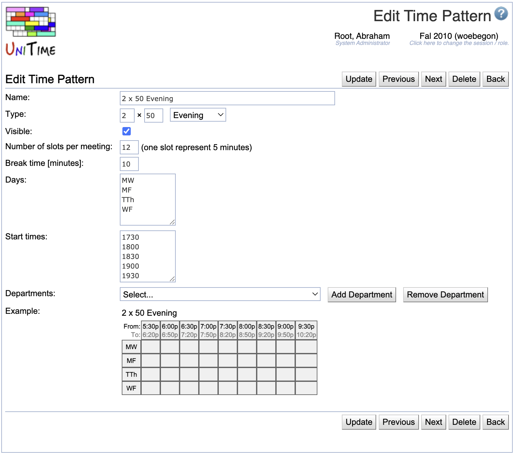

## Screen Description

The Edit Time Pattern screen provides an interface for editing an existing time pattern.

{:class='screenshot'}

## Details

* **Name**
	* Name of the time pattern (e.g., 1 x 50)

* **Type**
	* Type of the time pattern (**Standard**, **Evening**, **Saturday**, **Morning**, **Extended**, **Exact Time**)
	* These types may be helpful for organizing the list of time patterns.
		* On classes and scheduling subparts, time patterns are ordered based on these types (Standard time patterns first, then Evening, etc.)
	* If the type is **Extended**, only explicitly indicated departments (and administrators) have access to this time pattern (this time pattern is not visible as an option on classes and scheduling subparts that are managed by departments not listed on this time pattern)
	* The **Exact Time** type is special. There only needs to be one time pattern of this type created. When set on a class, the days of the week and the start time is selected directly on the class.

* **Visible**
	* When checked (checked by default), the time pattern will be available to users authorized to use it
	* When not checked, the time pattern will not be available for the given academic session and will be displayed in gray letters in the list of time patterns
		* However, if there are existing classes or scheduling subparts that are using the time pattern, they will still be able to use it

* **Number of slots per meeting**
	* Number of five minute blocks necessary for the meeting
		* The number should include break time after the actual meeting time; for example, if a class meeting lasts 50 minutes and then there should be a 10 minute break, the number of slots is 12

* **Break time \[minutes\]**
	* Indicate how many minutes from the end of the time allocated to the meeting (number of slots x 5) should be reserved for a break (in the example with a 50 minute slot, the break time would be 10 minutes - meaning that the last two slots out of 12 are actually a break time)

* **Days**
	* List days of week (or combinations of days of week) which should be available for the time pattern
	* The format of possible days is Mon, Tue, Wed, Thu, Fri, Sat, Sun or M, T, W, Th, F, S, Su (each day or combination of days (e.g., MWF) on a separate line or on one line, separated by commas)
	* **Days are only editable if the time pattern is not in use**{:style='color:blue;'}

* **Start times**
	* List possible starting times in military format without separating hours and minutes (for example, "0700", "1530", etc.), each start time on a new line (or all of them on one line, separated by commas)
	* **Start times are only editable if the time pattern is not in use**{:style='color:blue;'}

* **Departments**
	* If the time pattern is of type **Extended**, indicate departments which should have access to this time pattern
	* Select a department from the drop-down list and click **Add Department** to authorize a department to use the time pattern
	* Select a department from the drop-down list and click **Remove Department** to withdraw authorization to use the time pattern

* **Example**
	* A preview of the time grid as displayed in edit screens (such as [Edit Class](edit-class)); this preview is useful to verify that there is correct number of time slots and minutes of break, since it displays available times the way they will be displayed on students' schedules

## Operations

* **Update**
	* Save changes and go back to the [Time Patterns](time-patterns) screen

* **Previous**
	* Save changes and open the edit screen for the next time pattern

* **Next**
	* Save changes and open the edit screen for the previous time pattern

* **Delete**
	* Delete the time pattern and go back to the [Time Patterns](time-patterns) screen
	* It is only possible to delete a time pattern that is not being used

* **Back**
	* Go back to the [Time Patterns](time-patterns) screen without saving any changes
