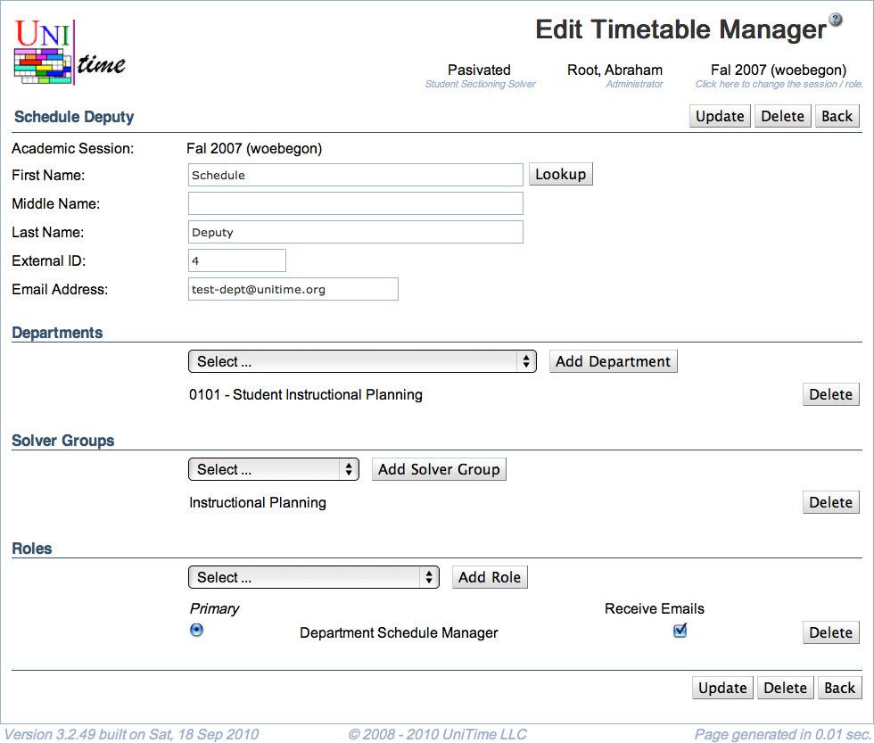

## Screen Description

In the Edit Timetable Manager screen you can edit information about an existing manager.

{:class='screenshot'}

## Details

There are two different layouts of the upper part of the screen, in one case all users are entered through the timetabling application (users are authenticated by the application), in the other case the application is connected to an employee database (users are authenticated through an external interface).

### Using Internal Authentication

The upper part of the screen contains the following

* **Academic Session**
	* Session to which the user should have access
	* Can be changed from the [Academic Sessions](academic-sessions) screen

* **First Name**

* **Middle Name**

* **Last Name**

* **External ID**
	* The External ID can be changed only to a number that is not currently used for another manager and it must be the same as the External ID in the [Users (Database Authentication)](https://sites.google.com/a/unitime.org/help/Users_%28Database_Authentication%29) screen

* **Email Address**
	* Change the contact email address

### Using External Authentication

The upper part of the screen contains the following

* **Academic Session**
	* Session to which the user should have access
	* Can be changed from the [Academic Sessions](academic-sessions) screen

* **External ID**
	* ID that can be looked up in e.g. an employee database
	* Click on **Lookup Manager** to fill in the rest of user information (such as email address) based on his/her external ID - the name of the user will be displayed above the top line of this screen

* **Email address**
	* User's email address

* **External Manager**
	* Indicates whether the user is associated with a department that is marked as an external manager, see [Edit Department](edit-department) for more details.

### Departments

Select a department in the drop down list and click **Add Department** to make the user a manager for a department.

To remove user's access to a department, click **Delete** on the line with that department.

Note: A user that has "Departmental Schedule Manager" role has to be associated with at least one department.

### Solver Groups

Select a solver group for which the user should be able to create a timetable and click **Add Solver Group**.

To remove user's access to a solver group, click **Delete** on the line with that solver group.

### Roles

Select a role for the user from the drop down list and click **Add Role**. Select which role should be the primary one (the one applied whenever the user logs on to the application). To remove a role, click **Delete** on the appropriate line.

Note: Only the "Departmental Schedule Manager" role reflects the choice of departments and solver groups in this screen. "View All" and "Administrator" have access to all data (a user in the "View All" role cannot make any changes and can only see committed timetables).

Note: A user needs to be associated with at least one role.

## Operations

* **Update** (ALT+U)
	* Save changes and go back to the [Timetable Managers](timetable-managers) screen

* **Delete** (ALT+D)
	* Delete this manager and go back to the [Timetable Managers](timetable-managers) screen

* **Back** (ALT+B)
	* Go back to the [Timetable Managers](timetable-managers) screen without saving changes
