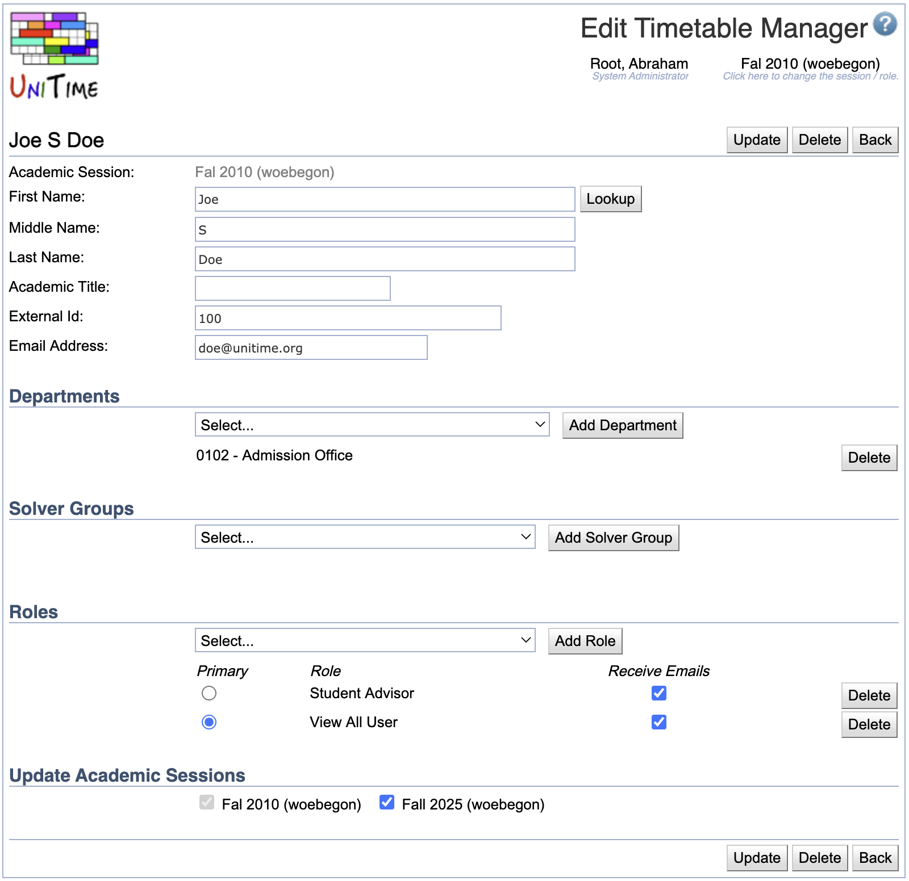

## Screen Description

In the Edit Timetable Manager screen you can edit information about an existing manager.

{:class='screenshot'}

## Details

The upper part of the screen contains the following

* **Academic Session**
	* Session to which the user should have access
	* Can be changed from the [Academic Sessions](academic-sessions) screen

* **First Name**
* **Middle Name**
* **Last Name**
* **Academic Title**
	* Manager's name and academic title

* **External ID**
	* The External ID can be changed only to a number that is not currently used for another manager.
	* It must be the same as the External ID in the [Users](users-database-authentication) screen or the external ID of an authenticated user using other means such as [LDAP](LDAP), [CAS](CAS), or [OAuth2](OAuth2) authentication
	* Can be an arbitrary string of at most 40 characters

* **Email Address**
	* Change the contact email address

### Departments

Select a [department](departments) in the drop-down list and click **Add Department** to make the user a manager for a department.
To remove user's access to a department, click **Delete** on the line with that department.

**Note:** A user that has *Departmental Schedule Manager* role has to be associated with at least one department.

### Solver Groups

Select a [solver group](solver-groups) for which the user should be able to create a timetable and click **Add Solver Group**.
To remove user's access to a solver group, click **Delete** on the line with that solver group.

**Note:** Solver groups are only needed for the *Departmental Schedule Manager* and similar roles that have non-admin access to the course timetabling solver.

### Roles

Select a [role](roles) for the user from the drop-down list and click **Add Role**. Select which role should be the primary one (the one applied whenever the user logs on to the application). To remove a role, click **Delete** on the appropriate line.

The default manager roles are:
* **System Administrator** - user who has access to all screens and can do anything
* **Session Administrator** - user who has access everything related to the academic session(s) they are associated with (through their department)
* **Departmental Schedule Manager** - user who has access to and can change the input course timetabling and examination data of certain department(s)
* **Curriculum Manager** - user who has access to and can change the curricula for their department
* **Examination Timetabling Manager** - user who has access to and can change and timetable examinations for the academic session of their department
* **Event Manager** - user who can approve or reject events for rooms in their department
* **View All User** - user who has access to the (timetabling) data of all departmental schedule managers but cannot make any changes

Additional roles can be defined on the [Roles](roles) page and their permissions on the [Permissions](permissions) page

Additional notes about roles:
* A user needs to be associated with at least one role.
* For the department-dependent roles such as the *Departmental Schedule Manager* role or *Event Manager* role, the department (or departments) is required, and it will restrict the users to only data of their departments.
* For the session-dependent roles such as the *Examination Manager* or *Session Administrator*, the department is used to associate the user with the academic session(s) they have access to
* For the session-independent roles such as the *System Administrator*, no department is needed.

## Update Academic Sessions

Please note that all information except of the solver groups and departments are session-independent (there is one record for each timetabling manager shared between all the academic session). This means that a user cannot have a different role for different academic sessions or departments, but they may be associated with different departments or solver groups in each academic session.

The **Update Academic Sessions** section allows to indicate any future academic sessions of the same academic initiative that will have the departments and solver groups updated with the matching information. By default, all academic sessions of the same academic initiative that have the matching departments and solver groups are pre-selected.

## Operations

* **Update** (ALT+U)
	* Save changes and go back to the [Timetable Managers](timetable-managers) screen

* **Delete** (ALT+D)
	* Delete this manager and go back to the [Timetable Managers](timetable-managers) screen

* **Back** (ALT+B)
	* Go back to the [Timetable Managers](timetable-managers) screen without saving changes
