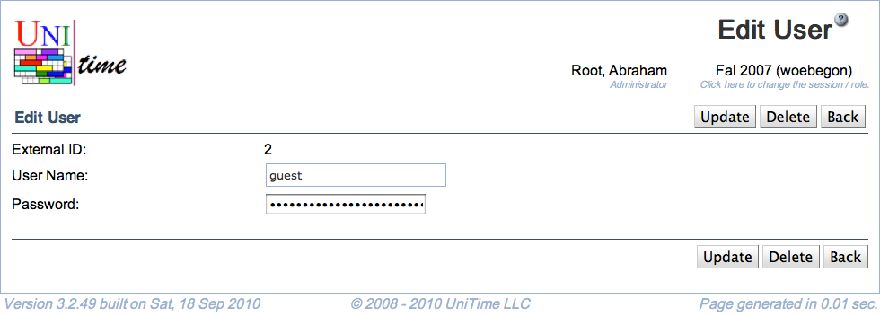

## Screen Description

The Add and Edit User screens provide interfaces for adding a new user or changing user's authentication data, if the timetabling application is not connected to any external database for this purpose.

{:class='screenshot'}

## Details

* **External ID**
	* Not editable any more

* **User Name**
	* Edit the user's login name

* **Password**
	* Edit the user's password

## Operations

* **Update**
	* Save changes and go back to the [Users (Database Authentication)](users-database-authentication) screen

* **Delete**
	* Delete the user's authentication data

* **Cancel**
	* Go back to the [Users (Database Authentication)](users-database-authentication) screen without saving any changes
