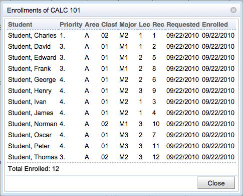

## Screen Description

 The pop-up screen Enrollments of ... (class or course) lists students enrolled in a given class or course. This screen is accessible from both [Student Sectioning Dashboard](student-sectioning-dashboard) and [Online Student Scheduling Dashboard](online-student-scheduling-dashboard) and there can be differences based on the access point.

## Details

 The table of enrolled students has the following columns

* **External Id** (optional column)
	* External id of the student

* **Student(s)**
	* Name(s) of student(s) enrolled in the course or class

* **Course** (when the course is cross-listed)
	* Course for which the enrollments are listed

* **Priority**
	* Priority of the course in the student's prioritized list of course requests

* **Area**
	* Academic area
	* Displayed only if applicable

* **Degr**
	* Student degree

* Displayed only if applicable

* **Clasf**
	* Academic classification
	* Displayed only if applicable

* **Major**
	* Student's major
	* Displayed only if applicable

* **Minor**
	* Student's minor
	* Displayed only if applicable

* **Group**
	* Student's group(s)
	* Displayed only if applicable

* **Accommodation**
	* Student's accommodation(s)
	* Displayed only if applicable

* **Instructional Type** (Lab / Lec / Ind / ...)
	* External Id or section number of the lab, lecture, etc.
	* Click on the column header to switch between external id and section number

* **Requested**
	* Date of the student's request

* **Enrolled**
	* Date when the student was enrolled into the course or class
	* Displayed only when coming from the [Online Student Scheduling Dashboard](online-student-scheduling-dashboard)

* **Advisor**
	* Student's advisor(s)
	* Displayed only if applicable

 You can sort by any column of this table.

 Click on any line with a student to get to the pop-up window with [Classes](classes-for-student) for that student.

## Operations

* **Close**
	* Close the window and go back to the previous screen

{:class='screenshot'}
