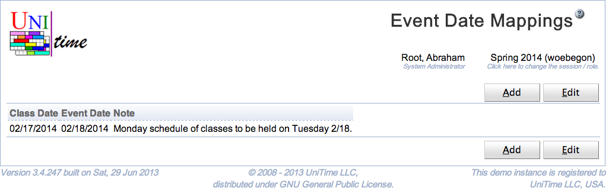
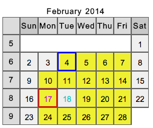
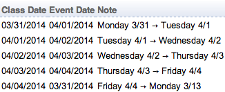
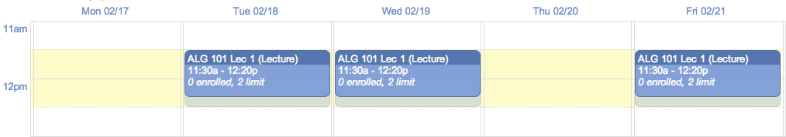
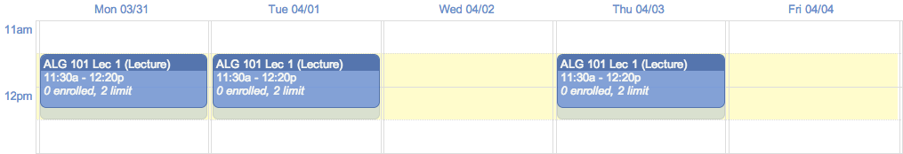

## Screen Description

The Event Date Mappings page adds the ability to create a mapping of class dates to event dates. It is a list of pairs class date → event date related to an academic session.

{:class='screenshot'}

When a mapping is defined, it is used for the creation of class events (class dates are mapped to event dates) and for the room availability in course timetabling (events are mapped back from event dates to class dates).

When a date mapping is defined, the date patterns should be updated so that classes do take place on the class dates (marked with purple text color in the pattern) and not on the event dates (marked with teal color in the pattern). Such meetings will be mapped from these class dates to the event dates using the defined mapping when a solution is committed (or a committed assignment is changed using [Class Assignment](class-assignment) page).

{:class='screenshot'}

For course timetabling, Monday 2/17 schedule is to be created. But in the events, all Monday 2/17 class meetings will appear on Tuesday 2/18. Also, all approved events that are not class events and that are held on Tuesday 2/18 will translate as unavailabilities in the course timetabling for the Monday 2/17.

Multiple event date mappings can be created. They can even rotate. The following example can be used to rotate the schedules by a day on the week starting March 31. That is, Monday will follow Friday schedule; Tuesday will follow Monday schedule; Wednesday will follow Tuesday schedule; Thursday will follow Wednesday schedule; and Friday will follow Thursday schedule.

{:class='screenshot'}

Note that the date change will only appear on pages that are based on the event management. These include [Events](events), [Event Room Availability](event-room-availability), [Personal Timetable](personal-timetable), [Classes](class-timetable), and [Examinations](exam-timetable). For instance, see the following example with a Monday-Wednesday-Friday class during the week when Monday 2/17 classes are moved to Tuesday 2/18.

{:class='screenshot'}

And here is another example with the week starting March 31, where all the dates are shifted by a day (see the mapping example above).

{:class='screenshot'}

The event date mappings do not roll forward.

## Permissions

The permission Event Date Mappings is needed to be able to access the page, the permission Event Date Mapping Edit is needed to be able to make changes. These two permissions are not assigned to any role by default (the event date mapping feature is not visible by default).

Please note that having the Event Date Mappings permission is not the only condition for the menu item to appear. The Event Date Mappings option will show in the menu (under Administration > Academic Sessions) only when one of the following conditions is also met:

(a) there is at least one event date mapping already defined

(b) there is no committed solution and the user does have the Event Date Mapping Edit permission (i.e., a new mapping can be added)

If there is already a committed solution, it is not allowed to tinker with the event date mappings. This is to prevent inconsistencies in the data as the mapping is used to create meetings while a solution is being committed or when a class is reassigned using [Class Assignment](class-assignment) page.

If the user cannot add a new mapping (because there is a committed solution, or because they does not have the edit permission) and there are no mappings defined, the menu item Event Date Mappings will not appear as there are no data to show and no operation to make.

## Operations

To edit or delete an event date mapping, click on the appropriate line, [Edit Event Date Mapping](edit-event-date-mapping) page will appear. All date mappings can be edited on the [Edit Event Date Mappings](edit-event-date-mappings) page. To do so, click on the **Edit** button.

A new mapping can be added on the [Edit Event Date Mappings](edit-event-date-mappings) page (button **Edit**) or using [Add Event Date Mapping](add-event-date-mapping) page (button **Add**).

The table can be ordered by any of the columns. To do so, click on the column header and select Sort by <column name> option.
