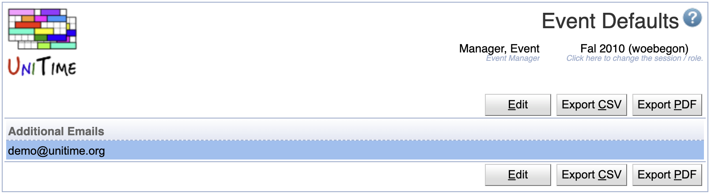
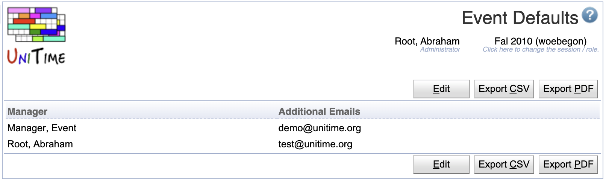
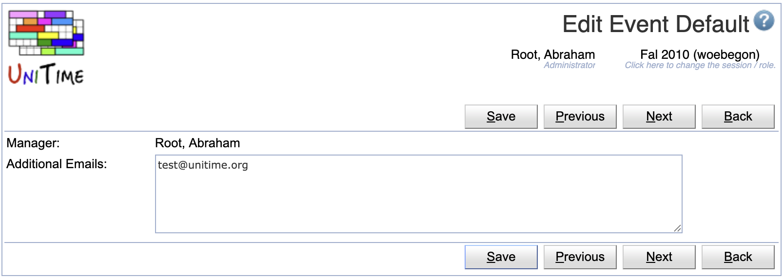
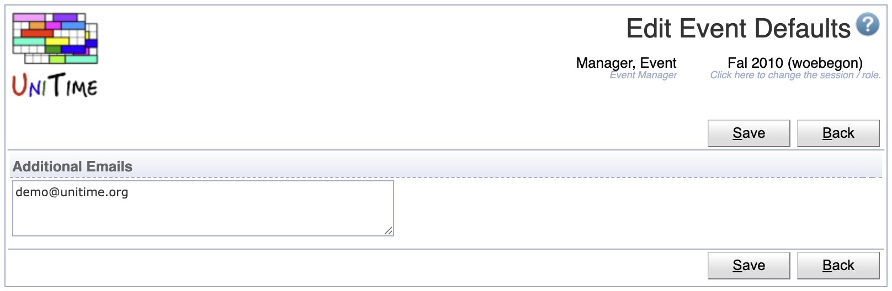

## Screen Description

The Event Defaults page provides an ability to configure the default setting for the Additional Emails field when creating an event. When defined, the [Add Event](add-event) page will have the Additional Emails filed pre-populated with the given email(s).

{:class='screenshot'}

Additional event management related fields may be added in the future.

For administrators, the page allows to change the defaults for all other event managers.

{:class='screenshot'}

## Operations

The table can be sorted by any of its columns, just by clicking on the column header and the sorting option that opens.

## Edit Event Default

Click a particular line to make changes or to the appropriate manager.

{:class='screenshot'}

* Click **Save** to make changes, **Back** to return to the list without making any changes

## Edit Event Defaults

Click **Edit** to edit the event details

{:class='screenshot'}

* Click **Save** to make changes, **Back** to return to the list without making any changes
