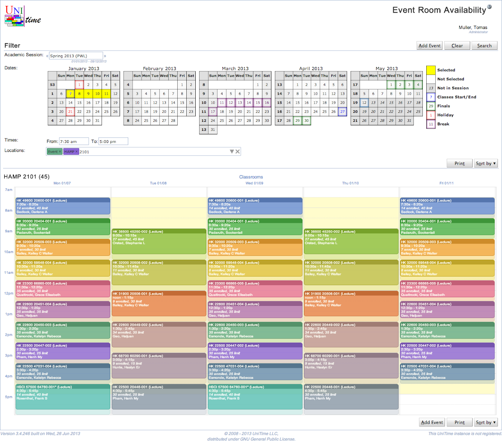
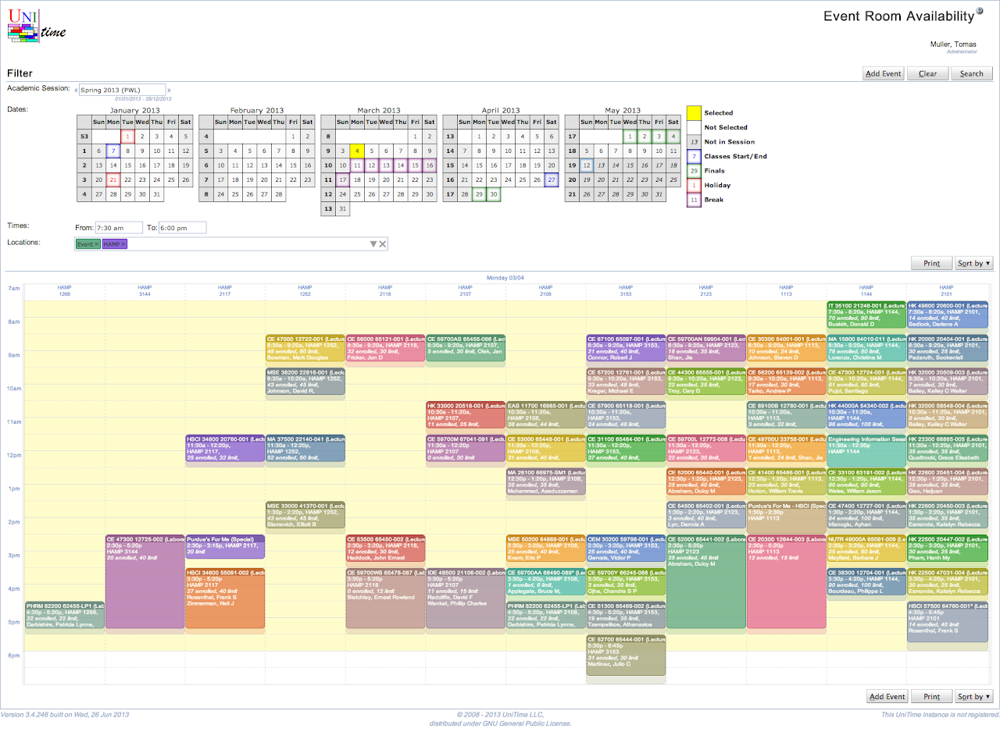
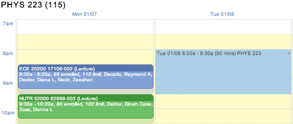
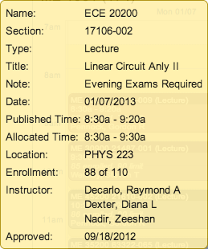

## Screen Description

The Event Room Availability screen lets the user set up dates, times, and location parameters in a similar manner as the [Add Event](add-event) screen. After clicking **Search** button, the user can see a time grid with information about availability of each of the locations matching his/her criteria. It is then possible to highlight available times and request those times for an event.

{:class='screenshot'}

**Dates** can be selected by mouse. You can click on a particular day, on a week, on a day of week, or on a whole month. Second click will unselect the selected day. When clicking on a week, a day of week, or a whole month, the selection will iterate between all working days since today, all working days, all days except holiday, all days, and no days. It is also possible to use arrow keys to navigate through the calendar and space key to select / unselect particular day. Only dates from the academic session selected in the **Academic Session** selection box can be selected. **Times** define starting and end time of the requested availability table (the requested area is marked by yellow background in the table). It is possible to use mouse to select particular times, or the times can be entered by keyboard. While the suggestions are only in 15 minute increments, it is possible to type in a time with 5 minute increments. The from and end time text fields recognize time in various formates (e.g., 7:00 pm can be entered as 7p, 19, 700pm, etc.), the end time can be also entered in the number of minutes or hours from the start time (e.g., 1h for 1 hour, 90m for 90 minutes). If no times are entered, the availability defaults to 7:30 am - 5:30 pm time window. The **Locations** component is explained [here](events-room-filter) (the possible locations are filtered by the same Room Filter as on the [Events](events) page). It is useful to keep the Only event locations chip (together with some additional restrictions) in the filter as these are the rooms in which an event can be requested. Once the **Search** button is pressed, the availability table(s) will appear.

{:class='screenshot'}

When two or more dates are selected, there is one table for each room matching the room filter (one after another). If there is only one date selected, all the rooms that match the room filter are displayed in one table.  The last selection is reflected in the page URL (page can be refreshed without loosing the last selection) and remembered in the browser cookies.

The availability grid allows for a mouse selection of available time that can be used to create a new event when [Add Event](add-event) button is clicked. The mouse selection is in light blue, and it can be deleted by clicking on the little x in the top right corner. It can be also dragged around the timetable grid or changed by moving its corners or edges. Multiple selections can be made across the requested rooms, times, and dates, however, the selection is lost when the Search button is clicked or the page is left. It is generally not possible to make a selection (and request meetings) on the dates that are in past (before today). Such dates are slightly grayed out.

{:class='screenshot'}

Each meeting is displayed as a box, featuring its name, time, date, and a few additional information. The shades are used to display setup (on the top of the box) and teardown (on the bottom of the box) times. In the above example, the ECE 20200 class event is scheduled from 8:30 am to 9:20 am, but it occupies the room till 9:30 am. This means that the following meeting in this room cannot start earlier than 9:30 am, and there is a 10 minute buffer for the students to move between classes and/or events. On the events, we distinguish between Published Time (time printed on the event, i.e., 8:30 - 9:20) and Allocated Time (time blocking the room). The diference between these two times are displayed as Setup Time (at the beginning of the meeting) and Teardown Time (at the end of the meeting).

{:class='screenshot'}

Additional information about a particular meeting can be seen in a small yellow tooltip window that is displayed in the bottom left or right corner when the mouse is hovering over the appropriate box.

It is possible to change the order of the displayed rooms. To do so, click **Sort by** button and select the sort criterion (capacity, name, availability, or distance when nearby locations are searched as well). To print the room availabilities, use the **Print** button. It gives a better results than printing the page directly as the availability grids are formatted to beter fit the printed page(s).

If allowed, clicking on a meeting will open the [Event Detail](event-detail) page for the appropriate event.

## Operations

* **Search** (Alt+S)
	* Display availability grid for the dates/times/locations specified in the Filter

* **Add Event**
	* Go to the [Add Event](add-event) page to fill in necessary information about the event
	* If a selection was made on the availability grid(s), the appropriate meetings will appear in the Meetings table of the Add Event page.

* **Clear**
	* Clear the filter and start over
