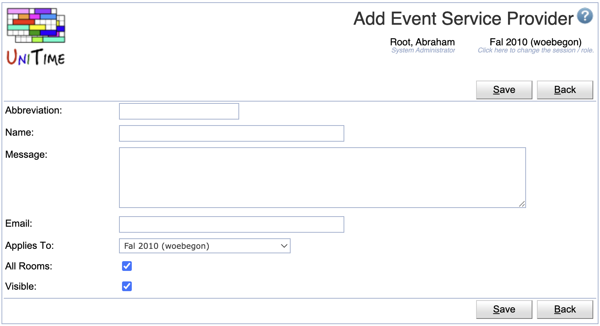

## Screen Description

The event service providers that can be defined on this page can be used by users when they are requesting an event to request additional services, like catering.

{:class='screenshot'}

A service provider must have an **abbreviation** and a **name**. **Message** and **email** are optional. A service provider can be **global** (applies to rooms across all the academic sessions), for an **academic session** (applies to rooms in the academic session), or just for a particular **department**. A service provider can be used for **all rooms** (to which it applies), or only to a subset of rooms. When it does not apply to all rooms (All Rooms toggle is not set), the service provider can be selected on one or more rooms. This can be done using the [Edit Room](edit-room) page or on the [Event Statuses](event-statuses) page.

### Add/Edit Event Page

Now, when an event is being requested, a toggle for each service (that is applicable) is shown on the [Add/Edit Event](add-event) page

{:class='screenshot'}

### Event Detail Page

The **Requested Services** section is only visible when there is one or more service providers defined and available. If a message is provided, it shows when the service is selected. It can contain HTML links to additional forms, etc.

{:class='screenshot'}

If the email is provided, the service provider is CC-ed on the event confirmation email when a meeting is committed or canceled. This also includes cases when a room is automatically approved or when a service provider is selected on the event (Edit Event page) after one or more of its meetings have been approved.

### Events Page

The selected services also show on the [Events](events) page, in the **Requested Services** column on the List of Events and the List of Meetings tables.

{:class='screenshot'}

They also show in the event mouse-over tooltip.

{:class='screenshot'}

And in the [Event Filter](events-event-filter); for example, one can search for approved events requesting a particular service:

{:class='screenshot'}

## Operations

The table can be sorted by any of its columns, just by clicking on the column header and the sorting option that opens.

### Add Event Service Provider
Click **Add** to add a new event service provider

{:class='screenshot'}

* Click **Save** to create a new event service provider
* Click **Back** to return to the list without making any changes

### Edit Event Service Provider
Click a particular event service provider to make changes or to delete the event service provider.

{:class='screenshot'}

* Click **Save** to make changes, **Back** to return to the list without making any changes
* Click **Previous** or **Next** to save the changes and go to the previous or next event service provider, respectively
* Click **Delete** to delete the event service provider.

### Edit Event Service Providers
Click **Edit** to edit all event service providers

{:class='screenshot'}

* Use the  icon to add a new line and  to delete a line
* Click **Save** to make changes, **Back** to return to the list without making any changes

### Export CSV/PDF
Click the **Export CSV** or **Export PDF** to export the list of event service providers to a CSV or PDF document, respectively.