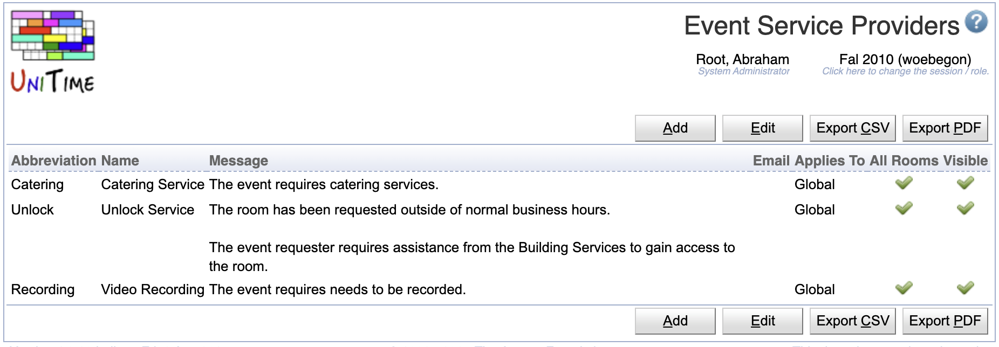

## Screen Description

 The event service providers, that can be defined on this page can be used by users when they are requesting an event to request additional services, like catering.

 A service provider must have an abbreviation and a name. Message and email are optional. It can be global (applies to rooms across all the academic sessions), for an academic session (applies to rooms in the academic session), or just for a particular department. A service provider can be used for all rooms (that it applies to), or only to a subset of rooms. When it does not apply to all rooms (All Rooms toggle is not set), the service provider can be selected on one or more rooms. This can be done using the Edit Room page or on the Event Statuses page.

 Now, when an event is being requested, a toggle for each service (that is applicable) is shown on the Add/Edit Event page

{:class='screenshot'}

 The Requested Services section is only visible when there are one or more service providers defined and available. If a message was provided, it shows when the service is selected. It can contain HTML links to additional forms etc.

 If the email is provided, the service provider is CC-ed on the event confirmation email when a meeting is committed or canceled. This also includes cases when a room is automatically approved or when a service provider is selected on the event (Edit Event page) after one or more of its meetings have been approved.

 The selected services also show on the detail page,  as a column on the Events page (List of Events, List of Meetings tables), in the event tooltip, and in the Event Filter (so one can only display approved events requesting a particular service).

{:class='screenshot'}

{:class='screenshot'}

 Event Detail Page

{:class='screenshot'}

 Events Page, Requested Services column has been added

{:class='screenshot'}

 Event tooltip

{:class='screenshot'}

 Event Filter, a service can be selected
