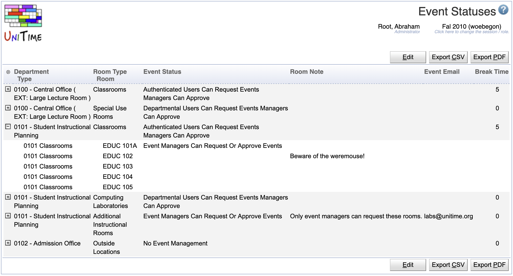

## Screen Description

The Event Statuses screen provides an overview of the statuses in which a given event room type (or a particular room of that room type) can be for a given department. This is a way to specify what each department can do with each room type or room in the given academic session. The page is available to not only administrators, but also to the event managers, who can see only the lines for their departments.

{:class='screenshot'}

## Details

The table of event statuses contains those pairs of "department, room type" for which the department has at least one room of that room type available for the event management. A line with a department can be unfolded by clicking on the small plus sign at the beginning of that line - a list of rooms of that departments and room type will be displayed below. The table consists of the following columns

* **Department**
	* Department for which the room type status is specified on that line

* **Room Type / Room**
	* Room type / Room for which the status is specified on that line

* **Event Status**
	* The status indicates what the particular department can do with rooms of the particular room type or with a particular room

* **Room Note**
	* Event room note that is the default message for rooms of this type and this department when a new event (or meeting) is being created

* **Event Email**
	* When filled in, this email is automatically CC'ed on all the event approval emails related to this room or department + room type

* **Break Time**
	* Time for which the room needs to be blocked after the official end of an event for this type of room and this department (similar to a break time after a class)

Clicking on the table header provides a menu for sorting and for indicating which columns should be visible in the table. It is also possible to collapse or expand all departments/types by clicking on the lightbulb sign in the upper left-hand side corner of the table, then on Collapse All or on Expand All.

If a room has no event status, room note, or break time defined, the fields default to the values that are set on the room type & department pair based on the type and event department of the room.

## Event Status

For a particular room (or a room type & department combination), one can specify whether all users (that have the permissions to request an event -- which is all authenticated users by default), only users associated with the appropriate department (using the room's event department), or only event managers (also associated with the department) are allowed to request an event.

The event status can be set to one of the following:

* No Event Management
	* Event management is disabled.

* Authenticated Users Can Request Events Managers Can Approve
	* Any authenticated user (with the appropriate right) can request an event, event managers are allowed to approve an event.

* Departmental Users Can Request Events Managers Can Approve
	* Any instructor or timetable manager (with the appropriate right) can request an event in a room of her/his department(s), event managers are allowed to approve an event.

* Event Managers Can Request Events Managers Can Approve
	* Only event managers are allowed to request and to approve an event.

* Authenticated Users Can Request Events No Approval
	* Any authenticated user (with the appropriate right) can request an event, event managers are not allowed to approve an event.

* Departmental Users Can Request Events No Approval
	* Any instructor or timetable manager (with the appropriate right) can request an event in a room of her/his department(s), event managers are not allowed to approve an event.

* Event Managers Can Request Events No Approval
	* Only event managers are allowed to request an event, event managers are not allowed to approve an event.

* Authenticated Users Can Request Events Automatically Approved
	* Any authenticated user can request an event, the event is automatically approved.

* Departmental Users Can Request Events Automatically Approved
	* Any instructor or timetable manager can request an event in a room of her/his department(s), the event is automatically approved.

* Event Managers Can Request Events Automatically Approved
	* Only event managers are allowed to request and event, the event is automatically approved.

There is a minimal set of permissions an authenticated user must have to be able to request an event (see the default event permissions for a No Role user). For departmental users, besides of timetabling managers, instructors of the appropriate department are also included (if the instructor role is allowed to request an event). For the event status check, event managers are all users with the Event Meeting Approve permission (which by default are users with the event manager role). Administrative users with Event Any Location permission override this status (they can request any location at any time).

## Room Note

A room note shows in the tool tip of a room (many pages, whenever a mouse hovering over a room name).

{:class='screenshot'}

While a new meeting is being requested, if a room is not available for the user, it is shown as an unavailability on the next page of the Add Meetings... dialog

{:class='screenshot'}

Or in red bellow the requested meeting in the meetings table (e.g., when a selection was made on the [Event Room Availability](event-room-availability) page).

{:class='screenshot'}

If the room is available to the user, the message shows in yellow below a meeting requesting the room on the [Add Event](add-event), [Edit Event](edit-event), and [Event Detail](event-detail) pages.

{:class='screenshot'}

## Break Time

If a room (or all rooms of a particular type and department, e.g., all centrally managed classrooms) has a break time defined, the break time translates into a teardown time of a newly requested meeting (in the appropriate room). This means that, for instance, if a 8 am - 9 am meeting is requested in a room that requires 10 minute break time, the allocated time will be 8:00 am - 9:00 am, but the published time will be 8:00 am - 8:50am. This is particularly useful for classrooms as all classes usually have a break time defined (see [Time Patterns](time-patterns)) and it can be a good practice to extend this policy (e.g., there are always at least 10 minutes between two consecutive classes) to other events as well.

{:class='screenshot'}

## Operations

### Edit Event Status

Click on any line to get to edit the corresponding combination of a department and room type or room.

{:class='screenshot'}

* Click **Save** to make changes, **Back** to return to the list without making any changes
* Click **Previous** or **Next** to save the changes and go to the previous or next department and room or room type respectively

### Edit Event Statuses

Click **Edit** to edit all event room type departmental statuses in one screen

{:class='screenshot'}

* Click **Save** to make changes, **Back** to return to the list without making any changes

### Export CSV/PDF
Click the **Export CSV** or **Export PDF** to export the list to a CSV or PDF document respectively