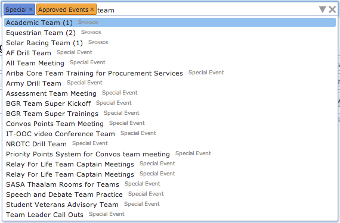
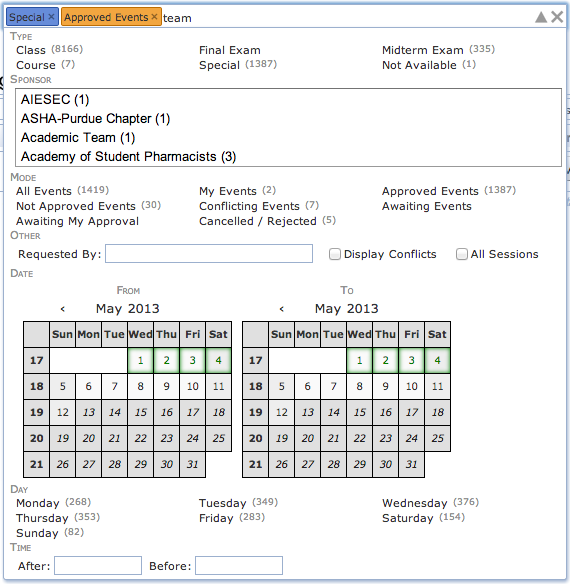

{:class='screenshot'}

## Description

The Event filter is a component used on the [Events](events) page and several other pages to select a list of events (and their meetings) to be displayed on the page.  It allows selection of events by their name or sponsoring organization, by their type (e.g., class events), of a certain manner (all events, my events, approved events, etc.), by a requestor, before or after a given date, by a day of week, or the meeting time.  It can also notify the page that conflicting events are to be displayed as well, or it allows the display of events from other academic sessions.

While the event filter appears as a single text input area, it has a lot of functionality.  Information can be entered as text using just the keyboard.  While typing, a list of matching suggestions is displayed below the box.  These suggestions include matching events along with other filtering options (e.g., an event type or a sponsoring organization that all the matching events must have).  Suggestions can be browsed using the Up and Down arrow keys. A suggestion is selected by typing Enter or by clicking on a suggestion using a mouse.  If a selected suggestion is an event, its name gets entered in the text field, otherwise it is put into the filter as a colored box (called a Chip) just before the text entry area.  This allows filtering events by several criteria at once.  For instance, on the right hand side example we are looking for all special events (event type is Special), that are already approved (Approved Events mode) and contain "team" in their name.  Some chips of the same type (e.g., event type or a day of week) can be combined together (a meeting must be on Monday or Wednesday for instance), some chips are allowed only one for each type (indicated by the color of the chip, e.g., mode or the start date).  A chip can be removed from the filter by hitting the little x at the right side of the colored box or by pressing Backspace at the beginning of the text area (i.e., when there is no character to remove). All of the entered data can be removed from the filter by clicking the big X button on the right most side of the filter box.  A list of suggestions appears automatically as the text is being entered in the text field, or when the Down arrow key is pressed at the end of the entered text.

The filter can also be used with a mouse. By clicking on the drop-down (triangle shaped) icon on the right side of the input area, a window is opened displaying all of the options. This is a very useful feature for someone not very familiar with existing event types, modes, sponsoring organizations, etc.  The window is closed by clicking on the drop-down icon for the second time (notice that it changes its orientation when the window is opened) or when the event filter component loses its focus (e.g., when clicked outside of the component or some other component is focused by pressing the Tab key).  The list of available options is automatically updated based on the current content of the event filter (e.g., a sponsoring organization with no matching event will disappear from the list).  The number in the brackets next to the option shows the number of events (out of the events already matching the filter) that match the option.  A selected chip can be also unselected by clicking on the appropriate option for the second time.  For instance, if the Special type is selected, clicking on the Special type for the second time will remove the Special type from the filter (the Special chip will disappear).

{:class='screenshot'}

## Options

Besides a name of an event, the event filter allows for the following options:

* **Type:** Type of event.  There are Class Events that correspond to classes along with Final Examination and Midterm Examination Events that correspond to final and midterm examinations respectively.  These events cannot be created through the event management pages, but are instead controlled through the course and examination timetabling functions of UniTime.  Ordinary events are called Special Events.  There are also Course Related Events that are like special events, but can be linked with a course or a class (in a similar manner as examinations).  When a course related event is being set up, it will show the related students (based on its courses or classes) and their conflicts. Also, if a course related event requires students to attend the event, it could show as a conflict for other events that are overlapping in time and for examinations during their timetabling. This is useful for instance for setting up special midterm examinations that do not follow the pre-defined examination periods.  Finally, administrators and event managers may also set up unavailability events that mark a particular room or rooms as not available for event management during certain periods. Unlike all other events, unavailability events show as a grayed out area on the timetable.

* **Sponsor:** Sponsoring organization of the event.

* **Mode:** Only events of a certain manner are to be displayed. There are the following modes. Please note that some of them are only available to certain users (event managers and administrators).
	* **All Events:** All events are to be displayed (no filtering)
	* **My Events:** Only events requested by the user are to be displayed. These are all events where the user is listed as the main contact of the event.
	* **Approved Events:** All events that are approved. There is an approval process. Newly created events are usually in a pending state until the appropriate event manager approves, cancels or rejects the event. During this time, the owner of the event can delete or cancel the event (or some of its meetings). Once an event is approved, it may only get cancelled.
	* **Not Approved Events**: All events that are not approved. These are all events that are in a pending state.
	* **Awaiting Events:** All events that are awaiting approval. These are all events that are in a pending state that have not happened yet. That is all pending events that meet today or in the future. In other words, the difference between Not Approved Events and Awaiting Events is that Awaiting Events do NOT contain events that already took place (and there is no point in approving them any more).
	* **Awaiting My Approval:** Events that are awaiting approval and that can be approved (or rejected) by the user  (only available to event managers and administrators).
	* **Conflicting Events:** Event meetings that conflict with another event. That means that there is a meeting of another event that uses the same room and overlaps with the meeting in time.
	* **Cancelled / Rejected:** Event meetings that are cancelled or rejected. Usually, cancelled or rejected meetings only show in "My Events" mode, or when looking at events requested by a given user (event manager only).
	* **Expiring Events:** All events that are awaiting approval and have an expiration date set. These events, if they are not approved by the given expiration date, will be automatically cancelled (expired). This mode is only available when there is an expiring event to be displayed.

* **Requested By:** All events (including cancelled and rejected meetings) requested a particular user. This option is only available to event managers and administrators.

* **Display Conflicts:** For an event, if there is a conflicting event, it will be displayed with the event in the list of events or meetings.

* **All Sessions:** The search will return events from other academic sessions (that have the same academic initiative) as the selected academic session. This is particularly useful when requesting events of a particular user or sponsoring organization or a given name.

* **Date:** First and/or last day of the event meeting(s) to be displayed.

* **Time:** Start and/or end time of the event meeting(s) to be displayed. When used, all meetings that overlap with the given time frame will be returned. So for instance, when events between 8 am and 9 am are requested, 7 am - 8:30 am will show up as well.

## Notes

As it was mentioned above, when an event meeting is created, it is in a pending (awaiting approval) state until the appropriate event manager approves the meeting. While a meeting is awaiting approval, it is still blocking the desired room for other events (another event trying to use the same room at the time would have a conflict). Once a meeting is approved, it also blocks the room from course and examination timetabling. A meeting awaiting approval can be deleted by the owner (leaving no trace in the system). Once approved, it can only be cancelled (and it will show on the event as a cancelled meeting).

{:class='screenshot'}
