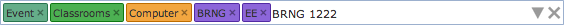
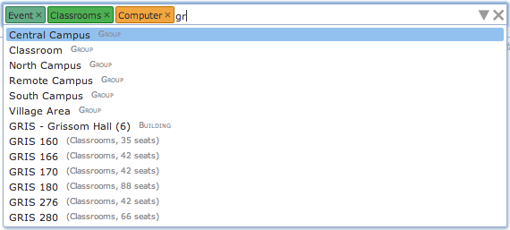
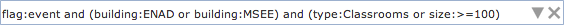

{:class='screenshot'}

## Description

The Room filter is a component used on the [Events](events) page and several other pages to filter the list of rooms that are displayed on the page.  It allows selection of rooms by department, room type, room feature, room group, building, and size.  It also allows displaying only rooms that can be used for events (i.e., rooms that have the event management enabled) and rooms that are nearby to a selected building or buildings.

{:class='screenshot'}

While the room filter appears as a single text input area, it has a lot of functionality.  Information can be entered as text using just the keyboard.  While typing, a list of matching suggestions is displayed below the box.  These suggestions include the matching rooms as well as other filtering options (e.g., the name of a room feature that all the matching rooms must have).  Suggestions can be browsed using the Up and Down arrow keys.  A suggestion is selected by typing Enter or by clicking on a suggestion using the mouse.  If a selected suggestion is a room, it gets entered in the text field, otherwise it is put into the filter as a colored box (called a Chip) just before the text entry area.  This allows filtering rooms by several criteria at once.  For instance, in the right hand side example we are looking for all event rooms that are classrooms (room type is Classrooms), that have a computer (Computer feature) and start with "gr".  Some chips of the same type (e.g., room feature) can be combined together (meaning a room must contain both selected features for instance, or be in one of the selected buildings).  Some chips are allowed only one for each type (indicated by the color of the chip, e.g., selected department or size restriction).  A chip can be removed from the filter by hitting the little x at the right side of the colored box or by pressing Backspace at the beginning of the text area (i.e., when there is no character to remove).  All entered data can be removed from the filter by clicking the big X button on the right most side of the filter box. The list of suggestions appears automatically as the text is being entered in the text field, or when Down arrow key is pressed at the end of the entered text.

The filter can be also used with a mouse. By clicking on the drop-down (triangle shaped) icon on the right side of the box a window is opened displaying all of the options.  This is a very useful feature for someone not very familiar with existing room types, features, groups, etc.  The window is closed by clicking on the drop-down icon for the second time (notice that it changes its orientation when the window is opened) or when the room filter component loses its focus (e.g., when clicked outside of the component or some other component is focused by pressing Tab key).  The list of available options is automatically updated based on the current content of the room filter (e.g., a room feature that is not present in any of the matching rooms will disappear from the list).  The number in the brackets next to the option shows the number of rooms (out of the rooms already matching the filter) that match the option.  A selected chip can be also unselected by clicking on the appropriate option for the second time.  For instance, if the Computer feature is selected, clicking on the Computer feature for the second time will remove the Computer feature from the filter (the Computer chip will disappear).Finally, the component also allows for boolean expressions. In these, most of the chips can be used as well, in the format type:value (see the mouseover tooltip on a chip to see how to enter it as a text).  For instance, the following query

{:class='screenshot'}

returns all event rooms that are in ENAD or MSEE building and that are of type Classrooms or have at least 100 seats. If a value of a chip contains spaces, use quotation marks, e.g., feature:"Tablet Arm Chairs".

{:class='screenshot'}

## Options

Besides a name of a room (or location in general), the room filter allows for the following options:

* **Department**: Department of the room. If only event rooms are to be displayed, it is the event department of a room. If all rooms are to be displayed (Only event locations toggle is unchecked), room sharing is also used. This means that all rooms into which a selected department can timetable will match the filter. The department drop down also allows for Managed Rooms for a timetabling manager (this is all the rooms that are shared with one or more departments of the manager), Final or Midterm Examination Rooms (rooms in which a final or a midterm examination can take place).

* **Type**: Type of the room. If used, only rooms matching the selected room types will be accepted.

* **Feature**: A room feature that the room must contain. If multiple room features are selected, a room must contain all of the selected features. It is possible to split room features by type (e.g., seating type features can be grouped together into a "SEATING ARRANGEMENT" block).

* **Group**: Room group of the room. If multiple room groups are selected, a room must be of at least one of the selected groups to be accepted.

* **Building**: Building of the room. If multiple buildings are selected, a room must be in one of the buildings (unless close by locations are also included).

* **Size:** The minimal and/or a maximal size of a room can be defined. For suggestions, start typing in the size, or use <, <=, >=, > operators (e.g., >=100 for all rooms of at least 100 seats). A range can be typed in as min..max (e.g., 10..20 for rooms of size between 10 and 20 seats).

* **Include event locations**: If checked (which is also the default for many event pages), only rooms that are enabled for event management are accepted. These are the rooms where an event can be requested using UniTime. More precisely, they are rooms that have an event department defined, the department has the event management enabled, and the [event status](event-statuses) is different from No Event Management.

* **Include close by locations**: If checked and at least one building is selected, rooms that are in a reasonable distance from the selected buildings are also included in the list. For the distances, rooms' coordinates and travel times (if defined) are used. The distance limit defaults to 670 meters (or 10 minutes).

## Notes

* If there are a lot of room features, it is possible to split room features by type (e.g., seating type, projection equipment). It is also possible to hide some of the types that are more useful for timetabling than events from the event management. See [Room Feature Types](room-feature-types) page for more detail.

* The close by locations distance limit can be changed by application property tmtbl.events.nearByDistance (integer number in meters, defaults to 670). For the conversion between distance in meters and travel time in minutes the application property tmtbl.events.distanceSpeed is used (number of meters traveled in a minute, defaults to 67.0). The default is set so that 1 kilometer roughly translates to 15 minutes of travel, with the nearby rooms being 10 minutes from the selected building.

* Suggestions can be used to quickly see the rooms that match the filter. Press the Down arrow key to display suggestions below the filter even when there is no text entered. Only the first 20 suggestions are displayed.
