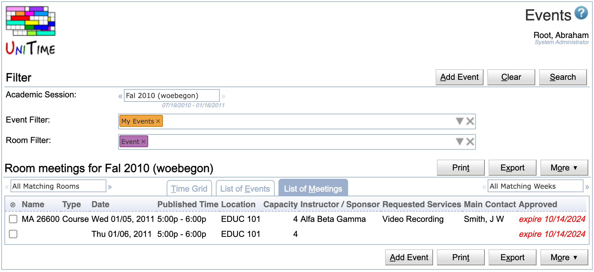

## Screen Description

The Events screen is the primary starting place for anybody interested in events and associated meetings - be it a student looking for activities of a student organization or an event manager looking for room reservation requests requiring approval.

{:class='screenshot'}

Searches for events scheduled in the system are filtered by academic session and by information entered into two additional filters.  The [Event Filter](events-event-filter) input area allows selection of events by name, type, sponsoring organization, mode, date, day of week, and time.  The [Room Filter](events-room-filter) input area allows selection of events by their room placement.  Rooms can be filtered by name, department, room type, room feature, room group, building, and occupant capacity.  Filter criteria can be entered directly in the input area or selected from a dialog box activated by clicking on the triangle symbol at the right hand side of the input area.  The event filter defaults to "My Events" (i.e., all events requested by the user) and the room filter defaults to "Events" (i.e., only rooms that are enabled for event management in the selected academic session). The last selection in these input boxes is reflected in the page URL and remembered in the browser cookies.  This allows the page to be refreshed without loosing the last selection.

The listed events can be displayed in a grid (Timetable tab), as a list of events (List of Events tab) or as a list of individual meetings (List of Meetings tab).  The events can be also filtered down to a particular room or week in the semester.  The search output is limited to 10,000 meetings.

## Timetable

Events can be displayed in a calendar-like Timetable.  In this view, multiple rooms and/or weeks can be either displayed together, or filtered further using the drop down boxes to the left and right of the tabs (see "All Matching Rooms" on the left side, or "All Matching Weeks" on the right side).  When only one room is displayed, or there are multiple rooms (but less than 20) in a single week, the Timetable view is changed so that each day in each room is displayed separately.

{:class='screenshot'}

When one or multiple rooms in one week are displayed, the grid allows for a mouse selection of available time that can be used to create a new event when the [Add Event](add-event) button is clicked.  The mouse selection is highlighted in light blue, and it can be deleted by clicking on the little x in the top right corner.  The selected block of time can be also dragged around the timetable grid or changed by moving its corners or edges.  Multiple selections can be made across the requested rooms and weeks.  The selection is remembered when a different room or week is selected, but it will be lost when the Search button is clicked or the user leaves the page.  Please note that the ability to select a particular time in a room does not necessarily mean that the time is available.  For instance, if only Special events are displayed, it is possible that there is a class event overlapping with the selected time.  When the [Add Event](add-event) button is clicked, the room availability is checked and any conflicting meetings are displayed in red in the Meetings table of the [Add Event](add-event) page.

Each meeting is displayed as a box, featuring its name, time, date, and some additional information.  Shaded areas above and below each box are used to display any setup and teardown times, respectively, that are associated with the meeting.  In the above example, the MA 26600 class event is scheduled from 8:30 am to 9:20 am, but it occupies the room till 9:30 am.  This means that any subsequent meeting in this room cannot start earlier than 9:30 am, allowing a 10 minute buffer for the students to move between classes and/or events.  For events, we distinguish between Published Time (time printed on the event, i.e., 8:30 - 9:20) and Allocated Time (time blocking the room).  The difference between these two times is displayed as Setup Time (at the beginning of the meeting) and Teardown Time (at the end of the meeting).

{:class='screenshot'}

Additional information about a particular meeting can be seen in a small yellow tooltip window that is displayed in the bottom left or right corner when the mouse is hovering over the appropriate box.

The start and end time of the Timetable grid is automatically adjusted to show all the events meeting the filter and the selected room(s) and week(s).  If needed, the start and end times can be manually enlarged by setting start and end time in the [Event Filter](events-event-filter). Similarly, Saturdays and Sundays are only displayed if needed.

Various columns can be selected. A column can be shown or hidden by clicking on the More button, or by clicking on the appropriate column header.

## List of Events

The List of Events table shows all events matching the filter.  The list of events can also be filtered further by the room and week selections (to the left and right of the Timetable, List of Events, and List of Meetings tabs).  Unlike the List of Meetings table, multiple meetings can be shown in one line.  These are meetings that meet at the same time, in the same room, and are have the same approval status.

{:class='screenshot'}

Within an event, the meeting information (date, time, location, approval) can be repeated on each line, or if it is the same as above, it can be condensed by displaying a wavy line instead (e.g., click on the Published Time column header and select or unselect the Condense Repetition toggle).  This makes the page a little easier to glance over.  For instance, in the example on the right side, all the meetings of the BGR Team Super Trainings event are from 6 pm till 9 pm, on six different days, each in four different rooms.

The table can be sorted by a particular column.  To do so, click on the appropriate column header, and select the Sort by ... option.  The second click on the same Sort by ... option will reverse the order.  This is indicated by the arrow next to the column name pointing up or down (reverse order).

If allowed, the first column (named ⊗) can be used to select a particular line or lines and for instance to approve all the appropriate meetings.

{:class='screenshot'}

## List of Meetings

The List of Meetings table is very similar to the List of Events table, however, each line always represents a single meeting.  This can make for a much longer table, but it allows selection of a particular meeting or set of meetings to be approved, inquired, cancelled, or rejected.

{:class='screenshot'}

This view also allows for events to be split by meeting information, providing a nicer view when sorting by date.  In such a case, the List of Events would only use the first date of the event (as it always displays an event as one block) whereas the List of Meetings will use all the meeting dates splitting the events into individual meetings.

## Operations

* **Search** (Alt+S)
	* Apply the filter in the search for events

* **Clear** (Alt+C)

* Clear the filter and start over

* **Add Event** (Alt+A)
	* Go to the [Add Event](add-event) screen to add a new event (request locations for a new event)
	* The button is only available when it is permissible to request an event in the selected academic session
	* **Print** (Alt+T)
		* Print the events
	* **Export** (Alt+X)
		* Export the events to a PDF, CSV, or a calendar ([ICS format](http://en.wikipedia.org/wiki/ICalendar), used e.g. by Microsoft Outlook and other calendar applications)
		* The same selection of columns and sorting is applied to the exported data
		* Calendar can be exported as a URL that can be used in your favorite calendar application; it always returns the up-to-date list of events meeting the selected filter (e.g., My Events)
	* **More** (Alt+O)

* Show More options that may be be done with the List of Events, or List of Meetings

* It can be used to hide / show certain columns; make selection and/or approve, inquire, reject, or cancel the selected meetings (if allowed)
