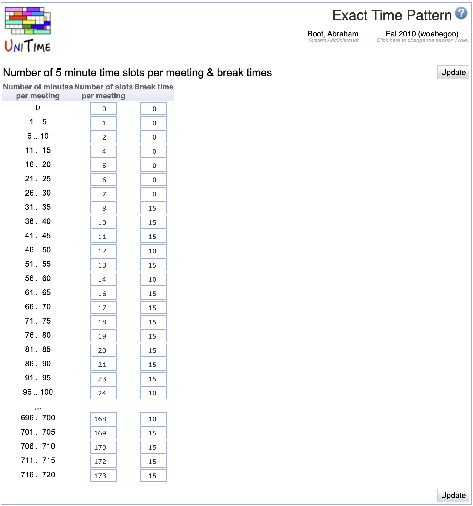

## Screen Description

In the Exact Time Pattern screen the user can define how many slots per meeting and how many minutes of break time should be associated with each number of minutes per meeting when the "Exact Time" time pattern is used for a class.

{:class='screenshot'}

For example, if a 200 minute long class has an exact starting time set to MW 8:00am (it takes place on Mondays and Wednesdays from 8:00 am), it has two meetings of 100 minutes, and each time the resources (room, instructor, etc.) will be allocated for the given number of 5 minute long time slots (given by this table) and the printed end time will be

* start time + 5 × number of slots for meeting of the length 96-100 minutes - break time [in minutes]

So, if there are 24 slots for 100 minute long meeting (2 whole hours to be allocated) and 10 minutes break time, the printed end time will be 9:50 am.

Note: Exact time should only be used in rare cases when the need for a non-standard times is so low that it does not justify establishing an ordinary time pattern.

Exact times can only be used if there is a time pattern of type Exact Time created on the [Time Patterns](time-patterns) screen and it is visible (other attributes like type, number of slots per meeting, break time, days and start times are irrelevant for Exact Time pattern). Also, only departments that are associated with this Exact Time time pattern can use it (as for Extended time patterns).

## Details

* **Number of minutes per meeting**
	* Number of minutes that the students should be in class each meeting (it does not include break time)
	* For each class, it is calculated from minutes per week which are set up in the [Instructional Offering Configuration](instructional-offering-configuration) screen divided by the number of meetings per week

* **Number of slots per meeting**
	* Indicates how many five minute long time slots should be associated with a given number of minutes per meeting (i.e., how much time should be blocked in the student's schedule for this class and the break after this class)

* **Break time**
	* Indicates how many minutes out of the ending time slots should be allocated to a break after a meeting

Example:

Number of minutes per meeting: 40

Number of slots per meeting: 10

Break time: 10

Interpretation of these numbers: For a class that meets for 40 minutes, the total number of 50 minutes (= 10 time slots x 5 minutes) should be blocked on students' schedules, 40 for instructions and 10 for a break so that students can e.g. change locations to get to another class.

## Operations

* **Update**
	* Save changes to the definitions of exact time and stay in this screen
