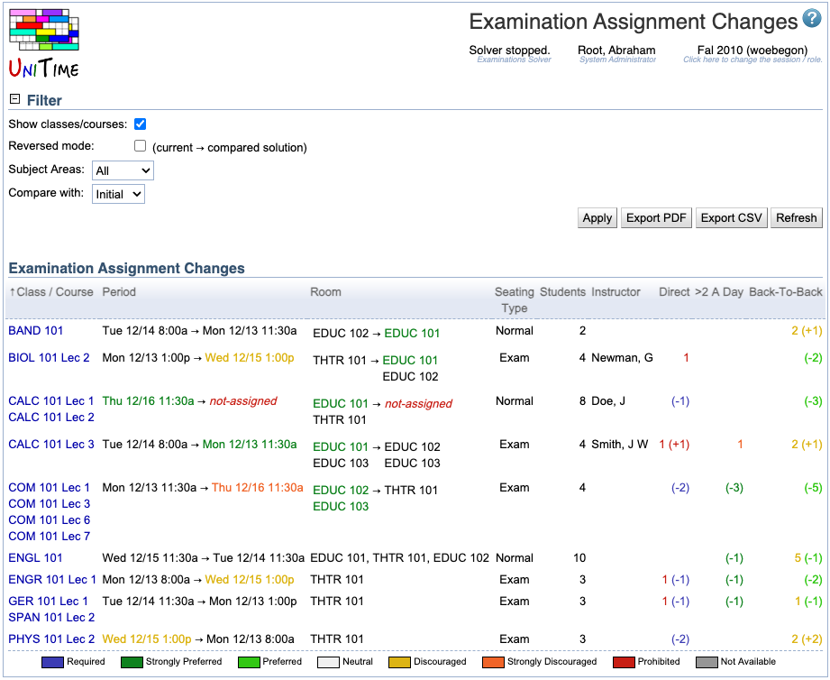

## Screen Description

In the Examination Assignment Changes screen, you can see changes made to the examination timetable. You can compare the current timetable with the Initial, Best, or Saved timetable. You can click on any change get to the [Examination Assignment](examination-assignment) screen for the changed exam.

{:class='screenshot'}

## Details

### Filter

Set up the filter to display changes you are interested in.

* **Show classes/courses**
	* Show classes/courses instead of examination name
		* When checked, names of all classes/courses that are associated with the exam are listed
		* When unchecked, the examination name is printed

* **Reverse mode (current → compared solution)**
	* When checked, period and room changes are listed in reversed order

* **Subject Areas**
	* Select for which subject area to display changes; to display changes for all subject areas, select "All"

* **Compare with**
	* Select with which timetable you want the current timetable to be compared
	* Options:
		* Initial - timetable initially loaded into the solver
		* Best - best solution found so far (either generated by the solver or saved by the user to the best timetable found so far in the [Examination Solver](examination-solver) screen)
		* Saved Solution - timetable saved before

### Changes

A list of changes in period/room assignments. Click on any change to go to the [Examination Assignment](examination-assignment) screen to see the details about the examination and make a change in its assignment.

## Operations

* **Apply**
	* Apply changes made to the filter

* **Export PDF**
	* Export the list of changes to a PDF document

* **Refresh**
	* Refresh the screen

