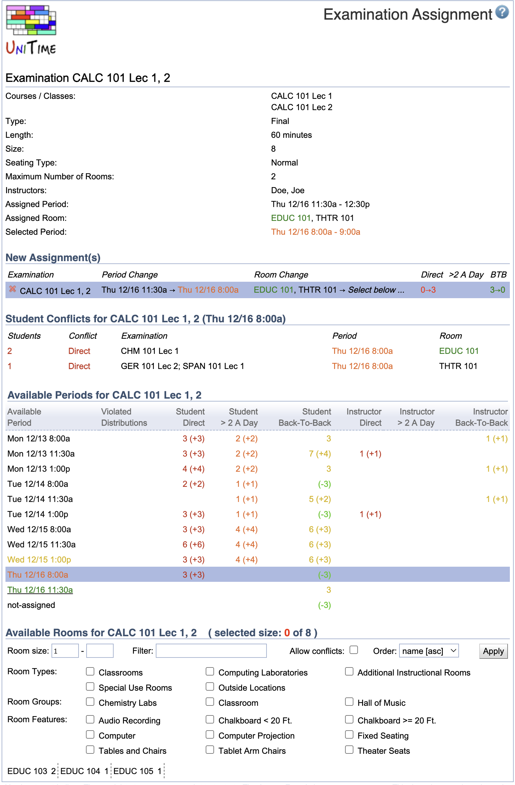

## Screen Description

The Examination Assignment screen provides interface for assigning time period and/or room to an examination manually (that includes making changes to the current assignment).

{:class='screenshot'}

## Examination

The top section of the screen provides an overview of examination properties.

* **Courses/Classes**
	* The instructional offering components that identify the students who need to take the examination (the students of these classes/courses/instructional offerings/configurations have to take this examination)

* **Type**
	* Midterm or Final

* **Length**
	* Length of the examination in minutes

* **Size**
	* Expected number of students to take this examination

* **Seating Type**
	* Exam or Normal
	* Based on the seating type, either room capacity (for Normal) or room examination capacity (for Exam) is used when fitting the examination into room(s) with sufficient seating capacity

* **Maximum Number of Rooms**
	* The maximum number of rooms into which an examination can be split (for example, an examination for a class of 400 students can be split into two or three rooms if they need to use Exam seating type and do not have a room with exam seating capacity of 400 seats)
	* An exam is not assigned to a room when the maximum number of rooms is set to zero (it is assigned to a period that best meets the student needs and period preferences).

* **Period**
	* The time period currently assigned to the examination

* **Room**
	* The room (or rooms) currently assigned to the examination

## New Assignment(s)

A list of changes that will be made to the examination timetable after the **Assign** button is clicked.

* **Examination**
	* Name of the examination

* **Period Change**
	* Change in the time period assignment

* **Room Change**
	* Change in the room assignment

* **Direct**
	* Change in number of direct conflicts for students

* **>2 A Day**
	* Change in number of students who will have more than two examinations in one day

* **BTB**
	* Change in number of students who will have back-to-back examinations

## Violated Distribution Preferences

This list of violated distribution preferences is displayed only if applicable.

* **Preference**
	* The preference level (prohibited, strongly discouraged, ..., required)

* **Distribution**
	* Distribution preference that has been violated

* **Exam**
	* Name(s) of the other examination(s) involved in that distribution preference (other than the New Assignment(s) examination)

* **Period**
	* Time period currently assigned to the conflicting examination

* **Room**
	* Room(s) currently assigned to the conflicting examination

## Student Conflicts

This table lists details about student conflicts for the selected examination.

* **Students**
	* Number of students with the conflict detailed on a particular line

* **Conflict**
	* Type of conflict (direct, back-to-back, ...)

* **Exam**
	* Examinations that are in conflict with the examination(s) in the New Assignment(s) section

* **Period**
	* Time period assignment of the conflicting examination

* **Room**
	* Room assignment of the conflicting examination

## Instructor Conflicts

The structure of the Instructor Conflicts table is the same as the one of the Student Conflicts table described above.

## Available Periods

This section presents a list of available time periods for this examination with the following information for each of the periods:

* **Available Period**
	* A time period available for the examination

* **Violated Distributions**
	* [Examination Distribution Preferences](examination-distribution-preferences) that would be violated if the period was assigned to the examination

* **Student Direct**
	* Number of direct student conflicts (i.e., overlapping examinations)
	* The parenthesis contain the change in number of direct student conflicts that would be caused by change of assignment from the currently assigned time period to the time period on a given line

* **Student >2 A Day**
	* Number of students who would have more than two examinations on the same day if this time period was assigned to the examination

* **Student Back-To-Back**
	* Number of students who would have back-to-back examinations if this time period was assigned to the examination

* **Instructor Direct**
	* Number of cases when instructors would have overlapping examinations if this time period was assigned to the examination

* **Instructor >2 A Day**
	* Number of instructors who would have more than two examinations on the same day if this time period was assigned to the examination

* **Instructor Back-To-Back**
	* Number of instructors who would have back-to-back examinations if this time period was assigned to the examination

## Available Rooms

This section, listing rooms available for the examination at a given time, is displayed after a time period has been selected.

* **Room Size**
	* Only rooms with seating capacity in this range will be displayed
	* For examinations with Normal seating type the rooms capacity is considered, for examinations with Exam seating capacity the examination room capacity is considered

* **Filter**
	* Enter e.g. a room abbreviation to see only available rooms in a given building
	* Semicolon can be used as logical or. For instance, **a,b;c** will display all rooms containing both **a** and **b** in their names or containing **c** in their names.

* **Allow Conflicts**
	* Include rooms that are already used for an examination
	* Such rooms are displayed in red
	* If such room is selected, the New Assignment(s) section of this screen will have a new line with the examination that got unassigned (you can click on that line to find time/room assignment for that examination)

* **Order**
	* Select order of the rooms displayed in this section

Click **Apply** to apply changes to the list of rooms

The rooms are displayed in six columns. For each of the room there is a building abbreviation, room number and room capacity. To select a room for a given examination, click on its name. Only when you have the desired number of seats in the room(s) selected the rooms become a part of the assignment in the New Assignment(s) section. (You can select more than one room if the number in Maximum Number of Rooms is larger than one.)

## Suggestions

The Suggestions section is only displayed when the examinations are loaded to the solver (through the [Examination Solver](examination-solver) page). Check the checkbox in front of the name of the section to see possible period/room assignment changes (suggestions). The suggestions are listed in the order of possible "harmfulness" to the existing examination timetable.

* **Value**
	* Change in the value of the optimization function caused by accepting this suggestion (the lower number the better)

* **Examination**
	* Examinations affected by this change

* **Period Change**
	* Change in period for the given examination

* **Room Change**
	* Change in room for the given examination

* **Direct**
	* Change in the number of direct student conflicts (overlapping examinations)

* **>2 A Day**
	* Change in the number of students who will have more than two examinations per day

* **BTB**
	* Change in the number of students who will have back-to-back examinations

## Notes

### Sample use of this screen

Situation: The user wants to switch rooms for two examinations that are held at the same time. At the beginning, Exam 1 has Room A at a certain time and Exam 2 has Room B at the same time. The user wants to end up with Exam 1 in Room B and Exam 2 in Room A, time unchanged.

Solution:

	1. Get to this Examination Assignment screen for Exam 1 from e.g. the list of Examinations.
	2. In Available Periods, click on the time period highlighted with a blue background - that is the currently assigned time period.
	3. In the Available Rooms section (that showed up after clicking on the time period), check the "Allow conflicts" checkbox and click Apply. Room B should appear in red letters.
	4. Click on Room B in the Available Rooms
	5. In the New Assignment(s) section, click on Exam 2 (the line with Exam 2 was added to New Assignment(s) because the room for Exam 2 was unassigned)
	6. In Available Periods, click on the time period that also became unassigned (the time that you want to keep)
	7. In Available Rooms, click on Room A; now the New Assignment(s) section should show a change that results in Exam 1 having Room B and Exam 2 having Room A.
	8. Click on the Assign button under the New Assignment(s) section
	9. Click OK in the pop-up window (yes, you want to save changes)

The switch has been made!
