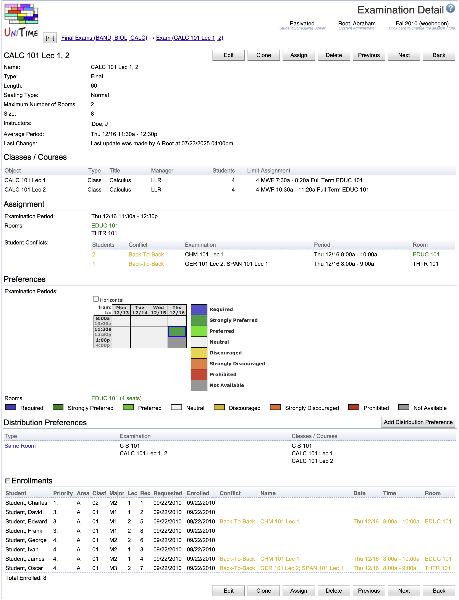

## Screen Description

The Examination Detail screen provides an overview of properties of an examination, including preferences on its time/room and the assigned time/room, if applicable.

{:class='screenshot'}

## Details

* **Name**
    * Name of the examination
    * If nothing is entered by the user, a list of courses/classes whose students need to take this examination is displayed (for example, "MA 170; STAT 170" or "BIOL 110; 111 Lec 1; 112; 113 Lec 1" - the information which is common to the classes such as the subject area is displayed only once)
    * See [Exam Naming Convention](exam-naming-convention) for more details about examination naming conventions.

* **Type**
    * Type of the examination
    * Midterm or Final
    * See [Examination Types](examination-types) screen in the Administration.

* **Length**
    * Length of the examination in minutes

* **Seating Type**
    * Exam or Normal seating type
    * An examination needs to be assigned to one or more rooms of sufficient capacity. Based on this seating type, either the room capacity (Normal type) or the room examination capacity (Exam type) must be met. These capacities are displayed for each room on the [Rooms](rooms) page.

* **Maximum Number of Rooms**
    * The maximum number of rooms into which an examination can be split (for example, an examination for a class of 400 students can be split into two or three rooms if they need to use Exam seating type and do not have a room with an exam seating capacity of 400 seats)
    * An exam is not assigned to a room when the maximum number of rooms is set to zero (it is assigned to a period that best meets the student's needs and period preferences).

* **Size**
    * The total number of students in the classes that require this examination

* **Instructors**
    * A list of instructors associated with the examination and their email addresses (displayed only if there are any)

* **Average Period**
    * Displayed only if applicable (for final examinations)
    * (Weighted)average time period for this examination as calculated from previous semesters
    * See more in the "Other Criteria" section of the [Examination Timetabling](examination-timetabling) page

* **Last Change**
    * Information about the last change made to this examination

### Classes/Courses

This section provides information about the instructional offering components (classes, instructional offering configurations, course offerings, and instructional offerings) whose students need to take this examination. These components define what students are to attend the examination (i.e., students who are enrolled in the classes/courses/etc displayed in this section).

* **Object**
    * Class, instructional offering configuration, course offering, or instructional offering

* **Type**
    * Type of the object (Class, Configuration, Course or Offering)

* **Title**
    * Title of the component, that is:
        * Course offering title of the course
        * Controlling course offering title of the offering
        * Controlling course offering title of the offering of the configuration
        * Student schedule note of the class (if present, controlling course title otherwise)

* **Manager**
    * The manager who timetables the component

* **Students**
    * Number of students enrolled in the component

* **Limit**
    * Limit of the component (maximum number of students allowed in the component)

* **Assignment**
    * The timetable for the class/course

**Note:** For midterm examinations, an examination must be placed in a room (or rooms) that are of equal or greater capacity (either normal or examination capacity, based on the seating type of the exam) of total enrollment of the offering components associated with the exam as well as the total of limit of these offering components. The reason for this is that the enrollment might not be fixed by the time the midterm examination schedule is being produced. For final examinations, only the total enrollment of the appropriate offering components is considered. This behavior can be changed using the `tmtbl.exam.useLimit.<type>` settings in the [Application Configuration](application-configuration).

### Assignment

Current assignment for the examination. To change it, click on the Assign button in this screen.

* **Examination Period**
    * Time period assigned to the examination

* **Room**
    * Room assigned to the examination

* The other parts are displayed if applicable:
    * **Violated Distributions**
        * Violated distribution preferences
    * **Student Conflicts**
        * Number of student conflicts broken down into conflicts with particular examinations
        * For midterm examinations, direct conflicts with evening classes are considered (and displayed) as well. This behavior can be changed using the `tmtbl.exam.eventConflicts.<type>` settings in the [Application Configuration](application-configuration).
    * **Instructor Conflicts**
        * Instructor conflicts (for instructors that are assigned to the examination) are displayed in the same manner as student conflicts.

### Preferences

* **Examination Periods**
    * A time grid for the available examination periods together with the color-coded preferences for each of the periods

* **Rooms**
    * Color-coded room preferences

* **Distribution Preferences**
    * List of distribution preferences that this exam participates in.

### Enrollments

List of students enrolled in the exam. That is, students who are enrolled in any of the classes/courses of the exam. Besides student names and curriculum information, the table also includes direct (red), more than two exams on a day (orange), and back-to-back (yellow) conflicts of the student if they involve this exam.

## Operations

* **Edit**
    * Edit the examination properties and preferences in the [Edit Examination](edit-examination) screen

* **Clone**
    * Add another examination with the same properties as the one currently displayed (except for time preferences, which need to be re-entered) - the [Add Examination](add-examination) screen will be pre-populated with applicable data

* **Add Distribution Preference**
    * Add a new distribution preference in the [Add Examination Distribution Preference](add-examination-distribution-preference) screen

* **Assign**
    * Go to the [Examination Assignment](examination-assignment) screen to look at details of the current assignment and/or to change the current assignment

* **Delete**
    * Delete this examination and go back to the [Examinations](examinations) screen

* **Previous**
    * Go to the Examination Detail screen for the previous examination ("previous" according to the list from which you entered this screen)

* **Next**
    * Go to the Examination Detail screen for the next examination ("next" according to the list from which you entered this screen)

* **Back**
    * Go back to the screen from which you entered this screen

