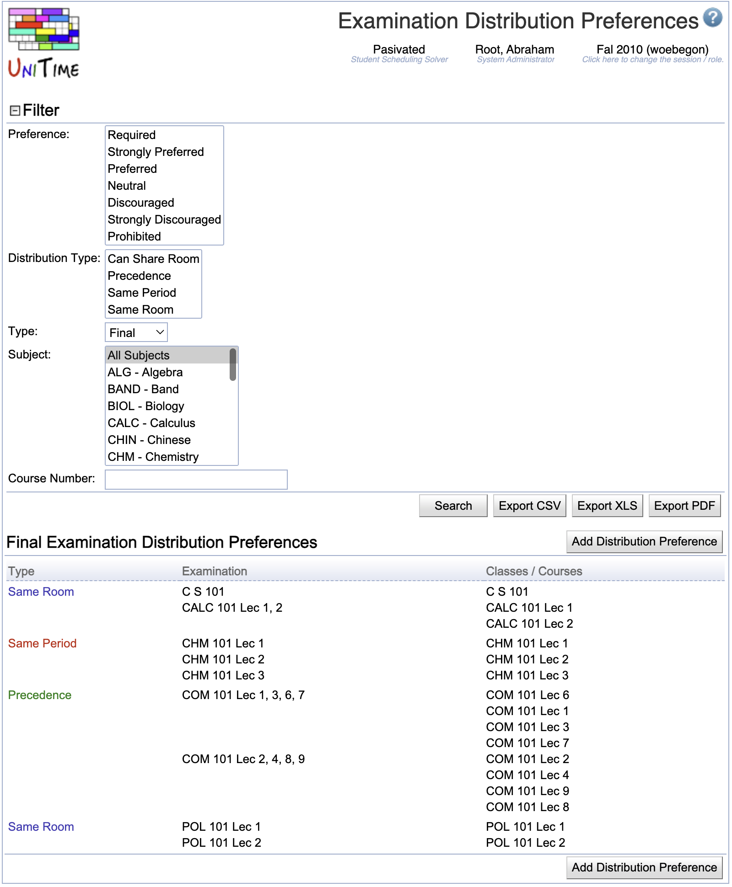

## Screen Description

The Examination Distribution Preferences screen provides a list of distribution preferences related to either midterm or final examinations.

{:class='screenshot'}

## Details

The following criteria can be used to specify what distribution preferences should be listed

* **Type**
	* Type of the examination (midterm or final)

* **Subject**
	* Subject area

* **Course Number**
	* Course number or a "wild card" (such as "2*" for all courses starting with 2)

Click the **Search** button to apply any changes to the search criteria.

The list of distribution preferences has the following columns

* **Type**
	* Type of the distribution preference
	* Possible types
		* Precedence
			* Exams are to be placed in the given order.
			* When prohibited or (strongly) discouraged: exams are to be placed in the order reverse to the given one.
		* Same Period
			* Exams are to be placed at the same period.
			* When prohibited or (strongly) discouraged: exams are to be placed at different periods.
		* Same Room
			* Exams are to be placed at the same room(s).
			* When prohibited or (strongly) discouraged: exams are to be placed at different rooms.

* **Exam**
	* The name of the examination (it is automatically generated from the classes/courses names unless overridden by the user in the [Edit Examination](edit-examination) screen)

* **Class/Course**
	* Instructional components (offerings, courses, configurations, classes) associated with the examination

Click on any distribution preference to get to the [Edit Examination Distribution Preference](edit-examination-distribution-preference) screen.

## Operations

* **Export PDF** (ALT+P)
	* Export the list of distribution preferences into a PDF file

* **Add Distribution Preference** (ALT+A)
	* Go to the [Add Examination Distribution Preference](add-examination-distribution-preference) screen to add a new distribution preference

