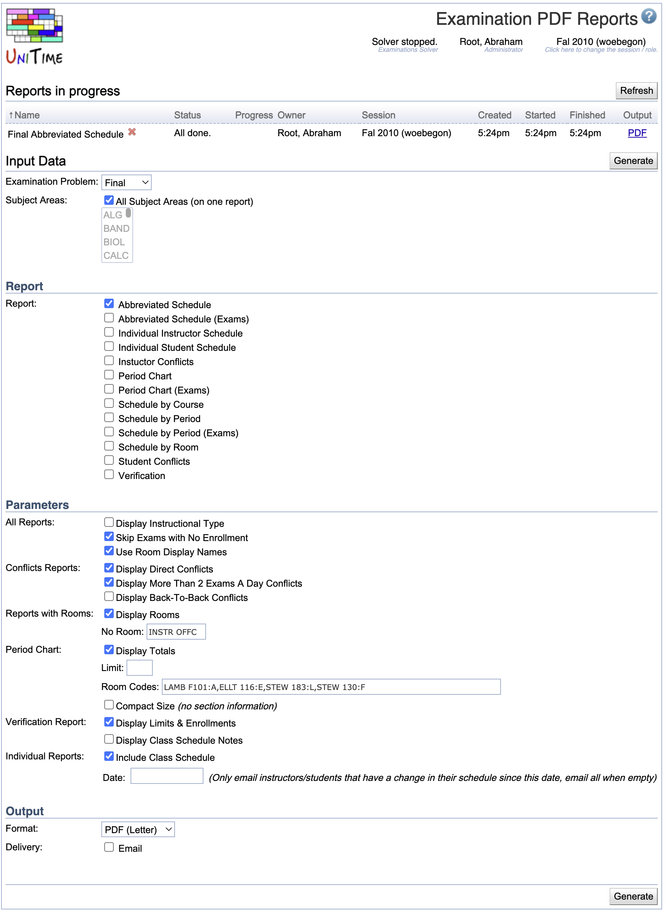

## Screen Description

The Examination PDF Reports screen provides an interface for selecting and generating PDF reports for further distribution among users whose email addresses are in the system or entered on this page.

{:class='screenshot'}

## Details

### Reports in progress

* The recently generated reports and the reports that are being generated are shown in this section. Click a report to see more details.
* The section is only available when there is at least one line to show.

### Input Data

* **Examination Problem**
    * Midterm or Final examinations

* **Subject Areas**
    * If the "All Subject Areas (on one report)" checkbox is checked, one report will be generated with each subject area starting on a new page
    * If the checkbox is unchecked, the user can select any subject area(s) he/she wants, and a report will be generated for each of these subject areas separately

### Report

Check all reports that should be generated and distributed. The reports currently available are

1. **Abbreviated Schedule**
    * Examination schedule
2. **Abbreviated Schedule (Exams)**
    * Examination schedule in which examinations are listed only once (even if they are held for more than one class/course), but each examination lists all the courses/classes that are a part of it
3. **Individual Instructor Schedule**
    1. An examination schedule for each instructor (if it is being distributed to instructors, a file is generated for each instructor even when the "All Subject Areas" is checked in the "Input Data" section)
    2. A class schedule can be included if "Include Class Schedule" is checked in the "Parameters" section
4. **Individual Student Schedule**
    * An examination schedule for each student (if it is being distributed to students, a file is generated for each student even when the "All Subject Areas" is checked in the "Input Data" section)
    * A class schedule can be included if "Include Class Schedule" is checked in the "Parameters" section
5. **Instructor Conflicts**
    * A list of conflicting examinations together with the instructor's name and type of conflict (such as Back-To-Back)
    * The type of conflicts to be included in this report can be selected in the "Parameters" section of the Examination PDF Reports screen
    * Besides "Direct", "BTB", or ">2-day", the type of conflict may also be "Class" (if an examination is overlapping with a class) or "Event" (if an examination is overlapping with a course-related event that the students must attend)
6. **Period Chart**
    * Examinations are listed by periods in which they occur
7. **Period Chart (Exams)**
    * Examinations are listed by periods in which they occur
8. **Schedule by Course**
    * Examinations schedule organized by courses/classes
9. **Schedule by Period**
    * Examination schedule organized by examination periods (each period starts on a new page)
10. **Schedule by Period (Exams)**
    * Examination schedule organized by examination periods (each period starts on a new page)
11. **Schedule by Room**
    * Examination schedule for each room
12. **Student Conflicts**
    * A list of conflicting examinations together with the student's name and type of conflict (such as Back-To-Back)
    * Besides "Direct", "BTB", or ">2-day", the type of conflict may also be "Class" (if an examination is overlapping with a class) or "Event" (if an examination is overlapping with a course-related event that the students must attend)
13. **Verification**
    * Report for schedule deputies to verify which classes/courses should have examinations (and later at what period/room)
    * Contains all courses/classes for a given subject area and
        * Before examination timetabling: Information about requested examinations (required/prohibited periods/rooms, etc.); if no examination is requested, it says ** NO EXAM **
        * After examination timetabling is done: Period/room assignments for timetabled examinations or ** NO EXAM ** if a class/course does not have an examination
    * At times when classes have the same properties, they are displayed on the same line (for example, Rec 1-10 ** NO EXAM **)

### Parameters

* **All Reports**
    * Display Instructional Type
        * Display the instructional type, such as Lec, Rec, ... in the reports
    * Skip Exams with No Enrollment
        * Exclude examinations that have no students enrolled
    * Use Room Display Names
        * Use room display names (instead of building abbreviation and room number) where available

* **Conflicts Reports**
    * Check which kinds of conflicts should be displayed (Direct, More Than 2 Exams A Day, Back-To-Back)

* **Reports with Rooms**
    * Display Rooms
        * Display rooms in the reports
    * No Room
        * Enter text that should be displayed in the reports when no room is assigned to the examination (for example, it can be "INSTR OFFC" so that both students and instructors know that the meeting place for the examination is the office of the instructor)

* **Period Chart**
    * Display Totals
        * Display the total number of students who should take examinations during a given period
    * Limit
        * Include only examinations that have the expected number of students equal to or higher than the limit
    * Room Codes
        * You can enter a one-letter room code for a room, and the code will be displayed in the period chart in the column between Exam and Enrl
        * The notation is "Room label:code" - for example, "EDUC 101:A"
        * You can enter codes for more than one room, just divide the entries by commas (for example "EDUC 101:A,EDUC 102:B,EDUC 103:C,THTR 101:T")
    * Compact Size
        * Exclude section information to make the report more compact

* **Verification Report**
    * Check whether or not to display limits & enrollments, and whether to display class schedule notes

* **Individual Reports**
    * Include Class Schedule
        * If checked, the recipient receives not only his/her examination schedule, but also his/her current class schedule
    * Date
        * Only email instructors/students who have a change in their schedule since this date, email all when empty

### Output

* **Format**
    * Either a PDF document (Letter or Ledger) or text
    * CSV, XLS, and a new version of PDF (no fixed columns) are also available

* **Delivery**
    * If Email is checked, emails will be sent out following the information entered in
        * **Address**
            * Email addresses where output should be delivered (if not to one of the groups that have checkboxes right under this field)
            * **All Involved Department Schedule Managers**
                * The output will be sent to the email addresses of all schedule managers whose subjects have been selected in the "Input Data" section
            * **Send Individual Instructor Schedule Reports to All Involved Instructors**
                * If the report "Individual Instructor Schedule" is selected in the Report section, send an email to each instructor (to the email address stored in the timetabling application in Course Timetabling → Input Data → [Instructors](instructors)) with his/her individual examination schedule
            * **Send Individual Student Schedule Reports to All Involved Students**
                * The email addresses used are the email addresses imported in the XML import described in Student Information under Students in [XML Interfaces](xml#xml-formats-for-student-data-import-and-export)
        * **CC**
            * Enter email addresses that should receive a copy of the report
        * **BCC**
            * Enter email addresses that should get the reports in a copy, but should be hidden from other addressees
        * **Subject**
            * Subject of the email that will be sent out
        * **Message**
            * Enter any message needed for the email report distribution.
        * Note: When individual reports are being generated and sent out, the addressees in the Address field will get only one email for all individual instructor reports and/or one email for all individual student reports (the reports will be all in one document), while the addressees in the CC: and BCC: fields will get a copy of each email generated (each email for an individual student or instructor)
    * If Email is not checked, the report(s) will be generated and available through the application, in the current screen

## Operations

* **Generate** (ALT+G)
    * Generate selected reports and deliver them as selected in the Output section of the screen
    * The generated reports will appear in the *Reports in progress* section
    * **Note:** It may take some time to generate the requested report or reports (especially for the verification and individual schedule reports). Use the **Refresh** button to refresh the page. If you are emailing the reports, you do not need to wait for this page to return.
