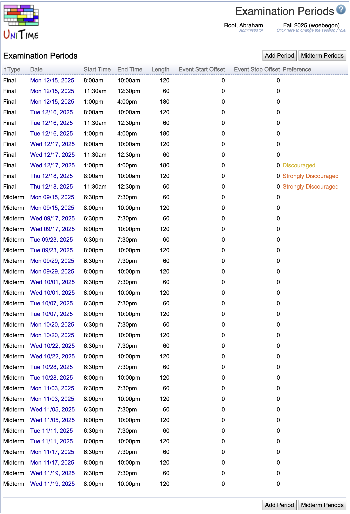

## Screen Description

The Examination Periods screen provides a list of all examination periods set up for the current session.

{:class='screenshot'}

Please note that the [Examinations](university-timetabling-application#examinations) menu is only available when there is at least one examination period defined for the current academic session.

**Note:** All examination periods are relative to the **Exams Begin** date set on the [Academic Sessions](academic-sessions) screen. If this date is moved, all periods are automatically moved as well.

## Details

* **Type**
    * Type of the examination (Midterm, Final)
    * Additional examination types can be defined on the [Examination Types](examination-types) screen

* **Date**
    * Examination date

* **Start Time**
    * Time when the examination should start

* **End Time**
    * Time when the examination period ends
    * Computed from Start Time and Length

* **Length**
    * Duration of the examination (minutes)

* **Event Start Offset**
    * For how many minutes before the examination should the room be available for students to enter and sit down, or to prepare the room (rearrange chairs, etc)

* **Event Stop Offset**
    * How many minutes after the examination should the room be available for the students to leave the room or to return the room to the state where it was before the examination

* **Preference**
    * Is it preferable in general to use this examination period? For example, some schools may discourage examinations on Saturdays (there are still examination periods on Saturday, but if possible, examinations are timetabled on other days)

## Operations

The table can be sorted by any of its columns, just by clicking on the column header you want the table to be sorted by. Second, click on the same column will reverse the order.

### Add Examination Period
Click **Add Period** to add a new examination period

{:class='screenshot'}

**Note:** the regular, typically midterm, examination periods can be set up using the [Setup Examination Periods](#setup-examination-periods) screen, where it is easy to set up days and times for several weeks/months together.

* Click **Save** the new examination period
* Click **Back** to return to the list of examination periods without making any changes

### Edit Examination Period
Click on any examination period to make changes or to delete the examination period.

{:class='screenshot'}

* Click **Update** to make changes, **Back** to return to the list without making any changes
* Click **Delete** to delete the examination period

### Setup Examination Periods
Click **Midterm Periods** to set up midterm examination periods all at once. The option is available for all existing examination types that have either no periods configured yet, or they have the very same periods every examination day, with no more than five periods a day.

{:class='screenshot'}

In the first part of the screen, it is possible to set up up to five examination periods. Those periods will then be created for each of the dates indicated in the calendar in the second part. Only the periods that have their Start Time filled in will be created - the user can, e.g., fill in data for two examination periods and leave the rest empty - then there will be two examination periods created for each date from the calendar.

* **Type**
    * Type of examinations for which the periods are set up

* **1st Period Start Time**
    * The start time of the first examination period
    * If the start time is left empty, the examination period will not be created

* **1st Period Length**
    * The length of the first examination period

* **1st Period Event Start Offset**
    * For how many minutes before the examination should the room be available for students to enter and sit down, or to prepare the room (rearrange chairs, etc)

* **1st Period Event Stop Offset**
    * How many minutes after the examination should the room be available for the students to leave the room or to return the room to the state where it was before the examination

* **Examination Dates**
    * To indicate dates on which the examinations should be held, click on the yellow rectangle ("Examinations offered") and then on the dates
    * To correct the dates and indicate that on some days there should be no examinations, click on the white rectangle ("Examinations not offered") and then on the dates when the examinations should not be offered
    * The calendar includes information about state and other holidays - the off days have red or pink borders in the calendar; the user can still set up examination periods for those days

* Click **Save** to make changes, **Back** to return to the list without making any changes

* To set up a single examination period that is different from the "regular" ones, use the [Add Examination Period](#add-examination-period) screen.
* To make changes to an individual examination period (after the general pattern is set up in this screen), click on the examination period in the [Examination Periods](examination-periods) screen and make changes (such as changing time or preference) in its [Edit Examination Period](#edit-examination-period) screen.
