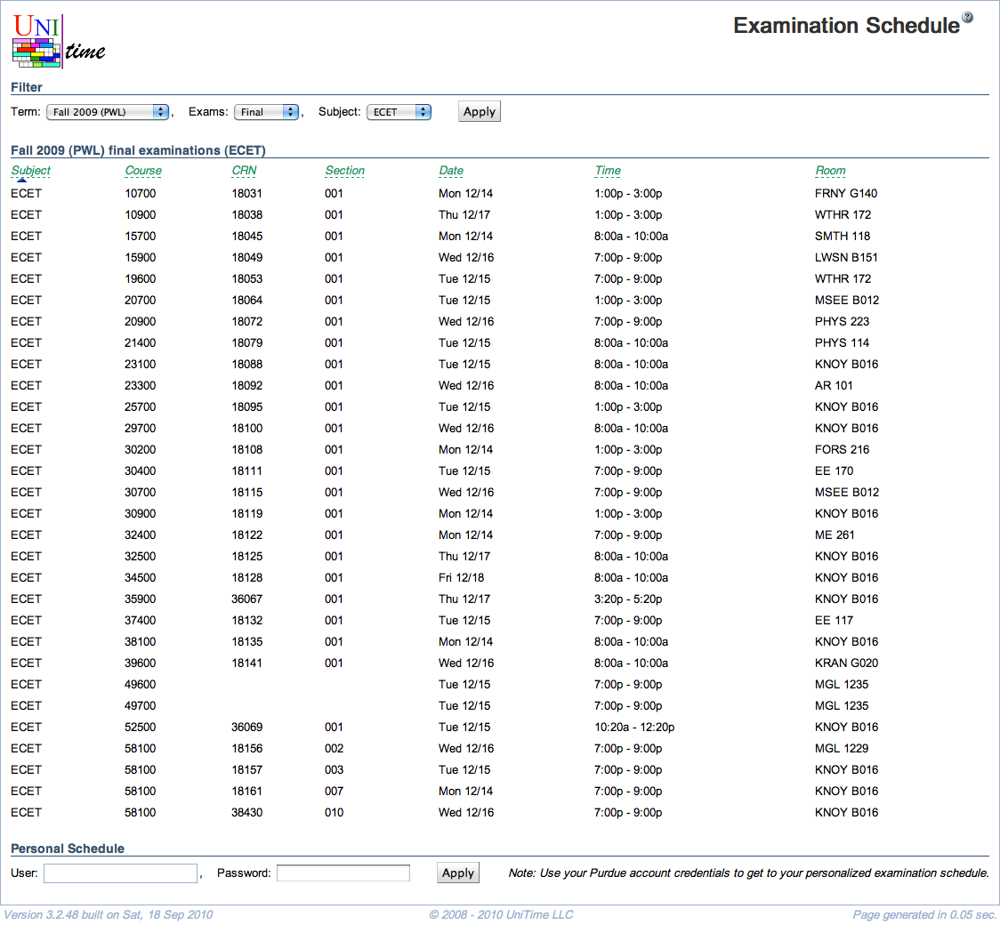

## Screen Description

The Examination Schedule screen allows users who do not need to be authenticated in the timetabling application to view an examination schedule. It is possible to authenticate and receive a personalized schedule - see the last section of this screen.

{:class='screenshot'}

## Filter

* **Term**
	* Academic term for which the examinations should be displayed

* **Exams**
	* Type of examinations to be displayed (Final or Midterm)

* **Subject**
	* Select subject area for which the examinations should be displayed (examinations for all subject areas are displayed if the "All" option is selected)

Click **Apply** to apply changes to the filter and display the examination schedule.

## Examinations

The list of examinations that can be sorted by any of the columns - just click the column header in green letters.

* **Subject**
	* Subject area

* **Course**
	* Course number

* **Instruction Type**
	* Lecture, lab,...
	* When there is one examination for the whole course (with multiple classes), no instruction type is displayed

* **Section**
	* Section number that distinguishes for which class the examination is held (not displayed if there is one examination for all classes of a course)

* **Date**
	* Examination date

* **Time**
	* Examination time

* **Room**
	* Examination room
	* There can be more than one room per examination

## Personalized Examination Schedule

Log on to the timetabling application to see your personalized schedule. (For Purdue users, the career account and password ought to be used.)

* **User**
	* User's login name

* **Password**
	* User's password

Click **Apply** to log on to see the personalized schedule.

Note: Filter settings may be passed on the URL, e.g., the following URL will select all final examinations for Fall 2007 on woebegon campus:
```
https://<portal>/UniTime/exams.do?select=1&year=2007&term=Fal&campus=woebegon&subject=--ALL--&type=final
```
