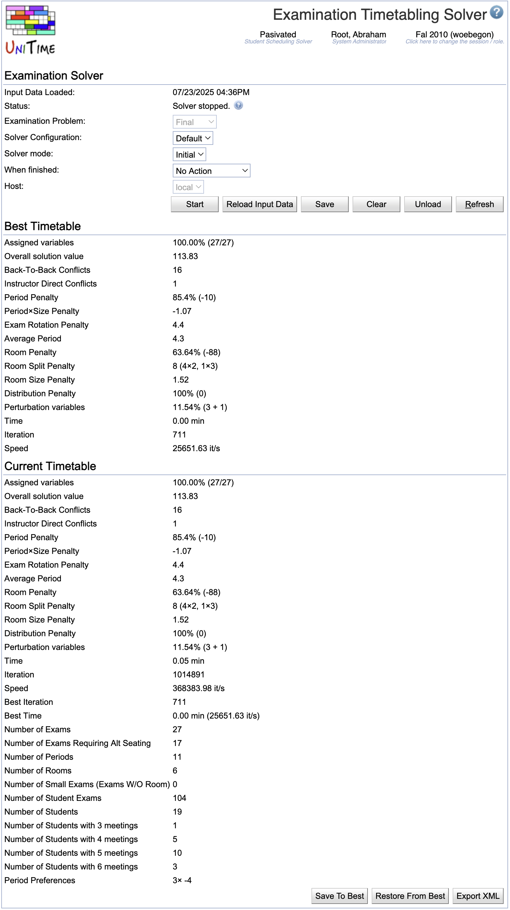

## Screen Description

The Examination Solver screen provides interface for running the solver to schedule midterm or final examinations.

{:class='screenshot'}

Note: There can only be at most one examination solver running at any time in the application. That is different from the course timetabling solver where several users can have their solvers running at the same time.

## Solver Not Started

### Solver

* **Status**
	* Status of the solver

* **Examination Problem**
	* Indicate which type of examinations you want to timetable - either Midterm or Final

* **Solver configuration**
	* Configuration - see [Solver Configurations](solver-configurations) for more information

* **Solver mode**
	* Options: Initial - creates a new timetable; MPP - continues working on the loaded timetable, trying to find a better timetable with as few differences from the loaded one as possible

* **When finished**
	* Choose what to do when the time-out limit on the solver is reached

* **Host** (admin)
	* Select server you want to run the solver on (setting "auto" means that the least occupied solver will be used, this is the default behavior for non-administrator users)

### Operations

* **Load**
	* Load all input data necessary to create an examination timetable (time preferences, rooms, instructors, distribution preferences, student enrollments, ...) to the solver.

* **Start**
	* Load all necessary data and start creating a timetable

* **Refresh**
	* Refresh this screen

## Loading Input Data

During the loading phase, input data and student information is loaded and the examinations which have only one required room and one required time period will get them assigned.

### Solver

* **Input data loaded**
	* Time stamp from the time when the latest load of input data started

For the rest, see above

### Current Timetable

An initial timetable is created as soon as you start loading data. Only examinations with one required time period and one required room get there assignments at this point.

### Operations

* **Refresh**
	* Refresh this screen
		* When loading is done, new buttons will appear

## Awaiting commands

### Operations

* **Start**
	* Start the solver which will create/improve an examination timetable

* **Reload Input Data**
	* Reload input data while keeping the current timetable
		* The assignments that are no longer valid due to the change in the input data will be unassigned (see the [Not-Assigned Examinations](not-assigned-examinations) screen for their list)

* **Save**
	* Replace the timetable that was loaded originally with this new one

* **Clear**
	* Delete all assignments for the given examination problem (in order to start assigning time periods and rooms all over again, independent of last assigned time periods/rooms)

* **Unload**
	* Unload all data and the timetable from the solver

* **Refresh**
	* Refresh this screen

## Solving problem

### Solver

See above

### Operations

* **Stop**
	* Stop the solver

* **Refresh**
	* Refresh this screen

## Solver stopped

### Best Timetable Found So Far

During the automated timetabling (when the solver is running), the best timetable found so far is saved here. It is the timetable that is presented to the user when they stop the solver or when the time-out is reached.

When the user interacts and makes changes, they can save intermediate results as "Best Timetable Found So Far" and later come back to this timetable if the current one is not good.

### Current Timetable

When solver is stopped, the Best Timetable Found So Far is the same as the Current Timetable. From that moment, any manual changes made by the user are applied to the Current Timetable.

Operations

* **Restore From Best**
	* Discard the current timetable and start again from the best timetable found so far

* **Store To Best**
	* Overwrite the Best Timetable Found So Far with this current timetable (when you consider the current one better and want to store it temporarily)

### Problems

The list of warnings appears if any problem occurred during the data load. If there is a problem during solving, there will be an error message (such as Error: FATAL).

### Operations

* **Start**
	* Restart the solver from the current timetable

* **Reload Input Data**
	* Reload the data from the Input Data section without loosing the current time/room assignments in the current timetable; only prohibited assignments will be lost if breaking hard constraints is not allowed

* **Save**
	* Replace the timetable that was loaded originally with this new one

* **Clear**
	* Delete all assignments for the given examination problem (in order to start assigning time periods and rooms all over again, independent of last assigned time periods/rooms)

* **Unload**
	* Unload both the input data and the timetable from memory (any timetable will be lost unless saved in the Best Timetable Found So Far section)

* **Refresh**
	* Refresh this screen
