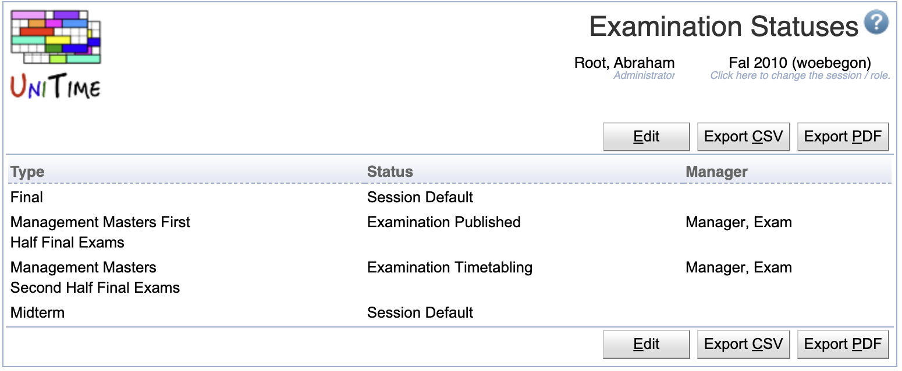

## Screen Description

It is possible to set the examination status individually for each examination type, using the Examination Statuses page. This examination status, if set, overrides the academic session status (for all users).

{:class='screenshot'}

Examination statues can be defined on the Administration > Other > [Status Types](status-types) page, by setting the **Apply to Examinations**. The following statuses are created by default:

* **Examination Disabled**,
* **Examination Data Entry**,
* **Examination Timetabling**,
* and **Examination Published**.

The examination statuses can be set on the Examination Statuses page. This allows for each examination problem to be viewed, edited, timetabled, and published at a different time. Session Defaults falls back to the former behavior (using status of the academic session instead).

## Managers

It is also possible to attach examination managers to each examination type (for the current academic session). If this relation is defined, only the selected manager(s) can view, edit, or timetable the given examination problem (based on the status). If this relation is NOT defined, all examination managers can view, edit, or timetable all examination problems. This relation is also to be edited on the Examination Statuses page. Only managers with a role that is academic session dependent and that allows to access the examination solver are listed.

## Notes

The Examination Statuses permission is needed to access the page. Permission Examination Status Edit is needed to be able to make changes.
