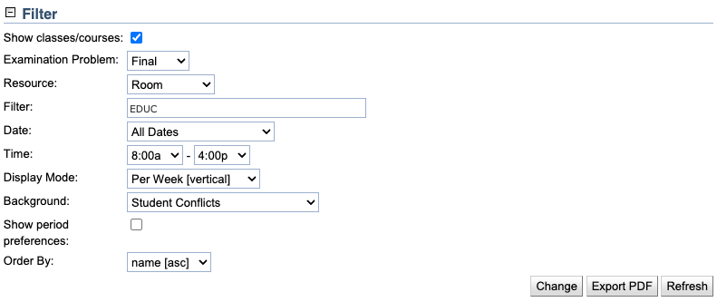

## Screen Description

 The Examination Timetable screen displays a time grid for the midterm or final examination timetable.

## Filter

* **Examination Problem**
	* Select whether midterm or final examinations should be displayed

* **Resource**
	* Select based on which resource the time grid should be organized (for example, display the time grid by room)

* **Filter**
	* Filter the selected resource by a substring (for example, filter rooms to display only rooms in a certain building - based on building abbreviation; or filter instructors by last name - such as Brown)
	* Semicolon can be used as logical or. For instance, **a,b;c** will display all instructors (or rooms or subject areas, based on the selected resource) containing both **a** and **b** in their names or containing **c** in their names.

* **Date**
	* Scope of dates for which you want to see the time grid

* **Time**
	* Limit the time range for which the examinations should be displayed

* **Display Mode**
	* Options
		* In Row [horizontal] - resources on the left, dates/times on top
		* In Row [vertical] - dates/times on the left, resources on top
		* Per Day [horizontal] - days on the left, times on top
		* Per Day [vertical] - times on the left, days on top
		* Per Week [horizontal] - days on the left, weeks on top
		* Per Week [vertical] - weeks on the left, days on top

* **Background**
	* Select what property should be color-coded in the background color of the time grid cells
	* Example: When "Period Preferences" are selected, the background color of each examination in the grid indicates whether the examination got a time period that was required, or strongly preferred, or ... prohibited (see the legend below the time grid)

* **Show Period Preferences**
	* When checked, default examination preferences that are set for all examinations will be displayed as the background color in the time grid

* **Order By**
	* Select whether the grid should be ordered by name or size, in ascending or descending ordered

 To apply the changes made to the filter, click the **Change** button.

## Examination Timetable

 This section contains the time grid selected in the filter section of the screen.

{:class='screenshot'}

{:class='screenshot'}

## Legend

 Legend explains the scale for the selected background color coding.

## Operations

* **Export PDF**
	* Export the time grid into a PDF file

* **Refresh**
	* Refresh the timetable (needed e.g. after you have made a change in the [Examination Assignment](examination-assignment) screen)
