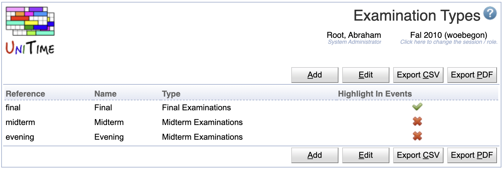

## Screen Description

Since UniTime 3.4, the examination timetabling is no longer limited to only two examination problems. Multiple examination types can be defined on the Examination Types page. The examination types are academic session independent, however, only examination types that have some [examination periods](examination-periods) defined will show on examination pages (e.g., [Examinations](examinations) page, Type drop down). Similarly, a set of rooms that are available for a particular examination problem (together with their availabilities and default period preferences) can only defined for examination types that already have some examination periods defined in the academic session.

{:class='screenshot'}

Examinations of each examination type are timetabled separately. So, for instance, there can be a different examination timetable for midterm and for evening exams during a term, or there can be multiple final examination timetables produced during the summer session (e.g., one for the first half and another for the second half).

Examinations of each examination type can be also published at different times and/or managed by different Examination Managers. This can be defined on the [Examination Statuses](examination-statuses) page.

If the **Highlight In Events** is checked, examination days (days during which there are examination periods) for this examination type are highlighted in the events.

The Examination Types page is visible to users with Examination Types permission, changes can be made with Examination Type Edit permission.

## Details

While there can be many examination types defined, all of them are either of **final** or of **midterm** examination type. This type drives how the examination period preferences are displayed, whether there will be midterm or final examination events created (see [Events](events) page), and they are used in the status types (see [Status Types](status-types) page). This needs to be taken in consideration when a new examination type is being created.

On the other hand, each examination type does have a different set of examination periods defined and it can have a different set of examination rooms.

Only examination types that are not being used (i.e., there is no examination period of the type created) can be deleted. For historic reasons, there always have to be one final examination type and one midterm examination type. Examination types that are being used cannot have the type changed as well.

## Operations

The table can be sorted by any of its columns, just by clicking on the column header and the sorting option that opens.

### Add Examination Type
Click **Add** to add a new examination type

{:class='screenshot'}

* Click **Save** to create a new examination type
* Click **Back** to return to the list without making any changes

### Edit Examination Type
Click a particular examination type to make changes or to delete the examination type

{:class='screenshot'}

* Click **Save** to make changes, **Back** to return to the list without making any changes
* Click **Previous** or **Next** to save the changes and go to the previous or next examination type respectively
* Click **Delete** to delete the examination type.

### Edit Examination Types
Click **Edit** to edit all examination types

{:class='screenshot'}

* Use the  icon to add a new line and  to delete a line
* Click **Save** to make changes, **Back** to return to the list without making any changes

### Export CSV/PDF
Click the **Export CSV** or **Export PDF** to export the list of examination types to a CSV or PDF document respectively