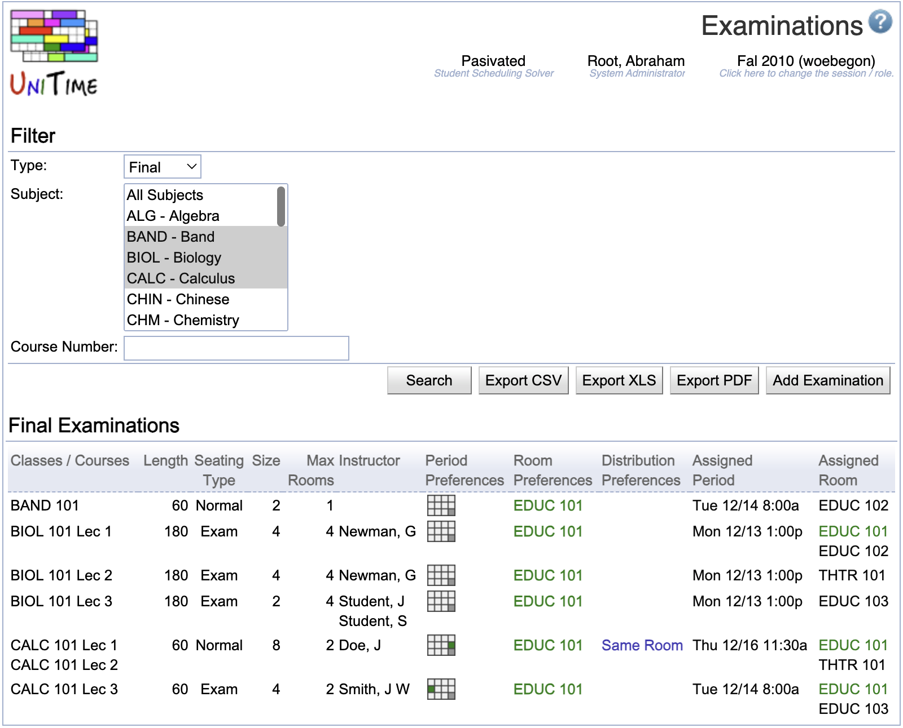

## Screen Description

The Examinations screen provides a list of midterm or final examinations either for a given subject area or for all subject areas at once.

{:class='screenshot'}

## Details

The top section of the screen contains the options to select

* **Type**
	* Type of the examination (Final or Midterm)
		* Midterm type is only available if there are some Midterm examination periods defined for the academic session.

* **Subject**
	* Subject area for which the examinations should be displayed
	* Select "All" to see examinations for all subject areas

* **Course Number**
	* Course number of a course for which the examinations should be displayed
	* Wild card can be used (such as "1*" for all course numbers starting with one)

Click **Search** to apply changes in the Type, Subject or Course Number.

The table of midterm/final examinations contains the following information

* **Classes/Courses**
	* Instructional offering components (classes, instructional offering configurations, course offerings, and instructional offerings) whose students need to take the given examination

* **Length**
	* Length of the examination in minutes

* **Seating Type**
	* Exam or Normal seating type
	* An examination needs to be assigned to one or more rooms of enough capacity. Based on this seating type, either room capacity (seating type Normal) or room examination capacity (seating type Exam) must be met. These capacities are displayed for each room on the [Rooms](rooms) page.

* **Size**
	* Expected number of students to take the examination

* **Max Rooms**
	* The maximum number of rooms into which an examination can be split (for example, an examination for a class of 400 students can be split into two or three rooms if they need to use Exam seating type and do not have a room with exam seating capacity of 400 seats)
	* An exam is not assigned to a room when the maximum number of rooms is set to zero (it is assigned to a period that best meets the student needs and period preferences).

* **Instructor**
	* Instructors associated with the examination

* **Period Preferences**
	* Preferences for time periods (color-coded in a time grid for final examinations or in text for midterm examinations)

* **Room Preferences**
	* Color-coded room preferences

* **Distribution Preferences**
	* Examination distribution preferences for a given examination (see possible types in the [Examination Distribution Preferences](examination-distribution-preferences) screen)

* **Assigned Period**
	* Time period assigned to the examination, color-coded based on the preference level of the assigned time period

* **Assigned Room**
	* Room(s) assigned to the examination, color-coded based on the preference level of the assigned room(s)

Click on any examination to get to its [Examination Detail](examination-detail) screen.

## Operations

* **Export PDF**
	* Export the list of midterm/final examinations into a PDF file

* **Add Examination**
	* Add a new examination in the [Add Examination](add-examination) screen
