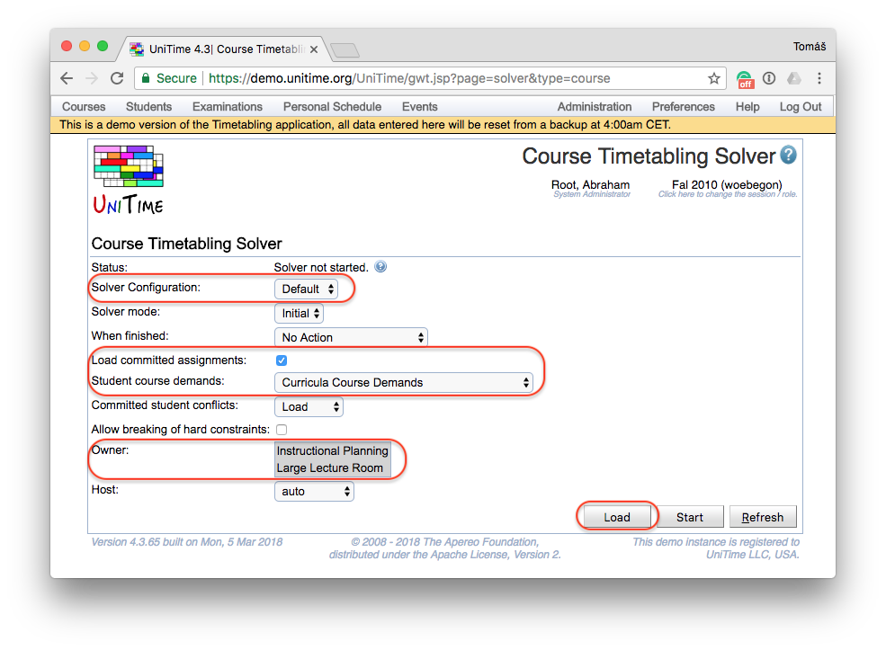
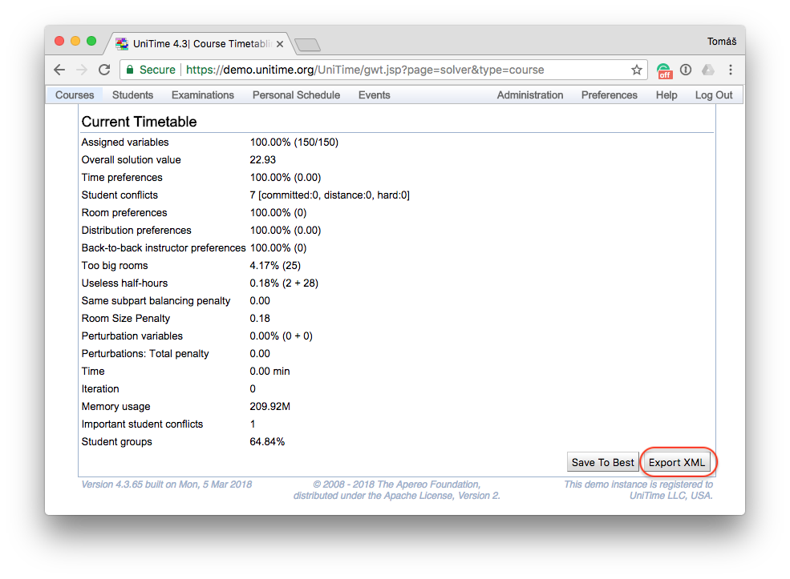
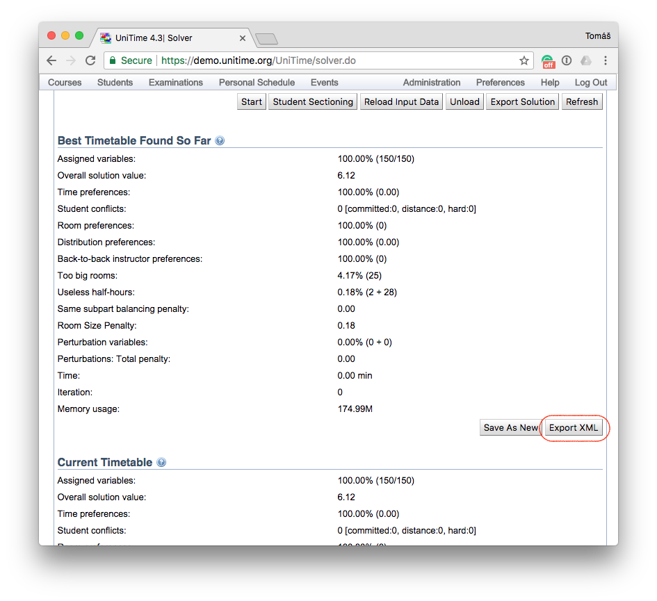

## Description

The data that are loaded into the course timetabling solver can be easily exported to an XML format (see the description at [University Course Timetabling Data Format](https://www.unitime.org/uct_dataformat_v24.php) page) that only contains the data needed by the solver to run and that can be used to run and or debug the solver outside of UniTime (only the [CPSolver](https://github.com/UniTime/cpsolver) library is needed, see [University Course Timetabling Solver Execution](https://www.unitime.org/uct_execution.php) page for more details). This data format can be also used to publish data instance for research purposes (see the [University Course Timetabling Benchmark Datasets](https://www.unitime.org/uct_datasets.php) page for more details). It is possible to make sure that the exported XML contains no labels, only the UniTime's unique ids which can be also obfuscated if needed.

## Details

1. To export the Solver XML file, you need to to have the data loaded into the solver. You can skip this step if you have the data loaded in the solver already. You can load the data into the solver using the Courses > Course Timetabling > [Solver](course-timetabling-solver) page. Select the **Solver Configuration** you want to use, checked the **Load committed assignments** parameter to include the committed solution, select the appropriate **Student course demands** and other parameters as needed. If present, select the problem or problems that you want to load in the **Owner** parametr. Click **Load**.


{:class='screenshot'}

2. Once the solver is loaded (and the solver status says Awaiting commands ... on the top of the page), open or refresh the Courses > Course Timetabling > [Solver](course-timetabling-solver) page and scroll down to the **Current Timetable** section. Click the **Export XML** button at the bottom of the page.


{:class='screenshot'}

This will create create an XML file (usually named course-solution.xml) that should be automatically downloaded by the browser or displayed in another browser's tab or window. This is the file that you need.

__Note:__ If you are using UniTime 4.1 or older, the Export XML button is placed on the Best Timetable Found So Far section instead of the Current Timetable section. In this case, you need to click the **Save To Best** button first and scroll to the **Best Timetable Found So Far** section. Click the **Export XML** button at the bottom of the section.


{:class='screenshot'}

## Anonymization

The follwoing two properties control the anonymization of the exported data. These properties can be changed using the Administration > Default > [Configuration](application-configuration) page.

**unitime.solution.export.names**

When this parameter is set to true, labels like class, instructor, and room names are included in the XML file (student names are never exported). It defaults to false, which means that there will be no names or external ids present in the exported XML file.

**unitime.solution.export.id-conv**

When this parameter is set to true, UniTime unique ids are replaced by a new sequence (there is class 1, class 2, etc.) that has no relation to the data in the UniTime database. It defaults to false, as keeping the unique ids is helful to report back the problem when the exported data are used for debugging.

**unitime.solution.export.configuration**

When this parameter is set to true, the exported XML contains solver parameters of the configuration that was used to load the data into the solver. It defaults to false. This parameter has been added in UniTime 4.1, so older UniTime versions do not have this capability and the solver configuration must be exported using the Administration > Solver > [Solver Configurations](solver-configurations) page if needed.

The published benchmark data that are available on the [University Course Timetabling Benchmark Datasets](https://www.unitime.org/uct_datasets.php) page have been exported from UniTime using the above properties set as follows:
```
unitime.solution.export.names=false
unitime.solution.export.id-conv=false
unitime.solution.export.configuration=false
```

## Additional Notes

Only users with the Solver Solution Export Xml permission can see the Export XML feature. By default, this permission is restricted only to System Administrator and Session Administrator roles. If you do not see the Export XML button, please check the [Permissions](permissions) or contact your administrator.
