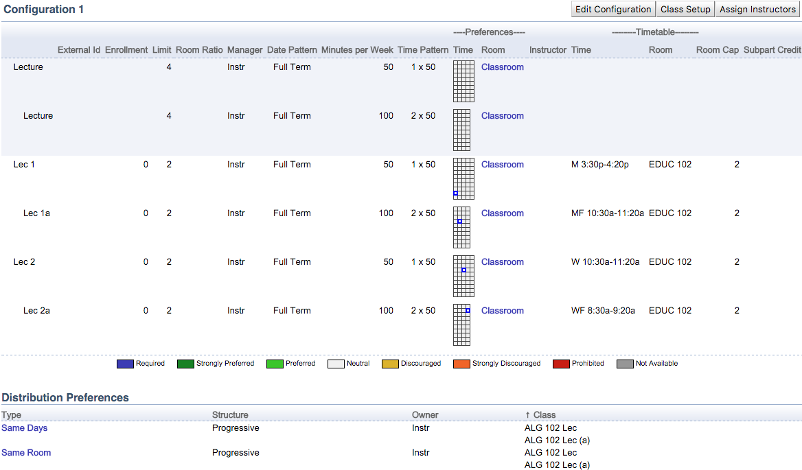
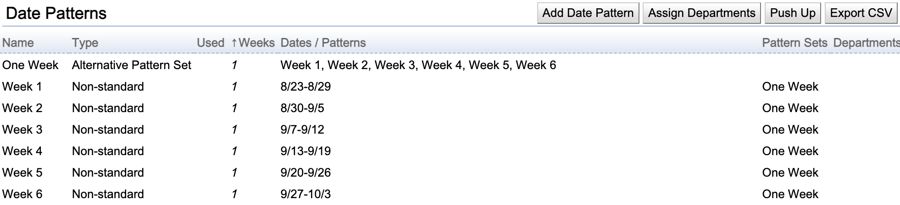
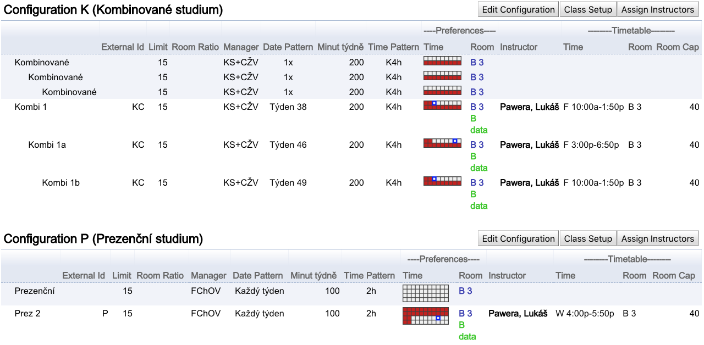

## Question

How do I set up a class that meets irregularly? For example, two times a week but in different rooms. Or multiple times a semester, but at different times and/or days of the week.

## Answer

For one class, all meetings must start at the same time, have the same length, and be placed in the same room. For instance, if you need to have Thursday's meetings at a different time (or in a different room) than Tuesday's meetings, this can be achieved by splitting the class into two. 

Here is a similar example with a 3 x 50 class needing two meetings on the same day. In this case, each 3 x 50 class was split into one 1 x 50 class and one 2 x 50 class:

{:class='screenshot'}

Also, the [distribution preferences](../distribution-preferences) can be used to provide additional structure between the appropriate classes (same days and room in the above example).

Please note the nesting between the two lecture subparts (the second lecture is under the first one). This ensures that a student will either take the Lec 1 and Lec 1a combination or the Lec 2 and Lec 2a combination (but not Lec 1 with Lec 2a, etc.). It also helps with the distribution preferences (progressive structure will create the constraint only between the nested classes Lec 1 - Lec 1a and between Lec 2 - Lec 2a).

Moreover, you can also create a [date pattern](../date-patterns) of the **Alternative Pattern Set** type, which can contain a selection of two or more date patterns. For example, you can have Week 1, Week 2, Week 3, ... date patterns, and create a One Week date pattern that contains Week 1, Week 2, ..., etc. In this case, the solver can choose which week the class will take place. Similarly, an Alternative Weeks date pattern can consist of Even Weeks and Odd Weeks date patterns. Or some more exotic combination.

* So, for example, create a date pattern of the Alternative Pattern Set first, then edit each of the single-week date patterns and add them to this date pattern. It would look like this on the Date Patterns page:

{:class='screenshot'}

* This way, when the classes use this One Week date pattern (set the One Week as the date pattern on the Lecture subpart), the solver can choose which of the single-week date patterns to select for each class.

To model a class following multiple date patterns (or to have multiple weekly meetings that do not start at the same time), you can split the subpart into multiple subparts. For example, instead of having Lec 1 that meets every week, there can be Lec 1 for the first meeting, Lec 1a for the second meeting, etc. These are usually modeled by scheduling subparts of the same instructional type and the number of classes that are nested under each other.

* Here is an example from the Faculty of Education at Masaryk University. Their normal (weekly) class schedule is usually Monday - Thursday. On Fridays and/or Saturdays, they offer distance learning for students who already have a job and only come to school on (some of) Fridays or Saturdays. Here is an example of a course that is offered in two configurations: Configuration P with a weekly schedule of 2 hours for normal students (the present form of study) and a distance Configuration D where the students meet for 4 hours on three Fridays during the term.

{:class='screenshot'}

Also, they have UniTime configured so that these meetings are automatically scheduled on different weeks (prohibited same weeks), one after the other (required precedence), and preferably in the same room (strongly preferred same room), using the Automatic hierarchical constraints parameter in the solver configuration.

Also, suppose there are two or more scheduling subparts in a parent-child relation with the same instructional type (e.g., Lec - Lec a - Lec b stacked underneath). In that case, it is also possible to automatically inherit preferences and the date patterns from the parent subpart whenever possible by setting `unitime.preferences.hierarchicalInheritance` to `true` on the [Application Configuration](../application-configuration) page (you would only need to set them up on the top-most level).

You can combine these approaches, so there could be, for instance, a course with a regular weekly lecture and three (irregular) seminar meetings.