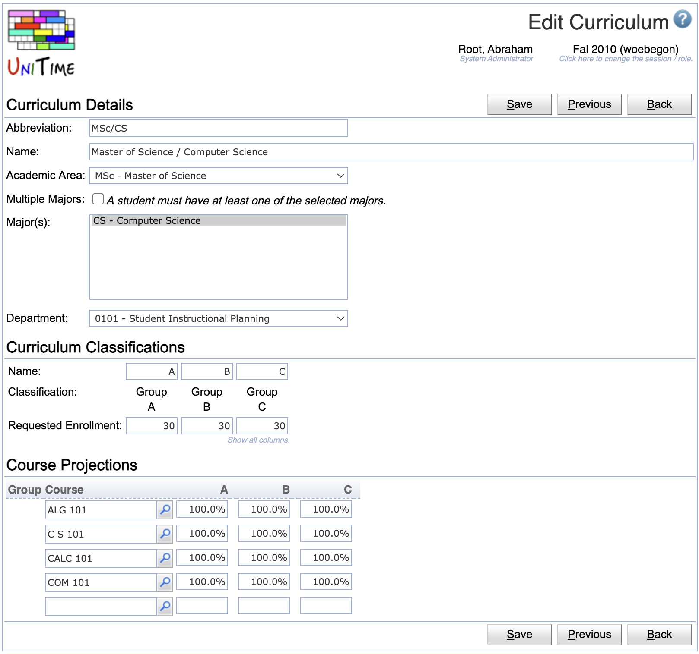
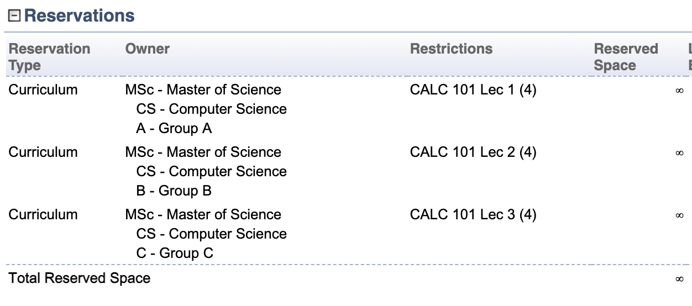
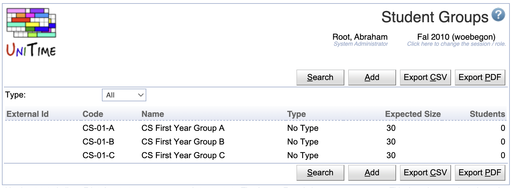
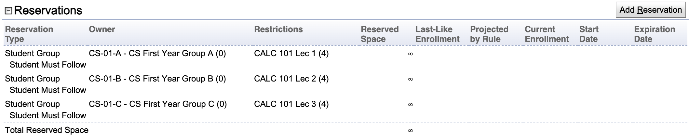
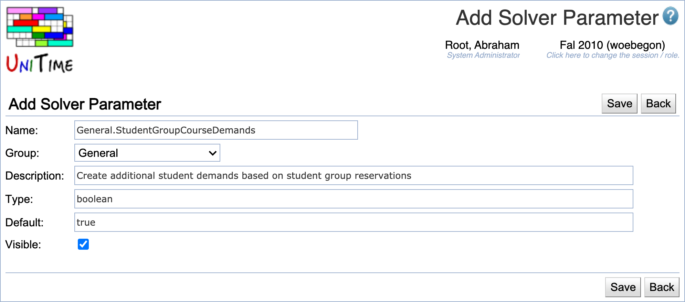

## Question

How do we assign classes to student groups?

* Our department doesn't usually deal with individual students, as we assign courses to entire groups.
* It is assumed that all student groups (that share the same curriculum) have the same set of courses.
* We need a view of the timetable from the perspective of an instructor, student group, and room.

## Answer

### Using Curricula & Curriculum Reservations 
This is usually handled with [curricula](../curricula). A curriculum defines groups of students (identified by their [academic area](../academic-areas), [major](../majors), and [classification](../academic-classifications)), each with a list of courses they are expected to attend. While the classifications usually identify the semester or year in which the students are, they can also be used to split students (of a particular program) into smaller groups of a given size. By default, the solver can move students freely between alternative sections of a course (when there is a course, e.g., with multiple alternative Seminar sections attended by students of multiple curricula/classifications). It is possible to use [curriculum reservations](../reservations) to fix students of a certain curriculum & classification to a particular section.

So, for instance, if you have three groups of students in a particular program, each with 30 students, you can create classifications A, B, and C and set up a curriculum with 30 students in each of these classifications.

{:class='screenshot'}

Furthermore, if a course has three alternative lectures, you can use curriculum reservations to assign each group of students to the appropriate lecture.

{:class='screenshot'}

When running the course timetabling solver, please make sure that the "Student course demands" parameter is set to Curricula Course Demands before the solver is loaded on the [Course Timetabling Solver](../course-timetabling-solver) page. This parameter indicates the source of the student course demand data. 

### Using Student Groups & Student Group Reservations

Another option would be to use [student groups](../student-groups), without any students but with their expected sizes filled in. You can use [student group reservations](../reservations) to indicate which course (and possibly also class) each group of students should attend.

So, on the [Student Groups](../student-groups) page, you would set up the individual student groups, just with the expected sizes.

{:class='screenshot'}

And for the course that students of these student groups would need to attend, you would need to set up [Student Group Reservations](../reservations) for each of the groups and the section they need to take.

{:class='screenshot'}

For the student groups to be considered by the solver, the `General.StudentGroupCourseDemands` solver parameter needs to be created and set to `true`. You can do that on the Administration > Solver > [Parameters](../solver-parameters) page, using the Add Solver Parameter button with the following parameters:

{:class='screenshot'}