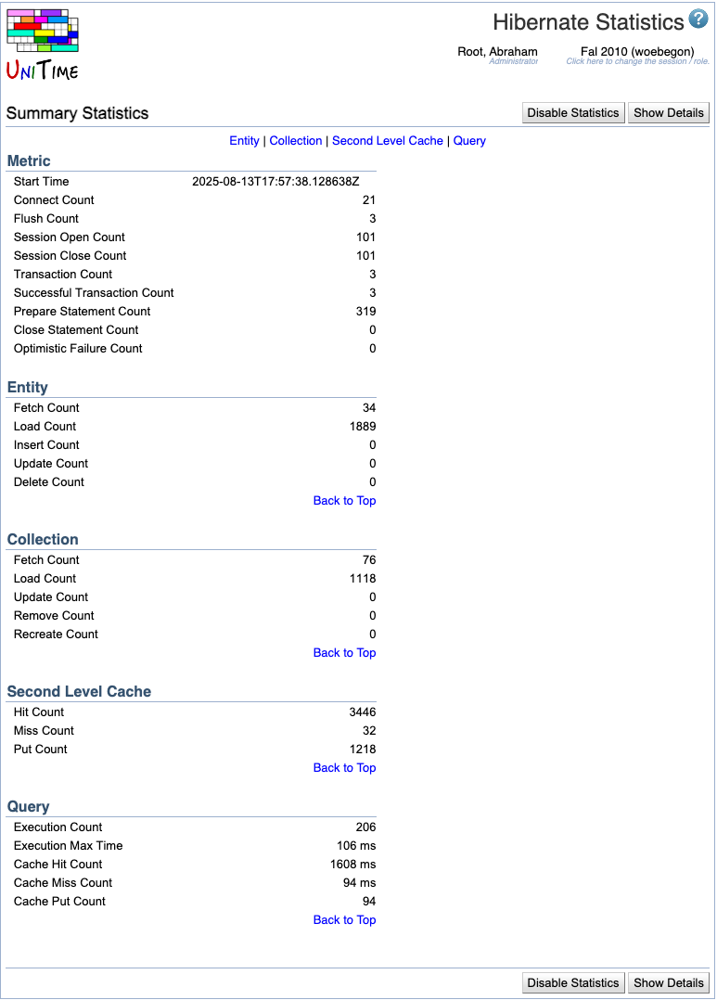

## Screen Description

 The Hibernate Statistics screen displays information about hibernate queries and operations (when the statistics are enabled).

## Operations

* **Enable Statistics**
	* Record and display the hibernate statistics

* **Disable Statistics**
	* Stop recording and displaying hibernate statistics

* **Show Details**
	* Show detailed statistics
	* Note: In the Query Statistics Detail section, you can see a lot of hibernate queries that have been executed; these queries could be helpful examples for your own queries in the [Test HQL](test-hql) screen

* **Hide Details**
	* Show only main elements of statistics

## Details

 If you enable hibernate.generate_statistics, Hibernate will expose a number of metrics that are useful when tuning a running system via SessionFactory.getStatistics(). Hibernate can even be configured to expose these statistics via JMX. Read the Javadoc of the interfaces in org.hibernate.stats for more information.

{:class='screenshot'}
