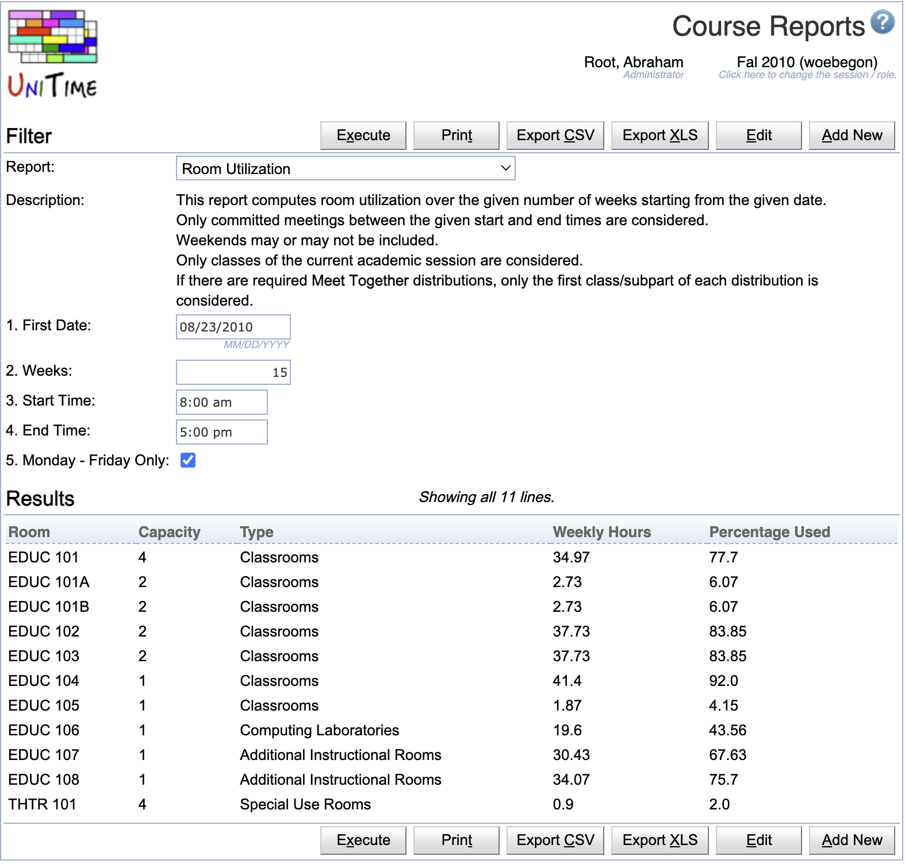

## Screen Description

Course, Examination, Student Sectioning, Event, and Administration Reports pages are used to create custom reports that are computed using [HQL](https://docs.jboss.org/hibernate/orm/6.6/querylanguage/html_single/Hibernate_Query_Language.html) (Hibernate Query Language) to directly query the database. The creation of such reports requires a working knowledge of UniTime's database structure and the Hibernate model. There is currently no comprehensive documentation of the database structure, except for the source code. The Hibernate model (i.e., the *.hbm.xml files in the [JavaSource](https://github.com/UniTime/unitime/tree/master/JavaSource) folder) is a good starting point. Please contact us at [support@unitime.org](mailto:support@unitime.org) if you need help with the development of a particular report.

{:class='screenshot'}

An HQL report can have one or more parameters (such as the current academic session, a department, or a list of subject areas), which the user can specify in the Filter section. A report can be accessed directly from the web page or exported to a CSV (Comma-Separated Values) text file.

## Details

Each report, based on its nature, can appear on one or more of the HQL report pages, and requires the appropriate permission to run:
* Course Reports are in the menu under Courses and require `HQLReports Courses` permission
* Examination Reports are in the menu under Examinations and require `HQLReports Examinations` permission
* Student Sectioning Reports are in the menu under Students and require `HQLReports Students` permission
* Event Reports are in the menu under Events and require `HQLReports Events` permission
* Administration Reports are in the menu under Administration > Academic Sessions and require `HQLReports Administration` permission

If there are no courses, examinations, student sectioning, or event reports, the appropriate Course, Examination, Student Sectioning, or Event Reports page does not appear in the menu. The Administration Reports page always appears in the menu (if the user has the required permissions). This allows administrative users to create new reports where none exist.

Users with `HQLReports Add / Edit / Delete` permissions can create new reports, edit existing reports, or delete them. Some reports may also be available to administrators despite their appearance (they require HQLReports Admin Only permission).

When a report is being created or edited (click the **Add New** button or **Edit** when the appropriate report is selected), the following dialog appears.


{:class='screenshot medium'}

A report consists of a name, a description, a query, and several flags. It may also contain additional parameters. The flags determine which page the report will be available on and whether it will be accessible to all users who can open the page (those with the appropriate `HQLReports` permission) or only to administrators (i.e., users with the `HQLReports Admin Only` permission). The query is in the standard [HQL](https://docs.jboss.org/hibernate/orm/6.6/querylanguage/html_single/Hibernate_Query_Language.html) format with a few additions:

* The query can be parametrized by the current academic session (of the user working with the page) and/or a selected room(s), building(s), subject area(s), and department(s). See the following section for more details.

* In column names, _ translates to a space. The first column can contain a unique ID of a class, a scheduling subpart, an instructional offering, a location, an instructor, an examination, or an event. This can make each line clickable, leading to the corresponding detail page.

* Additional parameters can be provided.

# Parameters

The parameter %SESSION% is automatically replaced with the unique id of the academic session that the user is working with. If the following parameters are used in the query, the appropriate drop-down will appear on the page, and the ID of the selected item will replace the parameter.

* %BUILDING% selection of a building (Building class)
* %ROOM% selection of a room or a non-university location (Room class)
* %LOCATION% selection of a room or a non-university location (Location class)
* %DEPARTMENT% selection of a department (Department class)
* %SUBJECT% selection of a subject area (SubjectArea class)
* %PITD% selection of a point in time data snapshot (PointInTimeData class)
* %STUDENT_GROUP% selection of a student group (StudentGroup class)
* %ACADEMIC_AREA% selection of an academic area of a student (AcademicArea class)
* %POS_MAJOR% selection of a major of a student (PosMajor class)
* %ACCOMODATION% selection of an accommodation of a student (StudentAccomodation class)

If the plural variant of the parameter is used (i.e., %BUILDINGS%, %ROOMS%, %DEPARTMENTS%, or %SUBJECTS%), a multi-select drop-down is used, and a list of the selected unique IDs replaces the parameter.  There is no plural for %PITD%, it is only possible to choose a single point in time data snapshot.

If a user has a department-dependent role (e.g., departmental schedule manager), only associated departments, subject areas, rooms, and buildings will be available in the drop-downs.

**Example:**
```
from Department d where d.session.uniqueId = %SESSION% and d.uniqueId in %DEPARTMENTS%
```

Single value parameters (i.e., %SESSION%, %BUILDING%, %ROOM%, %DEPARTMENT%, and %SUBJECT%) are replaced by the unique id of the selected item, multi value parameters (i.e., %BUILDINGS%, %ROOMS%, %DEPARTMENTS%, and %SUBJECTS%) are replaced by a list (id1, id2, ... idn).

The report can also be parameterized by additional parameters. The parameter name is used in the query prefixed with a colon (e.g., :date for a parameter named date). The parameters can be of various types. Basic types are string, boolean, int, long, double, float, short, byte, date, and time. Time is represented as an integer time slot, counted in five-minute increments since midnight.

## Clickable Lines

Report lines can be made clickable, leading to the appropriate detail page. To do so, the first column must return a unique ID with the following label. Such a unique ID column is not displayed in the report.

* [Class Detail](class-detail) page: first column returns Class_.uniqueId and is named **__Class**
* [Scheduling Subpart Detail](scheduling-subpart-detail) page: first column returns SchedulingSubpart.uniqueId and is named **__Subpart**
* [Instructional Offering Detail](instructional-offering-detail) page: first column returns InstructionalOffering.uniqueId and is named **__Offering**
* [Room Detail](room-detail) page: first column returns Location.uniqueId and is named **__Room**
* [Instructor Detail](instructor-detail) page: first column returns DepartmentalInstructor.uniqueId and is named **__Instructor**
* [Examination Detail](examination-detail) page: first column returns Exam.uniqueId and is named **__Exam**
* [Event Detail](event-detail) page: first column returns Event.uniqueId and is named **__Event**
* [Student](classes-for-student) detail dialog: first column returns Student.uniqueId and is named **__Student**

## Exports

The reports can be exported to CSV, XLS, or JSON. Besides of the provided **Export CSV** and **Export XLS** buttons, the [Export API](manuals/exports#2-hql-reports) can be used to get the data programmatically.