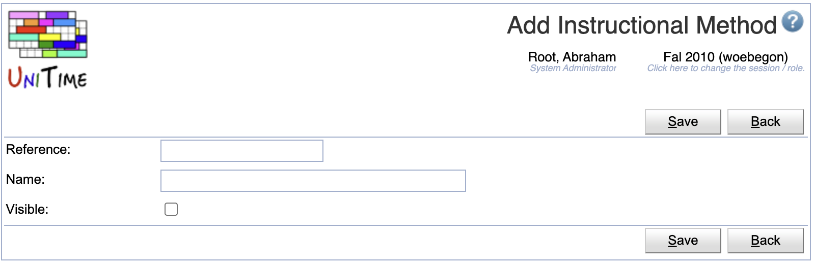
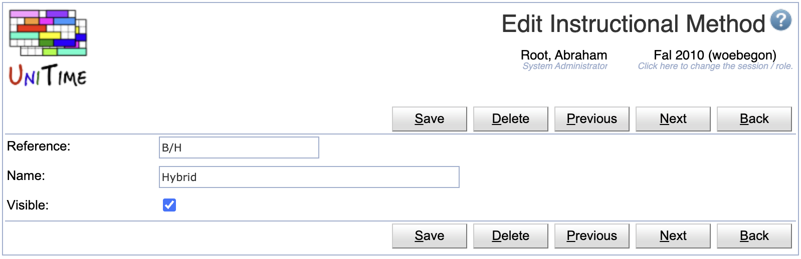
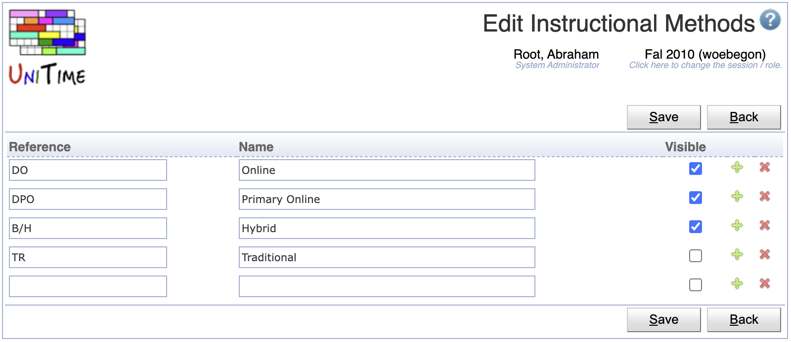

## Screen Description

The possible instructional methods can be defined on the Instructional Methods administrative page (under Administration > Other). A method can be assigned to a configuration on the Instructional Offering Configuration page or on the Multiple Class Setup page. The selected instructional method is visible on many pages across the application (e.g., where a configuration is being selected for an exam or a course-related event), typically next to the configuration name (e.g., Configuration 1 (Online)) or next to the instructional type (e.g., Lecture (Hybrid)). On some pages (e.g., on the Instructional Offerings), the reference is used instead of the label of the selected instructional method to save some space.

{:class='screenshot'}

## Notes

The Instructional Methods drop down is only available on the Instructional Offering Configuration page or on the Multiple Class Setup page when the configuration has an instructional method set or when one can be selected for the configuration.

## Operations

The table can be sorted by any of its columns, just by clicking on the column header and the sorting option that opens.

### Add Instructional Method
Click **Add** to add a new instructional method

{:class='screenshot'}

* Click **Save** to create a new instructional method
* Click **Back** to return to the list without making any changes

### Edit Instructional Method
Click a particular instructional method to make changes or to delete the instructional method

{:class='screenshot'}

* Click **Save** to make changes, **Back** to return to the list without making any changes
* Click **Previous** or **Next** to save the changes and go to the previous or next instructional method respectively
* Click **Delete** to delete an instructional method. Only instructional methods that are not being used (there is no course configuration with this method selected) can be deleted.

### Edit Instructional Methods
Click **Edit** to edit all instructional methods

{:class='screenshot'}

* Use the  icon to add a new line and  to delete a line
* Only instructional methods that are not being used (there is no course configuration with this method selected) can be deleted
* Click **Save** to make changes, **Back** to return to the list without making any changes

### Export CSV/PDF
Click the **Export CSV** or **Export PDF** to export the list to a CSV or PDF document respectively