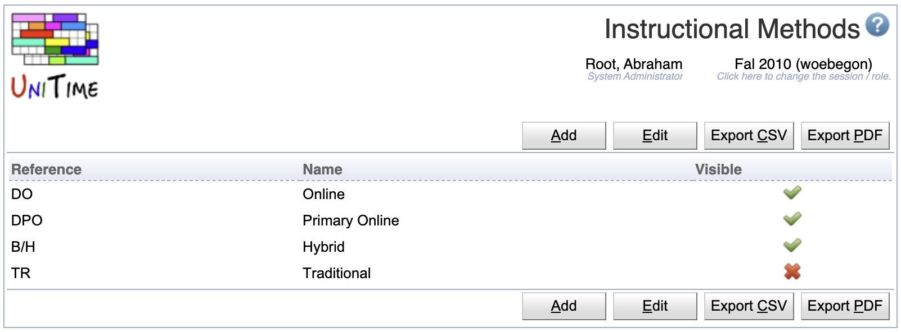

## Screen Description

 The possible instructional methods can be defined on the Instructional Methods administrative page (under Administration > Other). A method can be assigned to a configuration on the Instructional Offering Configuration page or on the Multiple Class Setup page. The selected instructional method is visible on many pages across the application (e.g., where a configuration is being selected for an exam or a course-related event), typically next to the configuration name (e.g., Configuration 1 (Online)) or next to the instructional type (e.g., Lecture (Hybrid)). On some pages (e.g., on the Instructional Offerings), the reference is used instead of the label of the selected instructional method to save some space.

## Notes

 The Instructional Methods drop down is only available on the Instructional Offering Configuration page or on the Multiple Class Setup page when the configuration has an instructional method set or when one can be selected for the configuration.

{:class='screenshot'}
