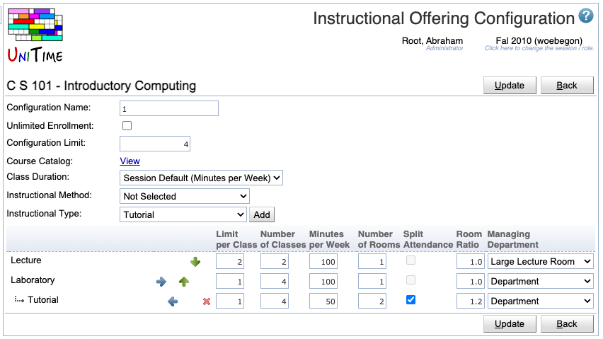

## Screen Description

In the Instructional Offering Configuration screen, you can set up or edit the general structure of the instructional offering. This is the only place where you can specify the number of minutes per week the classes should meet and whether they are grouped in any way.

{:class='screenshot'}

## Details

* **Configuration Name**
    * By default, the configuration names are numbers - the first configuration is named "1", etc.
    * You can change the name of your configuration
        * You may wish to give descriptive names to your configurations if there is more than one for this instructional offering

* **Unlimited Enrollment**
    * Check this checkbox if the instructional offering should have unlimited enrollment
    * When Unlimited Enrollment is selected, you can only set the number of minutes per week for the scheduling subparts. You will not be able to set a limit per class or number of rooms (the number of rooms is automatically set to zero). You have the option to indicate a room to print on the student schedule by requiring that room in the scheduling subpart or the class preferences. However, please note that there is no check to verify the room's availability; it is simply printed on the schedule.

* **Configuration Limit**
    * Indicates how many students you want to allow in this instructional offering in this configuration
    * It is the same as the course limit if you have only one configuration and one course in the instructional offering
    * It is the total limits of all cross-listed courses for this instructional offering if you have more than one course and only one configuration for this instructional offering

* **Class Duration**
    * Class duration model for the configuration
    * See [Class Duration Types](class-duration-types) for more details

* **Instructional Method**
    * An optional instructional method for the configuration (such as Traditional, Online, or Hybrid)
    * Instructional methods are defined on [Instructional Methods](instructional-methods) page in the Administration

* **Instructional Type**
    * Select the instructional type that you need in the drop-down menu and click **Add** (Alt+A) to add a scheduling subpart of this instructional type to your instructional offering
    * You can select and add as many instructional types as you want
    * You can also select and add the same instructional type more than once
        * This is necessary, e.g., if you have a lecture that is twice a week in one room and once a week in another room - you will need one scheduling subpart for each of the rooms; or if you have a part of the lab in your departmental rooms and a part in instructional computing labs; there are many reasons for reusing the instructional type
        * See the Nesting section below for further instructions when using the same instructional type for multiple subparts

For each scheduling subpart that you added, you have

* Click  to delete that subpart
* **Limit per Class**
    * How many students should there be in each class of this scheduling subpart
    * To be able to set variable limits per class, you need to change the property "Show the option to set variable class limits" in the [Manager Settings](manager-settings) screen before you edit this configuration

* **Number of Classes**
    * Calculated automatically from Limit per Class in order to have enough classes to cover the configuration limit, but can be overwritten by you

* **Minutes per Week**
    * Number of minutes per week - for example, a typical class that meets in a 2x75 or a 3x50 pattern would have 150 minutes per week (each 50 minutes is equivalent to one hour)
    * The name of the column, as well as the meaning of the provided number, depends on the [Class Duration Type](class-duration-types) used

* **Number of Rooms**
    * Number of meeting rooms required for each class
    * In most cases, it is one

* **Split Attendance**
    * When two or more rooms are needed
    * If checked, students are expected to split between the two (or more) rooms. That is the total capacity of the assigned room &times; the room ratio must be equal to or greater than the class limit.
    * If unchecked, all students are expected to be able to fit in any of the assigned rooms. That is, the room capacity of any assigned room &times; the room ratio must be equal to or greater than the class limit.

* **Room Ratio**
    * The ratio of the required room size to the class limit
        * Room Ratio = Room Size / Limit per Class
    * In almost all cases, this should be one
    * Some exceptions to the norm
        * You need a room for fewer students than the class limit (Room Ratio is less than one)
            * Example: A course has a PSO class for 100 students, but the schedule deputy knows that there will never be more than 50 students at a time in this PSO. Hence, this PSO can be set up with Limit per Class = 100 and Room Ratio = 0.50, which means that the application will look for a room of size 50 or more (0.5*100=50).
        * You need a room for a class with zero limit. In this case, the Room Ratio needs to contain the required room size.
            * Example: You set up a course with zero limit where all students require name raises. You plan on enrolling 20 students per class. Then the Room Ratio should be set to 20. In this situation, the above formula for Room Ratio does not apply. The Room Ratio will be used as the room size needed.

* **Managing Department**
    * Determines who will assign time and room to this class (for example, whether it is the Large Lecture Room manager, the departmental schedule deputy, or the Computing Lab manager).
    * The managing department also determines the set of rooms and/or times (time patterns) that you can use when you set up preferences
    * For Managing Department other than "Department", you usually cannot set the preference level "Required" in the preferences on the subparts or on the classes (in the [Edit Scheduling Subpart](edit-scheduling-subpart) or in the [Edit Class](edit-class) screens)

## Grouping

If an attendance relationship must be maintained across types of instructions within a course, you will need to do a grouping, i.e., Lec 01 with Rec 01 with Lab 01 and Lec 02 with Rec 02 and Lab 02. Grouping should be used only when necessary as student scheduling flexibility is reduced when grouping is used.

To group, e.g., lectures with recitations, make sure that the lecture subpart is listed first, and the recitation subpart is right under it (if you need to move a subpart up or down, use the green arrows pointing up or down). Then click on the blue arrow pointing to the right for the recitation subpart. This way, each lecture will have its own set of recitations - for example, students from Rec 1 and Rec 2 will have to be in Lec 1, students from Rec 3 and Rec 4 will have to be in Lec 2, etc.

## Nesting

If you have more than one scheduling subpart of the same instructional type (for example, two lecture subparts), make sure that these two are listed one right under the other and the second one is "nested" - indented to the right the same way as when you group classes (click on the blue arrow pointing to the right for the second subpart of the same instructional type). You must have the same number of classes in all the nested scheduling subparts.

Nesting differentiates this from multiple classes within the instructional offering (i.e., all nested parts are considered the same class in the legacy master schedule).

## Operations

* **Update** (Alt+U)
    * Save changes and go back to the [Instructional Offering Detail](instructional-offering-detail) screen.

* **Back** (Alt+B)
    * Go back to the [Instructional Offering Detail](instructional-offering-detail) screen without saving any changes.
