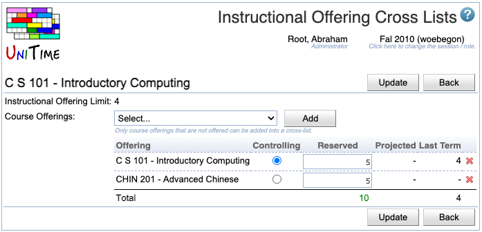

## Screen description

In the Instructional Offering Cross Lists screen, you can set up what courses a given instructional offering consists of. You can only work with the courses within your subject area(s). If you need to cross-list your course with a course from a different department, see the Details below.

{:class='screenshot'}

## Details

* **Instructional Offering Limit**
    * Limit of the instructional offering (= the sum of limits of all configurations)
    * The sum of reserved spaces for all the course offerings in the cross-list should be equal to or larger than the instructional offering limit

* **Course Offerings**
    * To add a course to the cross-list, select the course that you want to add from the drop-down menu, then click the **Add** (Alt+A) button
    * You will only be able to add courses that are in the "not offered" list and only from the subject areas that you timetable
        * To cross-list with a course that is currently listed as "offered", make the course not offered first and then come back
        * For Departmental Schedule Managers: To cross-list with courses from other subject areas, use the form in the [Contact Us](contact-us) screen (Help → Contact Us), where there is a special category "Request a course cross-listing"

* A table follows with all the courses in this instructional offering
    * You can switch the **Controlling** course by clicking the radio button in the appropriate column

* **Reserved**
    * Enter the limit per each of the cross-listed courses here to indicate how many seats should be reserved for each of the courses
    * This number will then become the course limit in other systems

* **Projected**
    * Projected demand for the course

* **Last Term**
    * The number of students enrolled in this course in the last-like semester 

To remove a course from this list, click on the  at the end of the line with that course

## Operations

* **Update** (Alt+U)
    * Save changes and go back to the [Instructional Offering Detail](instructional-offering-detail) screen

* **Back** (Alt+B)
    * Go back to the [Instructional Offering Detail](instructional-offering-detail) screen without saving any changes
