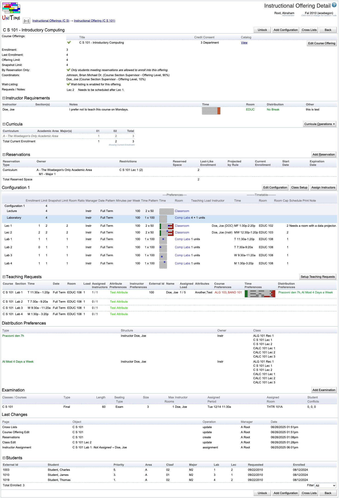

## Screen Description

 The Instructional Offering Detail screen provides an overview of the instructional offering. From here, you can also access screens to make changes to any property of that instructional offering.

## Navigation Line

* The button with the arrow pointing to the left takes you back to the previous page (roll your mouse over it to see exactly where it will take you).

* There are links to all the non-editable pages that you have visited before you got to this screen. The list always begins by a screen accessible from the main menu. Click on any link to get to the screen described in the link.

## Operations on the Title Line

* Clicking on the **course number and title** takes you to the [Instructional Offerings](instructional-offerings) screen for the subject area, to the place where this instructional offering is listed (you do not have to scroll down to this offering).

* **Lock** (Alt+X)
	* Lock this instructional offering temporarily for everybody else so that nobody interferes with the changes you are about to make
	* After Lock is clicked, the buttons that enable editing of various parts of the instructional offering become available
	* This button is displayed only when online sectioning or the scheduling assistant is enabled (see the [Status Types](status-types) screen in UniTime)

* **Unlock** (Alt+X)
	* Unlock the instructional offering; someone else will be able to lock and edit it
	* This button is displayed only when online sectioning or the scheduling assistant is enabled (see the [Status Types](status-types) screen in UniTime)

* **Add Configuration** (Alt+C)
	* Add a configuration to this instructional offering
		* Takes you to the [Instructional Offering Configuration](instructional-offering-configuration) screen

* **Cross Lists** (Alt+L)
	* Go to the [Instructional Offering Cross Lists](instructional-offering-cross-lists) screen where you can link the courses from your department(s) that are taught together in this instructional offering. For courses outside your department(s), please request a course cross-listing through the [Contact Us](contact-us) screen (under Help in the top right hand side section of the main menu)

* **Make NOT Offered** (Alt+F)
	* Make this instructional offering not offered for the semester that you are timetabling
		* The instructional offering will be displayed in the Not Offered Courses list in the [Instructional Offerings](instructional-offerings) screen
	* Displayed only if the instructional offering is currently being offered

* **Make Offered** (Alt+F)
	* Make this instructional offering offered for the semester that you are timetabling
	* This takes you to the [Instructional Offering Configuration](instructional-offering-configuration) screen where you can set up the course the way it should be offered
	* Displayed only if the instructional offering is currently not being offered

* **Previous** (Alt+P)
	* Go to the previous instructional offering

* **Next** (Alt+N)
	* Go to the next instructional offering

* **Back** (Alt+B)
	* Go back to the non-editable screen in which you were before

 Note: **Previous** and **Next** are stepping through the list that is displayed in the [Instructional Offerings](instructional-offerings) screen. You will not see **Previous** if you are in the detail screen for the first instructional offering from the list, and you will not see **Next** if you are in the last instructional offering from the list.

## Fields Under the Title Line

* **Course Offerings**
	* A list of course offerings that form this instructional offering. For each of them, you have
		* A check indicating if the course is the controlling course in the cross list
			* Automatically checked if the instructional offering consists of one course only
			* If there are multiple courses associated with this offering, it is considered a cross list and the controlling course is checked
			* To change the controlling course in a cross list, click on Cross Lists - that takes you to the [Instructional Offering Cross Lists](instructional-offering-cross-lists) screen
		* **Title**
			* The long title of the course
			* To change it, click on Edit Course Offering - that takes you to the [Edit Course Offering](edit-course-offering) screen

* **Reserved**
	* Number of seats reserved for the course within the instructional offering
	* A number is displayed only when there are multiple cross listed courses within this instructional offering

* **Schedule of Classes Note**
	* The course note that will be displayed in the online Schedule of Classes
	* To change it, click on Edit Course Offering - that takes you to the [Edit Course Offering](edit-course-offering) screen

* Plus the operation **Edit Course Offering**
	* Go to the [Edit Course Offering](edit-course-offering) screen for this course
	* Note: You will be able to set up many more parameters for the controlling course than for the other cross-listed courses (if there are any) - whatever is possible to set up on the controlling course only will then be applied to the cross-listed courses too

* **Enrollment**
	* Current enrollment in the courses of this instructional offering
	* Cannot be edited in this application

* **Last Enrollment**
	* The total number of students enrolled in the courses in this instructional offering in the last like semester
	* Example: For an instructional offering AB 100, which is a cross-list of AB 100 and AB 100H, during the timetabling for Spring 2008, the "Last Enrollment" number for this instructional offering will be the number of students enrolled in AB 100 in Spring 2007 plus the number of students enrolled in AB 100H in Spring 2007
	* Cannot be edited in this application

* **Projected Demand**
	* Projected demand for this instructional offering
	* Can be recalculated from curricula by a schedule deputy or a curriculum manager

* **Offering Limit**
	* The total limit for the whole instructional offering
	* It is the sum of all configuration limits
		* Usually there is only one configuration for each instructional offering and only one course per instructional offering, in such case this is the course limit
		* For a cross-list, a warning will appear if this is larger than the total of the reserved spaces for all of the cross-listed courses (set up in the [Instructional Offering Cross Lists](instructional-offering-cross-lists) screen)
	* To change the limit, click on Edit Configuration - that takes you to the [Instructional Offering Configuration](instructional-offering-configuration) screen

* **Snapshot Limit**
	* The total limit for the instructional offering at the time the Limit an Projection Snapshot was taken.
	* * The snapshot limit can be updated by taking a new snapshot using the Limit and Projection Snapshot Page.

* **Consent**
	* The type of consent (if any is required) for all the courses in this instructional offering
	* To change this, click on Edit Course Offering on the line with the controlling course - that takes you to the [Edit Course Offering](edit-course-offering) screen

* **Designator Required**
	* Indicates whether a designator is required
	* To change this, click on Edit Course Offering on the line with the controlling course - that takes you to the [Edit Course Offering](edit-course-offering) screen

* **Credit**

* Credit for each of the courses in this instructional offering (the credit must be the same for all the cross-listed courses)

* To change this, click on Edit Course Offering on the line with the controlling course - that takes you to the [Edit Course Offering](edit-course-offering) screen

* **Coordinators**
	* A list of instructors (from the department to which the course belongs) who will be able to provide the consent of instructor required for the course

* **Deadlines**

* These deadlines are used to control enrollment during online student scheduling (both via scheduling assistant and wait-list). The defaults are set on the academic session ([Edit Academic Session](edit-academic-session)), but can be overridden on each instructional offering.

* Deadlines are given in the number of weeks, relative to the class start (weeks start on the day of the session begin date).

{:class='screenshot'}

## Curricula

 This section lists all the curricula that contain courses of this instructional offering.

 Click on the plus sign in front of the section header "Curricula" to see the whole table which contains the following information

* **Curriculum**
	* Abbreviation and/or name of the curriculum

* **Area**
	* Academic area for which the curriculum is set up (each curriculum can only have one academic area)

* **Major(s)**
	* The major (or more majors) within the selected academic area for which the curriculum is set up

* **Curriculum Classifications**

* The curriculum classifications show numbers of students in particular semesters of study, including projected numbers or last-like enrollment.

* **Total**
	* The total number of students of that curriculum who are expected to take the course(s) of this instructional offering

 The last line of the table sums up the expected (or last-like or what is selected in Curricula Operations) enrollments per curriculum classification and then the expected (or last-like or...) enrollments for all curricula.

 Click on any header in the table to see the Curricula Operations (see list below).

 Click on any curriculum to see its details.

### Operations

* **Curricula Operations** - unfolds a list of possible operations, any of them can be clicked, the current operation is shaded
	* Show/Hide Details
		* Show or hide the listing of all curricula involved in the instructional offering
		* An equivalent of clicking the + (or -) sign before the section header
	* Expand/Colapse All
		* Show or hide detailed information about all individual curricula
	* Show Requested Enrollment
	* Show the expected number of students who will follow this curriculum
	* Show Current Enrollment
	* Show the number of students of this curriculum (i.e., who have the majors from this curriculum) currently enrolled in the courses of this curriculum
	* Show Last-Like Enrollment
	* Show the number of students from given majors who were enrolled in the courses of this curriculum in the last-like semester
	* Show Projected by Rule Enrollment
	* Number of students as projected in the [Curriculum Projection Rules](http://help.unitime.org/Curriculum_Projection_Rules) page (calculated and entered by administrators)
	* Show Requested / Current Enrollment
		* Show both the numbers for the requested and the current enrollment
	* Show Requested / Last-Like Enrollment
		* Show both the numbers for the requested and the last-like enrollment
	* Show Requested / Projected Enrollment
		* Show both the numbers for the requested and the projected enrollment
	* Show Last-Like / Current Enrollment
		* Show both the numbers for the last-like and the current enrollment
	* Show Projected / Current Enrollment
		* Show both the numbers for the projected and the current enrollment
	* Show Projected / Snapshot Projected Enrollment
		* Show both the numbers for the projected and the snapshot projected enrollment
	* Populate Course Projected Demands
		* Populate the Projected Demand for this instructional offering, do not include students of major(s) whose curricula do not include the course(s) of this instructional offering 
		* Projected Demand = Requested Demand
	* Populate Course Projected Demands (Include Other Students)
		* Populate the Projected Demand for this instructional offering, include also students of major(s) whose curricula do not include the course
		* Projected Demand = Requested Demand for curricula + Projected Demand for other students (in Curricula Operations, select "Show Requested/Projected Enrollment" to see the numbers that will be used)

{:class='screenshot'}

## Reservations

 The section lists all the reservations that are created for the instructional offering.

* **Reservation Type**
	* Individual, Student Group, Curriculum, or Course

* **Owner**
	* The particular student, student group, curriculum or course for which the reservation has been made
	* For student groups, there is a number in parenthesis next to the group name - it indicates how many students this reservation affects; that is, how many students there are in the student group

* **Restrictions**
	* Restrictions within the instructional offering regarding which part(s) of the instructional offering the reservation is set on
	* The number in parenthesis indicates what capacity the sections in the restrictions have (it is then possible to compare them to the number in the Reserved Space column)

* **Reserved Space**
	* Number of reserved spaces
	* ∞ if the whole part of an instructional offering is reserved

* **Last-Like Enrollment**
	* Number of students from the last-like semester that match the reservation

* **Projection by Rule**
	* Number of projected students that match the reservation

* **Current Enrollment**
	* Number of currently enrolled students that match the reservation

* **Expiration Date**
	* Date upon which the reservation expires, i.e., the reserved spaces are made available for other students
	* If there is no expiration date displayed, the reservation does not expire

 If the reservation is in grey letters, it is not editable (either you do not have the right to edit it or, during student scheduling, you need to first lock the instructional offering to be able to make changes).

 Click on any column header and then on the "Sort by..." menu item that pops up to sort by that column.

 Click on any line with a reservation (if it is in black letters) to go to its [Edit Reservation](edit-reservation) screen to make changes. Click **Add Reservation** to go to the [Add Reservation](add-reservation) screen to add a new reservation.

## Configuration

 There can be one or more configurations per instructional offering. Each of them should be an approved configuration. This is not automatically checked against the course catalog at the time of entry.

 For each configuration, the following operations are available

* **Edit Configuration**
	* Go to the [Instructional Offering Configuration](instructional-offering-configuration) screen where you can configure the instructional offering on the subpart level

* **Class Setup**
	* Go to the [Multiple Class Setup](multiple-class-setup) screen where you can set many properties on the class level

* **Assign Instructors**
	* Go to the [Assign Instructors](assign-instructors) screen where you can set instructors for each of the classes of this configuration

 The configuration consists of two parts

* The light blue shaded area contains information about scheduling subparts; clicking on a line with a subpart takes you to the [Scheduling Subpart Detail](scheduling-subpart-detail) screen

* The area with white background contains information about classes; clicking on a line with a class takes you to the [Class Detail](class-detail) screen

 Most of the columns in the Configuration part of this screen are the same as in the [Instructional Offerings](instructional-offerings) screen. Refer to the [Instructional Offerings](instructional-offerings) screen for their description.

 The configuration part of this screen also contains a legend to explain the colors of preferences.

{:class='screenshot'}

## Teaching Requests

 Teaching requests are used in the [Instructor Scheduling](instructor-scheduling). Instructors that are to be assigned automatically are not requested directly on classes, but there are teaching requests. Each teaching request may include multiple classes of the same course and provide some additional constraints.

 Use [Setup Teaching Requests](setup-teaching-requests) button to setup teaching requests. The created teaching requests are visible in the Teaching Requests section of the Instructor Offering Detail page and can be edited by clicking the [Setup Teaching Requests](setup-teaching-requests) button again.

 Once the solver has run, the table also shows the current instructor assignments, together with their details (instructor external id, name, assigned / maximal teaching load, attributes, time, course, and distribution preferences). [Teaching Request Detail](teaching-request-detail) dialog is shown when a teaching request is clicked that allows to see more details and to make an assignment change with or without the solver loaded in memory (see the Solver chapter below for more details).

 Each teaching request contains

* Classes that are associated with the teaching requests (classes that the instructor is not to be assigned to are in italics)

* Teaching load

* Number of instructors needed

* Attribute and instructor preferences and requirements

* Same course / common preference

* Assigned instructors and their current/maximal teaching load, time preferences and availability, course and distribution preferences

{:class='screenshot'}

## Examinations

 The Examinations section lists all examinations created for the classes and/or courses of the instructional offering. The table contains the following information

* **Classes/Courses**
	* Instructional offering components (classes, instructional offering configurations, course offerings, and instructional offerings) whose students need to take the given examination

* **Type**
	* Type of the examination. See [Examination Types](examination-types) for more details.

* **Length**
	* Length of the examination in minutes

* **Seating Type**
	* Exam or Normal seating type
	* An examination needs to be assigned to one or more rooms of enough capacity. Based on this seating type, either room capacity (seating type Normal) or room examination capacity (seating type Exam) must be met. These capacities are displayed for each room on the [Rooms](rooms) page.

* **Size**
	* Expected number of students to take the examination

* **Max Rooms**
	* The maximum number of rooms into which an examination can be split (for example, an examination for a class of 400 students can be split into two or three rooms if they need to use Exam seating type and do not have a room with exam seating capacity of 400 seats)
	* An exam is not assigned to a room when the maximum number of rooms is set to zero (it is assigned to a period that best meets the student needs and period preferences).

* **Instructor**
	* Instructors associated with the examination

* **Assigned Period**
	* Time period assigned to the examination, color-coded based on the preference level of the assigned time period
	* If the exam is not assigned, preferences for time periods (color-coded in a time grid for final examinations or in text for midterm examinations) are displayed instead 

* **Assigned Room**
	* Room(s) assigned to the examination, color-coded based on the preference level of the assigned room(s)
	* If the exam is not assigned, color-coded room preferences are displayed instead 

* **Student Conflicts**
	* If the exam is assigned, the number of direct student conflicts, more than two exams on a day student conflicts, and back-to-back student conflicts are displayed

 Click on any examination to get to its [Examination Detail](examination-detail) screen. Click **Add Examination** button to add a new exam in the [Add Examination](add-examination) screen.

{:class='screenshot'}

## Enrollments

 The Enrollments section lists all students that are requesting the course or that are enrolled in the course (or courses in case of a cross-list).

* **Student**
	* Name of the student

* **Course**
	* If there is a cross-list, displays course which the student is requesting / enrolled into

* **Priority**
	* Course request priority (see [Student Scheduling Assistant](student-scheduling-assistant))

* **Curriculum (Area, Classification, Major)**
	* Student curriculum information (if applicable)

* **Reservation**
	* Type of the reservation through which the student got into the course (if applicable)

* **Enrollment**
	* For each scheduling subpart, class number into which the student is enrolled.

* **Requested**
	* Date when the course request was made

* **Enrolled**
	* Date when the student was enrolled into the course

## Notes

 **Make Not Offered**: When the application property unitime.offering.makeNotOfferedStaysOnDetail is set to true, the Instructional Offering Detail screen with the newly not offered course will be displayed instead of going to the [Instructional Offerings](instructional-offerings) screen.

{:class='screenshot'}
