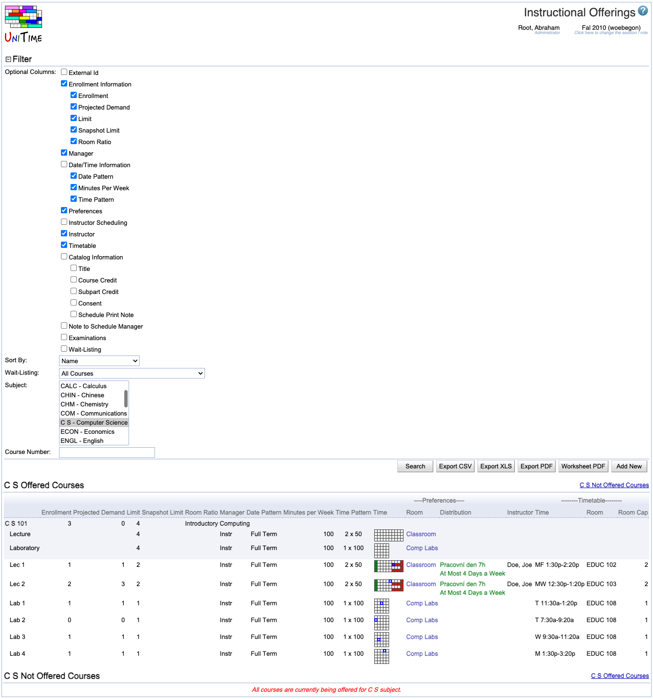
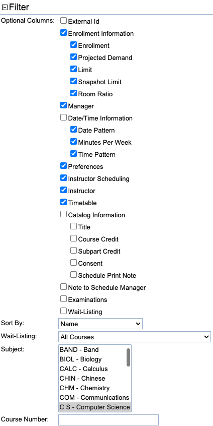

## Screen Description

This screen displays all instructional offerings for the selected subject area(s). It is separated into two parts. The first section lists "Offered Courses" - those that will be offered in the semester being timetabled (the semester is visible in the upper right-hand corner under the title of the screen). The second section lists "Courses Not Offered" - courses from the course catalog that are not being offered for that semester.

{:class='screenshot'}

## Filter

The first part of this screen helps you define what information you want to display in the list of instructional offerings. It consists of a filter and a line where you select a subject area and can enter a course number.

* In the **Filter**, you can select what information to display about each of your instructional offerings/scheduling subparts/classes. You always need to click on the **Search** button to apply changes you have made to the filter. Detailed description:
    * **External Id**
        * External Id of each class (how it may be represented in other systems at the university)

* **Enrollment Information**
    * **Enrollment**
        * Before the semester begins, there is the number of students enrolled in the instructional offering in the last-like semester (and the column header in the table is "Last Enrollment")
        * When enrollment numbers are known for the given semester, these numbers are published here (and the column header is changed to "Enrollment")
        * Cannot be edited in this application
    * **Projected Demand**
        * Projected demand for the instructional offering
        * Can be recalculated from curricula by a departmental schedule manager or a curriculum manager
    * **Limit**
        * Number of students that should be able to register for a given instructional offering or for a given class
        * The total of limits per class (set up, e.g., in the [Multiple Class Setup](multiple-class-setup) screen) displayed as a limit for a scheduling subpart can exceed the course limit. However, only the number of students listed on the line with the course number can enroll
    * **Snapshot Limit**
        * The limit for the instructional offering at the time the Limit and Projection Snapshot was taken.
        * The limit for the classes at the time the Limit and Projection Snapshot was taken.
        * This data is for informational use only.
        * The snapshot limit can be updated by taking a new snapshot using the [Limit and Projection Snapshot](limit-and-projection-snapshot) Page.
    * **Room Ratio**
        * The ratio of the required room size to the class limit
            * Room Ratio = Room Size / Limit per Class
        * Values
            * If the column is empty for a given class, it means that the room ratio is 1 (the most common value)
            * N/A is displayed when no room is used for a class (for example, if the class has arranged hours)
            * If the limit per class is 0 for a given class, then the number in the Room Ratio column determines the size of room needed for that class
            * If the class needs more than one room, the number of requested rooms is also displayed in this column

* **Manager**
    * Determines who will assign time and room to this class (for example, whether it is the external manager, such as the Large Lecture Room manager or Computing Lab manager, or the departmental schedule manager)
    * The managing department also determines the set of rooms and/or times (time patterns) that you can use when you set up preferences
    * Abbreviations are displayed in this column, not the full name of the manager (roll the mouse over the abbreviation to see the full name)

* **Date/Time Information**
    * **Date Pattern**
        * Indicates which weeks during the semester the class is taught
    * **Minutes Per Week**
        * Number of minutes per week
            * For example, a typical class that meets in a 2x75 or a 3x50 pattern would have 150 minutes per week (every 50 minutes being equivalent to "an hour of instruction")
    * **Time Pattern**
        * Number of meetings per week x number of minutes per meeting

* **Preferences**
    * Preferences that will be applied for a given class or scheduling subpart
    * Includes time, room, and distribution preferences in separate columns.

* **Instructor Scheduling**
    * Shows basic information about existing teaching requests.
        * **Attribute** attribute preferences for a class with a teaching request
        * **Instructor** instructor preferences for a class with a teaching request
        * **Teaching Load** requested teaching load for a class with a teaching request
    * Only useful when the instructor scheduling module is being used. To be configured using the [Setup Teaching Requests](setup-teaching-requests) page from the [Instructional Offering Detail](instructional-offering-detail)

* **Instructor**
    * Name of instructor assigned to a given class
    * Style of instructor's names
        * Bold: The instructor's time should be reserved for the class; there cannot be a conflicting class assigned to the same instructor (unless the other class doesn't require conflict checking)
        * Not bold: The instructor can have other classes that overlap with this class; conflicts are not checked
        * Italics: Instructors whose names should not be displayed in the online schedule, including the Event Management (the Display Instructors toggle on the class is unchecked)
    * To change the instructor for a given class, either go to its [Edit Class](edit-class) screen or go to the [Assign Instructors](assign-instructors) screen for a given instructional offering
    * If a non-default teaching responsibility is assigned to the instructor, its abbreviation is listed next to the instructor's name in the brackets. Teaching responsibilities can be defined on the [Teaching Responsibilities](teaching-responsibilities) page in the administration.

* **Timetable**
    * Time and room assigned to a class during the timetabling
        * Normally, a committed timetable is displayed unless there is a different timetable selected or loaded into the solver for the given class
        * If there is a timetable loaded into the solver and a timetable selected, the loaded one is displayed
        * See documentation for [Saved Timetables](saved-timetables) page for more details.
        * Capacity of the assigned room is listed in the **Room Cap** column.

* **Catalog Information**
    * **Title**
        * The title of the course
        * To change it, go to the [Edit Course Offering](edit-course-offering) screen
    * **Offering Credit**
        * Credit for each of the courses in a given instructional offering (the credit must be the same for all the cross-listed courses)
        * To change this, go to the [Edit Course Offering](edit-course-offering) screen
    * **Subpart Credit**
        * Credit for a given scheduling subpart
        * To change this, go to the [Edit Scheduling Subpart](edit-scheduling-subpart) screen. Only editable when the subpart credit is enabled using the `tmtbl.subpart.credit.editable` property in the [Application Configuration](application-configuration).
    * **Consent**
        * The type of consent (if any is required) for all the courses in a given instructional offering
        * To change this, go to the [Edit Course Offering](edit-course-offering) screen
    * **Schedule Print Note**
        * The course note that will be displayed in the Schedule of Classes
        * To change it, go to the [Edit Course Offering](edit-course-offering) screen

* **Note to Schedule Manager**
    * Note to the manager who assigns time and room for a given class; for example, if the class should be a part of the large lecture room manager's set of classes, the note will be for the LLR manager; if the departmental schedule manager should timetable the class, this note is to themself
    * The note is editable in the [Edit Class](edit-class) screen

* **Examinations**
    * Display examination name, period, and room(s) assigned to the course
    * When examinations are not yet timetabled, display the examination name
    * More overview information about examinations can be found in the [Examinations](examinations) screen

* **Wait-Listing**
    * Wait-list setting of a course, to be set on the [Edit Course Offering](edit-course-offering) screen for the controlling course
        * **Disabled** Wait-listing is not enabled for the offering.
        * **Re-Scheduling**: Wait-listing is not enabled; however, students can be automatically re-scheduled for this offering.
        * **Wait-Listing** Wait-listing is enabled for this offering.
    * Wait-listing and re-scheduling are only enabled when the academic session status allows for online student scheduling (see [Status Types](status-types)), and student scheduling status allows for wait-listing and/or re-scheduling (see [Student Scheduling Status Types](student-scheduling-status-types))

* **Sort By**
    * Sort classes within an instructional offering and scheduling subparts

* **Wait-Listing**
    * Allows to filter out offerings by their wait-listing status.
    * Only available when the `unitime.offering.waitListFilter` property is set to `true` in the [Application Configuration](application-configuration).

{:class='screenshot'}

* In the **Subject** field, you can select the subject area or areas (if you only have one subject area, this field will be pre-populated for you, and you cannot change it).

* You can use the **Course Number** field in several ways
    * Leave it blank to see all the instructional offerings for a given subject area and click **Search** - this will display all the instructional offerings for that subject area
    * Enter the course number of the course that you want to display and click **Search** - this will take you to the [Instructional Offering Detail](instructional-offering-detail) screen for that course
    * Enter a "wild card", such as "1\*" and click **Search** to display all 100 level courses. A variation on the use of the wildcard would be to enter "595\*" to display 595 and all 595 suffix courses
    * Enter the course number of a new course and click **Add New** to add a new course to your list - this will take you to the [Edit Course Offering](edit-course-offering) screen
    * The **Course Number** field also allows for a course to be looked up by its title

## Operations

* Click the **Search** (Alt+S) button to apply your filter and your selection of the subject area and the course number

* **Export CSV** (Alt+C) exports the list of instructional offerings to a CSV document, which can then be easily saved or printed.
* **Export XLS** (Alt+X) exports the list of instructional offerings into an XLS document, which is then easy to save or print.
* **Export PDF** (Alt+P) exports the list of instructional offerings to a PDF document, making it easy to save or print.

* **Worksheet PDF** (Alt+W) exports the list of instructional offerings into a PDF document organized in a way that used to be used at Purdue University

* Click on **Add New** (Alt+A) to add a new course. This will take you to the [Add Course Offering](add-course-offering) screen. If you enter a course number of a course that already exists, clicking on Add New will take you to the [Instructional Offering Detail](instructional-offering-detail) screen for that offering.

## Notes

When the list of the instructional offerings is displayed, you can see for each instructional offering.

* In the area with a light blue background:
    * A line with the course number (clicking on that takes you to the [Instructional Offering Detail](instructional-offering-detail) screen)
        * Immediately below this line, the course numbers of any courses cross-listed with this one will be listed in gray letters
    * If there is more than one configuration, a line with the configuration name
    * A line for each scheduling subpart (clicking on a scheduling subpart takes you to the [Scheduling Subpart Detail](scheduling-subpart-detail) screen)

* In the area with a white background:
    * A list of classes associated with the offering (clicking on a class takes you to the [Class Detail](class-detail) screen)