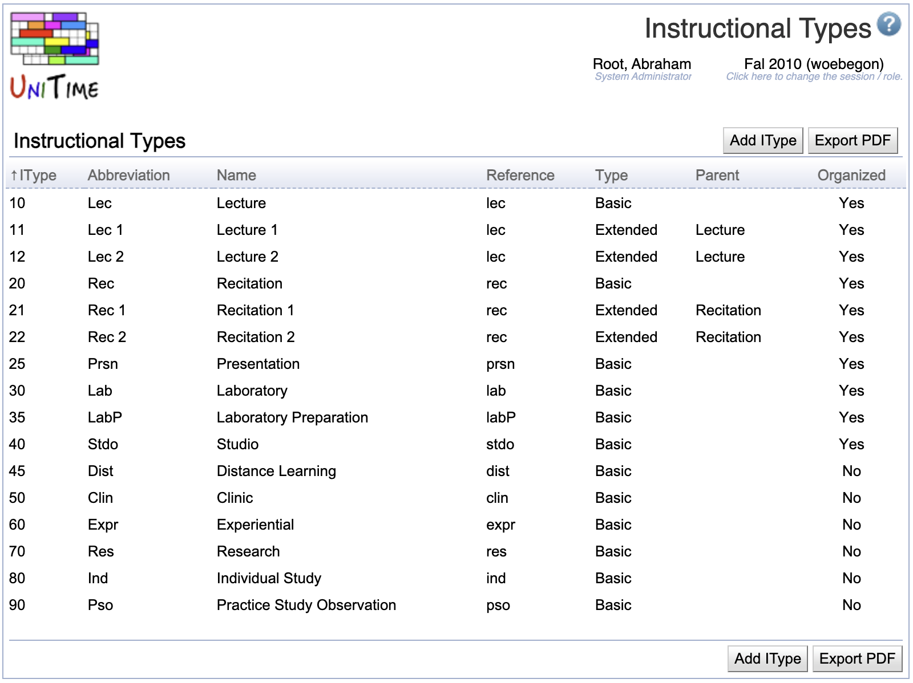

## Screen Description

The Instructional Types screen provides a list of all instructional types available for the current academic session.

{:class='screenshot'}

Instructional type is a property of a scheduling subpart, reflecting the nature of activity of classes of that subpart (Lecture, Lab, etc.).

## Details

* **Instructional Type** (IType)
	* ID of the instructional type
	* Also used for sorting of the list of instructional types (or scheduling subparts of different instructional types) on other screens
	* IType must be unique

* **Abbreviation**
	* Abbreviation of the name of the instructional type, used in the majority of the input data and solver screens as a part of the class name
	* Abbreviation must be unique

* **Name**
	* Name of the instructional type

* **Reference**
	* Reference name of the instructional type used for external systems

* **Type**
	* Basic - these instructional types are always a part of the drop-down list in the [Instructional Offering Configuration](instructional-offering-configuration) screen
	* Extended - these instructional types are displayed in the [Instructional Offering Configuration](instructional-offering-configuration) screen only when the user clicks on "More Options >>>" in the drop-down list

* **Parent**
	* Extended instructional types can have a parent defined
	* This is only used for reporting purposes

* **Organized**
	* **Yes:** Classes of scheduling subparts of an organized instructional type are expected to be timetabled
	* **No:** There is no solver warning for classes without a time pattern if they are of a scheduling subparts that has an instructional type that is marked as not organized
	* This is mostly used for reporting purposes

## Operations

### Add Instructional Type
Click **Add IType** to create a new instructional type

{:class='screenshot'}

* Click **Save** to save the new instructional type and go back to the list of instructional types
* Click **Back** to go back to the list of instructional types without making any changes

### Edit Instructional Type
Click on any instructional type to make changes

{:class='screenshot'}

* Click **Update** to save changes and go back to the list of instructional types
* Click **Delete** to delete the instructional type and go back to the list of instructional types
	* This option is only present if the instructional type is not being used for any class
* Click **Back** to go back to the list of instructional types without making any changes