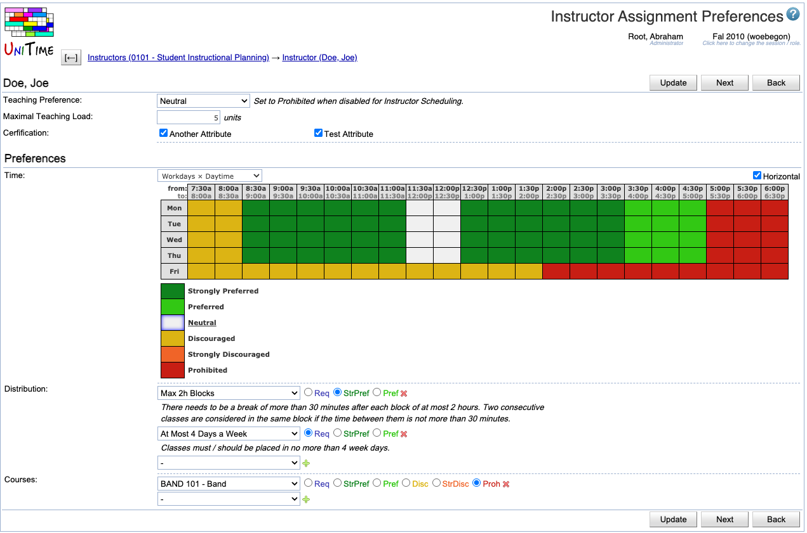

## Screen Description

Instructor attributes and other requirements can be set on the instructors. There is the Instructor Assignment Preferences page that can be reached from the Instructor Detail page by clicking the Edit Assignment Preferences button. See [Instructor Scheduling](instructor-scheduling) for more details about the instructor scheduling component.

{:class='screenshot'}

## Details

This page allows setting the teaching preference (defaults to Prohibited -- the instructor cannot be used for the automated instructor scheduling), maximal teaching load, instructor attributes (grouped by type), time preferences, distribution preferences, and course preferences. The time and distribution preferences are the same as on the Instructor Preferences page. 

The following distribution preferences are supported by the instructor scheduling solver (since UniTime 4.2):
* Back-To-Back: Classes are to be placed one after another, with no breaks in between
* Same Room: Classes are to be placed in the same room
* Same Days: Classes are to be placed in the same days of the week

The following distribution preferences have been added in UniTime 4.8 build 182
* At Most N Hours A Day: Classes are to be placed in a way that there is no more than given number of hours in any day.
* Same Weeks: Given classes must be taught during the same weeks (i.e., must have the same date pattern).
* N Hour Workday: Classes are to be placed in a way that there is no more than given number of hours between the start of the first class and the end of the class one on any day.
* Minimal Gap Between Classes: Classes need to be placed in a way that there is at least the given number of minutes between any two of them.
* Max Block: Given classes must be taught in a way there is a break between two blocks of classes.
* Max Breaks: Limit number of breaks between adjacent classes on a day.
* Max Days: Limit number of days of a week.
* Break: There must be a break of a given length in a given time interval.
* Max Weeks: Limit number of weeks on which an a class can take place.
* Max Holes: Minimize free time of an instructor during a day (between the first and the last class).
* Max Half-Days: Limit number of half-days of a week.
* Max Consecutive Days: Limit number of consecutive days of a week.

The new attribute and preferences are also displayed on the Instructor Detail page and on the Instructors list.

## Operations

* **Update**
	* Save the instructor assignment preferences and go back to the [Instructor Detail](instructor-detail) screen

* **Previous**
	* Save the assignment preferences and go to the Instructor Assignment Preferences screen for the previous instructor from your list

* **Next** 
	* Save the assignment preferences and go to the Instructor Assignment Preferences screen for the next instructor from your list

* **Back**
	* Go back to the [Instructor Detail](instructor-detail) screen without saving any changes in the assignment preferences
