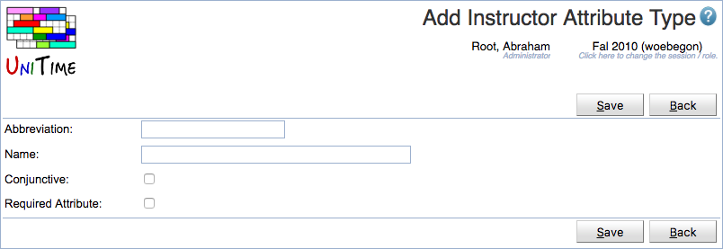
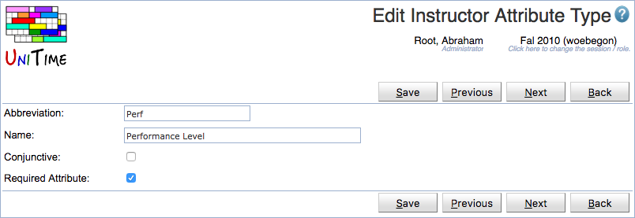
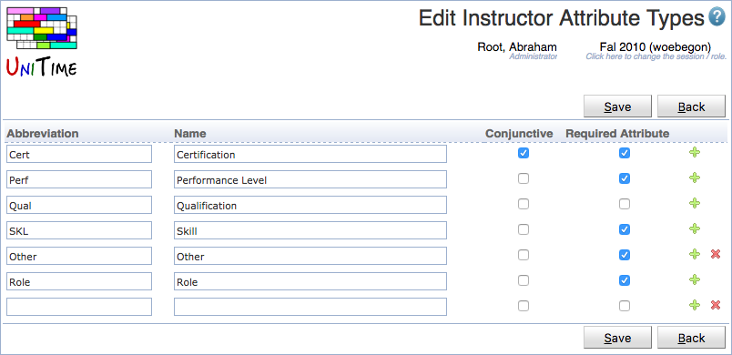

## Screen Description

This page defines instructor attribute types (every instructor attribute must have a type). Instructor attribute types are used to categorize instructor attributes. Instructor attribute types are academic session independent (the same set is used across all academic sessions). The user needs to have Instructor Attribute Types permission to be able to see the instructor attribute types. The permission Instructor Attribute Type Edit is needed to make modifications.

{:class='screenshot'}

## Details

Each attribute type has an abbreviation, a name, and two toggles:

* **Conjunctive**: if two or more attributes of the same conjunctive type are required on a teaching request, this means that only instructors that have ALL the indicated required attributes can be used (same as with room features). If the attribute type is disjunctive (conjunctive toggle is unchecked), it is sufficient for the instructor to have just one of the required attributes of the given type (same as with room groups).

* **Required Attribute**: If a teaching request has a preference of an attribute that is of the required attribute type (unless the preference is prohibited), the preference is considered as required and the actual preference is used to compare two instructors.

For example, if a teaching request strongly prefers Organic Chemistry Skill and prefers Inorganic Chemistry Skill (assuming that the Skill is a required disjunctive attribute type), an instructor must have either Organic Chemistry Skill or Inorganic Chemistry Skill (because of the required attribute type). Among these, instructors with both skills are most preferred, after which instructors with only the Organic Chemistry Skill are preferred before instructors with only the Inorganic Chemistry Skill (because of the strongly preferred preference on the Organic Chemistry Skill).

If the Skill attribute type is not marked as required attribute, instructors without the above two skills can also teach the course but are less preferred than instructors with one or both of the above two skills.

## Operations

The table can be sorted by any of its columns, just by clicking on the column header and the sorting option that opens.

### Add Instructor Attribute Type
Click **Add** to add a new instructor attribute type

{:class='screenshot'}

* Click **Save** to create a new instructor attribute type
* Click **Back** to return to the list without making any changes

### Edit Instructor Attribute Type
Click a particular instructor attribute type to make changes or to delete the instructor attribute type

{:class='screenshot'}

* Click **Save** to make changes, **Back** to return to the list without making any changes
* Click **Previous** or **Next** to save the changes and go to the previous or next instructor attribute type respectively
* Click **Delete** to delete the instructor attribute type. Attribute types that are being used cannot be deleted.

### Edit Instructor Attribute Types
Click **Edit** to edit all instructor attribute types

{:class='screenshot'}

* Use the  icon to add a new line and  to delete a line
* Attribute types that are being used cannot be deleted
* Click **Save** to make changes, **Back** to return to the list without making any changes

### Export CSV/PDF
Click the **Export CSV** or **Export PDF** to export the list to a CSV or PDF document respectively
