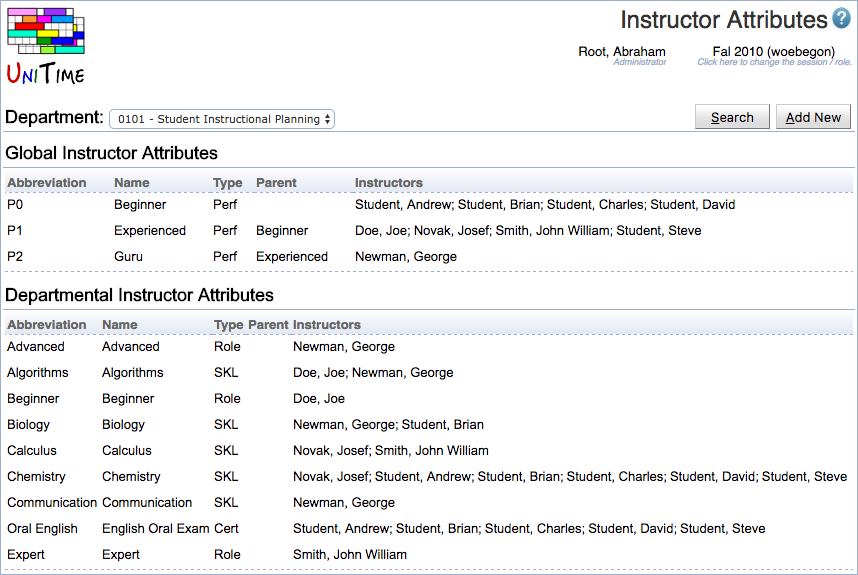

## Screen Description

The Instructor Attributes page can be used to define instructor attributes and to assign them to instructors of a department. An instructor attribute can be either global (for all departments of the academic session) or departmental (only related to a particular department).

{:class='screenshot'}

Instructor attribute types need to be defined first, see Administration > Other > [Instructor Attribute Types](instructor-attribute-types) for more detail. Permission Instructor Attributes is needed to see this page. Permission Instructor Global Attribute Edit is needed to create a global instructor attribute. Permission Instructor Attribute Assign is needed to assign an instructor attribute to instructors of a department.

## Details

Each attribute has an abbreviation, name, type (see [Instructor Attribute Types](instructor-attribute-types)), and it can be associated with a list of instructors. An instructor can have multiple attributes of the same type. It is also possible to define a parent of an attribute. This is useful if there is a hierarchy, e.g., an experienced instructor can teach advanced courses, but they can also teach beginner classes. In other words, if a particular attribute is preferred or required, instructors with the same attribute or with one of the parent attributes (attribute parent of the selected attribute, or the parent of the parent attribute, etc.) meet the preference or requirements.

## Operations

List of instructors attributes and instructors associated with these attributes shows when a department is selected and the **Search** button is clicked. A new attribute can be created using the **Add New** button which opens the [Add Instructor Attribute](add-instructor-attribute) page. An existing attribute can be edited or deleted by clicking on the appropriate line (goes to [Edit Instructor Attribute](edit-instructor-attribute) page).
