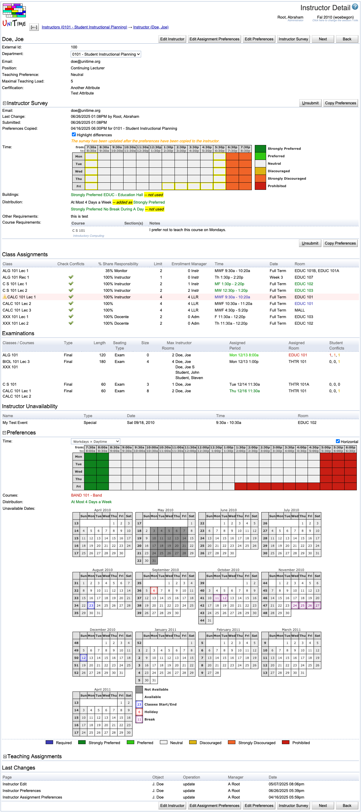

## Screen Description

In the Instructor Detail screen, you can see information about a given instructor. From this screen, you have access to edit screens for most of that information.

{:class='screenshot'}

## Instructor Information

The header of this section is the instructor's name.

To see a detailed description of each of the fields in this section (External Id, Account Name, ...), go to the description of the [Edit Instructor](edit-instructor) screen.

## Class Assignments

A list of all classes to which this instructor has been assigned. You can assign instructors to a class in the [Edit Class](edit-class) screen or in the [Assign Instructors](assign-instructors) screen.

For each class, you can see the following properties:

* **Class**
	* The name of the class

* **Check conflicts**
	* When a check is displayed in the column, the instructor's preferences are considered during departmental timetabling; also, checks are performed for this instructor to make sure that this person does not have conflicting teaching assignments (i.e., he/she is not teaching another class at the same time)
	* When not checked, the instructor's association with this class is ignored during timetabling, no conflicts will be discovered between this class and his/her other classes

* **Share**
	* Indicates the percentage of teaching activity for this class associated with this instructor

* **Limit**
	* Class limit for that class

* **Manager**
	* The manager who is going to timetable the class (for example, your department or Large Lecture Room or Computing Lab)

* If a timetable has been created that includes this class, you will also see
	* **Time**
		* Time assigned to this class during timetabling

* **Date**
	* Date pattern of the class

* **Room**
	* Room assigned to this class during timetabling

## Examinations

Information about examinations associated with the instructor.

* **Classes/Courses**
	* Instructional offering components (classes, instructional offering configurations, course offerings, and instructional offerings) defining which students need to take the examination (i.e., students enrolled into these components)

* **Type**
	* Type of the examination
	* Midterm or Final

* **Length**
	* Length of the examination in minutes

* **Seating Type**
	* Exam or Normal seating type

* **Size**
	* Expected number of students who will be taking the examination

* **Max Rooms**
	* The maximum number of rooms into which an examination can be split (for example, an examination for a class of 400 students can be split into two or three rooms if they need to use Exam seating type and do not have a room with exam seating capacity of 400 seats)

* **Instructor**
	* A list of instructors associated with the examination

* **Assigned Period**
	* Time period assigned to the examination
	* If no time period has been assigned yet, time preferences are displayed

* **Assigned Room**
	* Room(s) assigned to the examination
	* If no room has been assigned yet, room preferences are displayed

* **Student Conflicts**
	* Number of student conflicts (direct, more than two examinations a day, back-to-back)
	* Not Assigned when the exam has no period assigned.

Clicking on an examination takes you to its [Examination Detail](examination-detail) screen which contains more detailed information.

## Preferences

Preferences for the given instructor. You can hide or unhide this part of the Instructor Detail screen by clicking on the small square in front of the Preferences section heading. If you want to change these preferences, click on the Edit Instructor Preferences button in this detail screen. That will take you to the [Instructor Preferences](instructor-preferences) screen. There are more details about instructor preferences in the description of the [Instructor Preferences](instructor-preferences) screen.

## Instructor Scheduling

If the [Instructor Scheduling](instructor-scheduling) is enabled, the Instructor Detail page shows instructor assignment information about the instructor. Besides of the new teaching preference, maximal teaching load, assigned instructor attributes, and course preferences, the Instructor Detail page contains a new table with [Teaching Assignments](teaching-assignments) that are assigned to the instructor. More details are shown when an assignment is clicked showing the [Teaching Assignment Detail](teaching-assignment-detail) dialog.

Also, if the instructor is also a student (there is a student with matching external id in the current academic session), the [Enrollments](enrollments-of-class-or-course) table is displayed, showing all enrollments if the student. These include instructor assignments (dark blue color) as well as student class enrollments.

## Operations

* **Edit Instructor** (Alt+I)
	* Go to the [Edit Instructor](edit-instructor) screen to edit items listed in the first part of the Instructor Detail screen

* **Edit Preferences** (Alt+E)
	* Go to the [Instructor Preferences](instructor-preferences) screen to edit instructor's preferences

* **Edit Assignment Preferences**
	* Go to the [Instructor Assignment Preferences](instructor-assignment-preferences) screen to edit instructor's assignment preferences (see [Instructor Scheduling](instructor-scheduling) for more details about the instructor scheduling component)

* **Previous** (Alt+P)
	* Go to the Instructor Detail screen for the previous instructor in your list of [Instructors](instructors)
		* The button is displayed only if there is a previous instructor in your list

* **Next** (Alt+N)
	* Go to the Instructor Detail screen for the next instructor in your list of [Instructors](instructors)
		* The button is displayed only if there is a next instructor in your list

* **Back** (Alt+B)
	* Go back to the last non-editable screen from which you came
