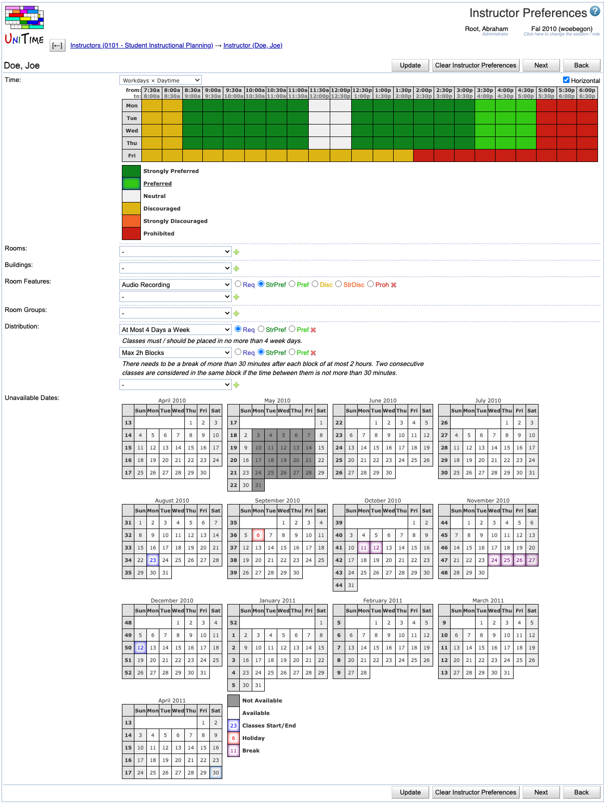

## Screen Description

In the Instructor Preferences screen, you can enter the instructor's preferences, which will then be applied to the classes to which this instructor is assigned (if conflict-checking is turned on for those classes). The rules explaining how preferences are applied to classes are located in [Application Of Preferences](application-of-preferences).

{:class='screenshot'}

## Preferences

**Time Preferences**

* Select the size (range) of the time grid that you want to work with in the drop-down menu above the time grid
    * The default setting that you see when you enter the screen is what you can set up in the [Manager Settings](manager-settings) screen (in the main menu, go to Preferences → Settings; then click on "Time Grid Default Selection" to change the default time grid
* Indicate the instructor's time preferences by filling in the half-hour time slots with appropriate colors (click on the colored square in the legend and then on the squares in the time grid that you want to fill in with this preference level)
* Click on the day of the week to fill in the grid for the whole day (or combination of days)
* Click on a particular time to fill in the grid for this time (across all the days)
* Click on the upper left-hand side corner (which has "from:" and "to:") to fill in the whole time grid
* Note: To express that, e.g., the instructor cannot teach on Tuesday and Thursday, fill in Tuesday and Thursday times as "Prohibited"

**Room Preferences**

* Select a room from the first drop-down list and the preference level from one of the options
* You can see only those rooms that are listed in the [Rooms](rooms) screen for the department managed by the manager listed in your Edit Scheduling Subpart screen (look at [Rooms](rooms) to see how to add new rooms to your list of departmental rooms)
* To add more lines for additional room preferences, click the  plus icon
* To delete a line with a room preference, click on the  cross icon on that line
* Blank lines are ignored

**Building Preferences**

* Select a building from the first drop-down list and the preference level from one of the options
* You can see only those buildings that are listed in your [Rooms](rooms) screen for the department of this scheduling subpart's manager
* To add more lines for additional building preferences, click the  plus icon
* To delete a line with a building preference, click on the  cross icon on that line
* Blank lines are ignored

**Room Feature Preferences**

* Select a room feature from the first drop-down list and the preference level from one of the options
* You can see only those room features that are listed in the [Rooms](rooms) screen
* If you need to add another room feature for your departmental rooms, go to the menu, to Courses → Input Data → [Room Features](room-features)
* To add more lines for additional room feature preferences, click the  plus icon
* To delete a line with a room feature preference, click on the  cross icon on that line
* Blank lines are ignored

**Room Group Preferences**

* Select a room group from the first drop-down list and the preference level from one of the options
* You can see only those room groups that are applicable to classes of the given manager (for example, for LLR classes you can see groups of large lecture rooms); for your departmental classes, you can see only those room groups that are listed in your [Room Groups](room-groups) screen - if you need to add another room group, go to the menu, to Courses → Input Data → [Room Groups](room-groups)
* To add more lines for additional room group preferences, click the  plus icon
* To delete a line with a room group preference, click on the  cross icon on that line
* Blank lines are ignored

**Distribution Preferences**

* The distribution preferences that you set up on an instructor will be applied to all the classes that the instructor is teaching, but only during the departmental timetabling
    * Example: If the instructor teaches three classes and you put in that he/she requires his/her classes to be back-to-back, all three of these classes will have to be back-to-back; if you want to specify which two of these three classes need to be back-to-back, you will need to put the distribution preference on the classes themselves, not on the instructor (you can do that for example by clicking on "Add Distribution Preference" in the [Class Detail](class-detail) screen of one of those classes)

* Select a distribution preference from the first drop-down list and the preference level from one of the options
* Only a subset of all distribution preferences is available here (only this subset can be set on instructors; the other distribution preferences have to be set on scheduling subparts or on classes)
* To add more lines for additional distribution preferences, click the  plus icon
* To delete a line with a distribution preference, click on the  cross icon on that line
* Blank lines are ignored

**Unavailable Dates**

* This table can be used to mark the days of the semester when the instructor is not available to teach classes.
* This means that a class (of such an instructor) cannot be placed on a time that would have a meeting on a day when the instructor is unavailable.
    * Please note that this setting is not very practical for regular classes (classes that meet every week during the whole semester), as having an instructor unavailable on one Monday of the term would prohibit such a class from being placed on Mondays. It is more useful for instructors who teach classes that only meet a few times during the semester (typically for a longer period). 
    * The instructor availability also works for the instructor assignment problem, and it is possible to change where the **Unavailable Dates** section will appear by setting the `tmtbl.instructor.unavaibleDates` property (on the Administration > Defaults > [Configuration](application-configuration) page). It can show on the Instructor Preferences page (which is the default), on the Instructor Assignment Preferences page, and on both these pages, or it can be disabled.

## Operations

* **Update** (Alt+U)
    * Save the preferences and go back to the [Instructor Detail](instructor-detail) screen

* **Clear Instructor Preferences** (Alt+C)
    * Clear all the instructor's preferences on this page and go back to the [Instructor Detail](instructor-detail) screen (where you can see that the preferences have been cleared)

* **Previous** (Alt+P)
    * Save the preferences and go to the Instructor Preferences screen for the previous instructor from your list

* **Next** (Alt+N)
    * Save the preferences and go to the Instructor Preferences screen for the next instructor from your list

* **Back** (Alt+B)
    * Go back to the [Instructor Detail](instructor-detail) screen without saving any changes in the preferences
