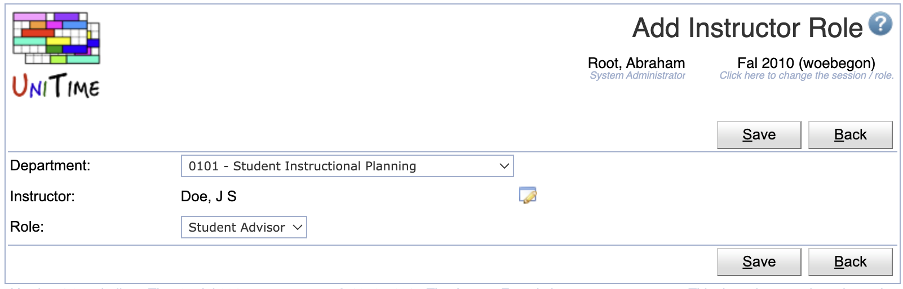

## Screen Description

Instructor Roles page can be used to assign a role (that has the Instructor toggle checked, see [Roles](roles) page) to an instructor or other department personel. That is to anyone from the [Instructors](instructors) page for a particular department. This feature may be handy if a schedule manager or event manager is allowed to dedicate some (usually lesser) roles to people within his/her department. For instance, an event manager can give other people from the department to request and/or approve event in the departmental event rooms. Or, a schedule manager can dedicate some part of the data entry to his/her assistants. To enable this functionality, appropriate roles need to be created on the [Roles](roles) page with the appropriate permissions provided on the [Permissions](permissions) page first.

Permission Instructor Roles is needed to access the page, changes can be made (for a particular department) when the Instructor Role Edit permission.

{:class='screenshot'}

## Details

Each instructor of a department can be given a role. If a new person is looked up, an appropriate instructor is also created on the [Instructors](instructors) page. Administrative uses do only see instructors which already have a role given on this page. Users of department dependent roles (e.g., an event manager or a schedule manager) can see all instructors of their department(s). See the second screen shot.

## Operations

To change or remove a role from an instructor, click on the appropriate line, [Edit Instructor Role](edit-instructor-role) page will appear. All instructor roles can be edited on the [Edit Instructor Roles](edit-instructor-roles) page. To do so, click on the **Edit** button.

A role can be assigned to a new instructor on the [Edit Instructor Roles](edit-instructor-roles) page (button **Edit**) or using [Add Instructor Role](add-instructor-role) page (button **Add**). These pages also allow for adding a new person into the department.

The table can be ordered by any of the columns. To do so, click on the column header and select Sort by <column name> option.

{:class='screenshot'}
